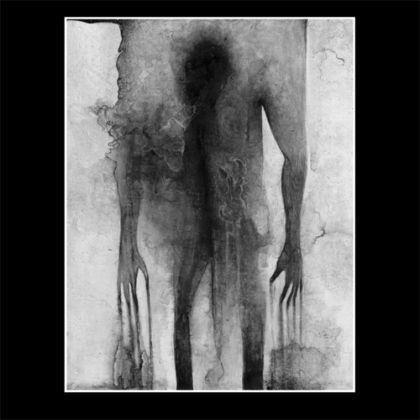

artist: **Troum** release: _Grote Mandrenke_ format: CD year of release: 2012 label: [Beta-lactam Ring](http://www.blrrecords.com/) duration: 44:02

detailed info: [discogs.com](http://www.discogs.com/Troum-Grote-Mandrenke/release/3710289)

Me: Yo, I'm looking for a great new record. **Troum:** Don't worry, we got this.

This german duo is one of those artists that you can rely on to deliver a great release at least once every two years. _Mare Idiophonika_ and [_Eald-Ge-Stréon_](http://www.eveningoflight.nl/2009/11/10/review-troum-eald-ge-streon-2009/ "Review: Troum – Eald-Ge-Stréon (2009)") were the two latest heavy hitters as far as I'm concerned, but this new one, _Grote Mandrenke_, fits that list perfectly. Based on a selection of their typical analog drones composed in live settings, it continues the oceanic theme of _Mare_, but far less abstractly, focusing on the horrible [Second St. Marcellus Flood](http://en.wikipedia.org/wiki/Grote_Mandrenke), known in the local Low Saxon as Grote Mandrenke, the great drowning of man.

To my ears, the long work can be divided into three main parts. The first movement of ten minutes or so has a steady, mid-tempo rhythm with lots of wavy chords and drones, as well as many melodic parts. It is a rather full composition but lovely in its warmth and cadence. There is the nagging suspicion, though, that this same cadence might be the swelling of the North Sea, still somewhere off the coast.

The second part, lasting over fifteen minutes, reminds me of the beaches, the calm before the storm, and the slow swelling of air and water currents. It has a consistent melodic pattern, starting out very minimally, but increasing in intensity towards the album's twenty-five minute mark. The sounds retain their lightness though, until the point where the storm really hits. When it does, thick basses and low melodies drift in slowly, as well as a drum rhythm, all of which build to a brilliant crescendo of destructive power, forming the last main part of the album.

Because the forces of nature are so compellingly musicalised on _Grote Mandrenke_, you'd almost forget the human suffering, but perhaps that's what the four minute closing movement to the album is for: a melancholic, drifting cloud of lamenting voices and airy melodies.

The album is completely in line with some of the best material the duo has released thus far, being varied, evocative, and very catchy at times. Although _Grote Mandrenke_ doesn't explore any new avenues for the band, it is convincing through and through and it'll take a lot more of albums like this before I'm tired of it. Excellent work!

Reviewed by **O.S.**

Tracklist:

1\. (44:02)
