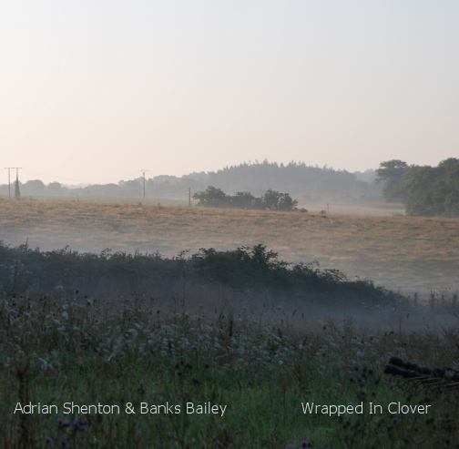

artist: **Adrian Shenton** & **Banks Bailey** release: _Wrapped in Clover_ format: CD-R year of release: 2012 label: [Phonospheric](http://www.phonospheric.co.uk/) duration: 38:05

detailed info: [discogs.com](http://www.discogs.com/Adrian-Shenton-Banks-Bailey-Wrapped-In-Clover/release/3720682)

**Shenton** and **Bailey** must have been orbiting one another for quiet a while, connected at the very least by their work and collaborations related to the **Quiet World** label. Now, though, they've truly met musically on this collaborative album of field recordings and ambient music.

The first of these diverse tracks weds recordings of water, chirping birds, and insects to tones of gongs and other metallophones. It has a distinct morning feel to it, of slowly waking up, and making tea the old-fashioned way in a lovely garden. A bit of a contrast with "In Which the Goose Has Been Broken", which - although it is still quite calm - has more of a nighttime mood, with darker undertones, crickets, and swathes of white noise.

The third track, "Dog Days", is forlorn affair, a sad organ melody drifting over splashes of water, tubular bells, and occasional influxes of sounds from the border of country and city. "Evening Shadow", finally, returns to the darkened feel of the second track, but with the heavy drones of vehicles going by and traversing overhead occasionally, a bell tolling the Big Ben melody, and a calm soundscape stretching out until the end.

_Wrapped in Clover_ is a rather unassuming record on the surface, with very few conspicuous fireworks. However, it nestles into your subconscious very well over the course of a few listens, and it is excellent listening while you are focussing on other activities, and the repeat button is tempting to push at the end. The tracks are not too long and have enough variation to hold part of your attention most of the time. A very interesting record if you like ambient atmospheres with upfront field recordings.

Reviewed by **O.S.**

Tracklist:

1\. Rapt in Clover (8:10) 2. In Which the Goose Has Been Broken (14:35) 3. Dog Days (7:26) 4. Evening Shadow (7:45)
