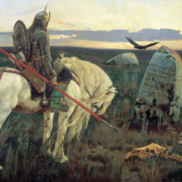

[Cloudscape #30.1: A Warrior's Peregrination](http://www.mixcloud.com/eveningoflight/cloudscape-301-a-warriors-peregrination/?utm_source=widget&utm_medium=web&utm_campaign=base_links&utm_term=resource_link) by [Evening Of Light](http://www.mixcloud.com/eveningoflight/?utm_source=widget&utm_medium=web&utm_campaign=base_links&utm_term=profile_link) on [Mixcloud](http://www.mixcloud.com/?utm_source=widget&utm_medium=web&utm_campaign=base_links&utm_term=homepage_link)

Part one of the September 2012 neofolk special follows the warrior's path through uncharted landscapes, epic battles, and solitary rituals.

Listen to part two [here](http://www.eveningoflight.nl/2012/09/11/cloudscape-30-2-the-lake-at-worlds-end/ "Cloudscape #30.2: The Lake at World’s End").

00:00 | Grey Force Wakeford | The Weavers Dream | Marble Heart | 2008 03:01 | Primordial | Dark Song | A Journey's End | 1998 07:55 | Wreathes | Odes | [Wreathes](http://www.eveningoflight.nl/2012/05/24/review-wreathes-2012/ "Review: Wreathes (2012)") | 2012 13:55 | HaWthorn | Rose Coloured Sky | The Murky Brine | 2004 17:16 | Time Moth Eye | Witchwalker | [Undeath](http://www.eveningoflight.nl/2012/08/28/review-time-moth-eye-undeath-2012/ "Review: Time Moth Eye – Undeath (2012)") | 2012 21:11 | The Triple Tree | Black Crusade | [Ghosts](http://www.eveningoflight.nl/2008/12/01/review-the-triple-tree-ghosts-2008/ "Review: The Triple Tree – Ghosts (2008)") | 2008 25:31 | Nest | Kontio | Trail of the Unwary | 2007 30:00 | Tenhi | Tuulenkaato | [Folk Aesthetic 1996-2006](http://www.eveningoflight.nl/2008/01/01/review-tenhi-folk-aesthetic-1996-2006-2007/ "Review: Tenhi – Folk Aesthetic 1996-2006 (2007)") | 2007 34:57 | Darkwood | Totenburg | Notwendfeuer | 2006 39:38 | Forseti | Der Graue König | Erde | 2003 44:16 | Nature and Organisation | Blood of Solitude I | Beauty Reaps the Blood of Solitude | 1994 45:34 | Nature and Organisation | Bloodstreamruns | Beauty Reaps the Blood of Solitude | 1994 50:10 | :Golgatha: & Dawn and Dusk Entwined | Crusade | Sang Graal | 2007 53:20 | Sieben | Ogham the Blood | Ogham Inside the Night | 2005 57:35 | In Gowan Ring | By Moss Strand and Waterspathe | The Twin Trees | 1997 59:47 | Kinit Her | The Prophet's Pen Ablaze | [Divine Names](http://www.eveningoflight.nl/2010/11/01/review-kinit-her-divine-names-2010/ "Review: Kinit Her – Divine Names (2010)") | 2010 1:03:40 | Twelve Thousand Days | The Moon Is Down | In the Garden of Wild Stars | 2000 1:07:44 | Current 93 | All the Stars Are Dead Now | Thunder Perfect Mind | 1992 1:16:36 | Alethes | Aletheia | Aletheia | 2006 1:22:42 | Comus | The Herald (excerpt) | First Utterance | 1971 1:28:04 | Amebix | Sonic Mass Part 1 | Sonic Mass | 2011 1:31:32 | Ulver | Ulvsblakk | [Kveldssanger](http://www.eveningoflight.nl/2009/04/29/eclipse-review-ulver-kveldssanger-1995/ "Eclipse Review: Ulver – Kveldssanger (1995)") | 1995

Painting: **Viktor Mikhaylovich Vasnetsov** -  _A Knight at the Crossroads_ (1878)
