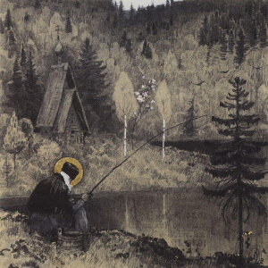

[Cloudscape #30.2: The Lake at World's End](http://www.mixcloud.com/eveningoflight/cloudscape-302-the-lake-at-worlds-end/?utm_source=widget&utm_medium=web&utm_campaign=base_links&utm_term=resource_link) by [Evening Of Light](http://www.mixcloud.com/eveningoflight/?utm_source=widget&utm_medium=web&utm_campaign=base_links&utm_term=profile_link) on [Mixcloud](http://www.mixcloud.com/?utm_source=widget&utm_medium=web&utm_campaign=base_links&utm_term=homepage_link)

In part two of the September 2012 neofolk special, the man - no longer a warrior - embarks upon the final stage of his journey, reaching the lake at the end of the world, and becomes a hermit.

Listen to part one [here](http://www.eveningoflight.nl/2012/09/10/cloudscape-30-1-a-warriors-peregrination/ "Cloudscape #30.1: A Warrior’s Peregrination").

00:00 | Death in June | Death Is the Martyr of Beauty | But What Ends When the Symbols Shatter? | 1992 03:34 | In Gowan Ring | Listen to Colours | Love Charms | 1994 07:53 | Magnet & Paul Giovanni | Willow's Song | The Wicker Man | 1973 12:34 | Tuhat Kuolemaa Sekunnissa | Vihainen Laulu | [Tuhat Kuolemaa Sekunnissa](http://www.eveningoflight.nl/2007/03/01/review-tuhat-kuolemaa-sekunnissa-2007/ "Review: Tuhat Kuolemaa Sekunnissa (2007)") | 2007 14:50 | Agalloch | The Wolves of Timberline | Agalloch/Nest | 2004 18:58 | Eitarnora | Wishing for Sleep | Murmurations | 2012 24:19 | Ulver | Trollskogen | Vargnatt | 1993 28:52 | Vàli | Her Ute i Moerket | Forlatt | 2004 32:56 | Empyrium | Dying Brokenhearted | Where at Night the Wood Grouse Plays | 1999 38:23 | Stone Breath | Solomon's Song | Lanterna Lucis Viriditatis | 2000 43:48 | Faelwa | Wilgenwind | [Farewell Sun](http://www.eveningoflight.nl/2009/11/06/review-faelwa-farewell-sun-2009/ "Review: Faelwa – Farewell Sun (2009)") | 2009 45:54 | Lost Harbours | Portent | [Hymns and Ghosts](http://www.eveningoflight.nl/2012/08/08/review-lost-harbours-hymns-ghosts-2012/ "Review: Lost Harbours – Hymns & Ghosts (2012)") | 2012 49:45 | Celestiial | From Elm Blossoms a Rose | [Where Life Springs Eternal](http://www.eveningoflight.nl/2010/07/17/review-celestiial-where-life-springs-eternal-2010/ "Review: Celestiial – Where Life Springs Eternal (2010)") | 2010 52:11 | :Of the Wand & the Moon: | In a Robe of Fire | Bringing Light and Darkness | 2001 56:35 | Casey Edward Denman | Ode to the Weathered | [Songs for the Living and Songs for the Dead](http://www.eveningoflight.nl/2011/02/20/review-casey-edward-denman-songs-for-the-living-2010/ "Review: Casey Edward Denman – Songs for the Living and Songs for the Dead (2010)") | 2010 59:31 | Martyn Bates | The Mountain Tomb | Imagination Feels Like Poison | 1997 1:04:16 | United Bible Studies | To the Newly Risen Mountains | The Jonah | 2009 1:07:25 | Forseti | Windzeit | Windzeit | 2002 1:11:04 | Ulver | Kveldssang | [Kveldssanger](http://www.eveningoflight.nl/2009/04/29/eclipse-review-ulver-kveldssanger-1995/ "Eclipse Review: Ulver – Kveldssanger (1995)") | 1995 1:12:31 | Sol Invictus | Media | Trees in Winter | 1990 1:14:54 | novemthree | Vespers | [Arrowwood/novemthree](http://www.eveningoflight.nl/2008/02/01/review-arrowwood-novemthree-2007/ "Review: Arrowwood / novemthree (2007)") | 2007 1:18:29 | Tenhi | Taival | Kauan | 1999 1:25:01 | Musk Ox | Les Plus Beaux de Nos Jours | [Musk Ox](http://www.eveningoflight.nl/2007/12/01/review-musk-ox-2007/ "Review: Musk Ox (2007)") | 2007

Painting: **Mikhail Vasilyevich Nesterov** - _Holy Man_
