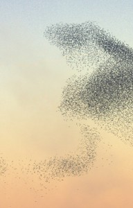

artist: **Eitarnora** release: _Murmurations_ format: MC year of release: 2012 label: [Brave Mysteries](http://www.bravemysteries.com) duration: 40:00

More intrepid new directions into acoustic music for **Brave Mysteries**. The duo **Eitarnora** firmly caught my attention with this five-part album of ponderous and forlorn compositions for guitar, voice, and organ.

I'm tempted to relate the music on _Murmurations_ to the neofolk genre, or particularly to that current of music focusing on completative, nature-inspired songs - and I have in fact done so by including "Wishing for Sleep" in my [recent mix](http://www.eveningoflight.nl/2012/09/11/cloudscape-30-2-the-lake-at-worlds-end/ "Cloudscape #30.2: The Lake at World’s End"). However, while there are points of convergence, **Eitarnora** sets itself apart quite clearly with a sense of style and composition that is original. The often long tracks on this album tend much more toward classical guitar suites than folksongs, with fingerpicked melodies that rarely repeat, but wander naturally towards their destination without retracing steps. At the same time, the organ parts add a droning quality, and the fragile falsetto voice fills a unique upper sound layer.

So, it's not really the musical style that connects Eitarnora to most other artists in the dark acoustic corner, but rather the atmosphere. _Murmurations_ feels like a very personal journey through rugged but calm North American landscapes, constantly drifting and stumbling upon the unexpected. In a way, the sound and play of this album is as rough (or lo-fi) as the mountain ranges and forests of my musical dreams for this album, but that doesn't bother me one bit. It possesses a charm that I've only found in similarly primitive freefolk recordings earlier in the century like some works by **Agitated Radio Pilot** or **United Bible Studies**, though again quite different from those in some respects.

It'll be clear that _Murmurations_ might be tough to get into if you're not on the same wavelength as these guys, but I'm really impressed by this album, and Eitarnora's approach to acoustic compositions is thoroughly refreshing. So yes, do lend this duo your ears to see if you get the same vibe as I'm getting.

\[vimeo 48321302\]

Reviewed by **O.S.**

Tracklist:

1\. Time (5:39) 2. Mountaintop (9:47) 3. Wishing for Sleep (5:23)

4\. Soft Blooms (10:42) 5. Don't Leave, Lover (8:29)
