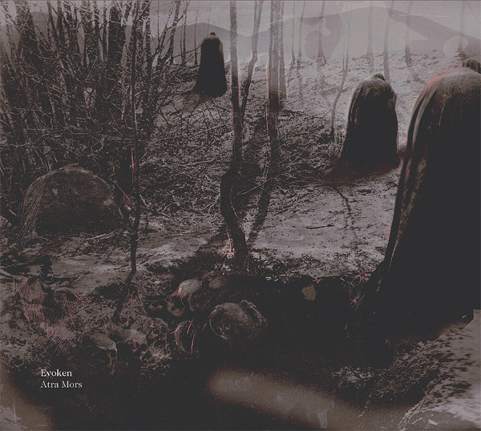

artist: **Evoken** release: _Atra Mors_ format: CD year of release: 2012 label: [Profound Lore](http://www.profoundlorerecords.com/) duration: 67:10

detailed info: [discogs.com](http://www.discogs.com/Evoken-Atra-Mors/release/3731202)

Ah yes, **Evoken**, one of the jewels in the crown of funeral doom metal. The production of these albums usually progresses at the same funereal pace as the music itself, so it's hardly any surprise that it's been five years since _Atra Mors_' decent but ultimately unassuming predecessor _A Caress of the Void._ So, what does this album bring us, apart from over an hour of 'dark, brooding, bleak death'?

Despite several significant line-up changes through the years, Evoken manages a stability of style that is extremely reliable, always true to itself, and always instantly recognisable. Other bands rarely manage to emulate it exactly, and perhaps they're not even trying, which is fair enough. Evoken is Evoken and should be allowed to remain where it is without too many copycats encroaching on their desolate realm. Little surprise then that _Atra Mors_, from the opening riffs of its title track, feels like returning to that same old realm where nothing much has changed. The plodding, leaden riffs are still there, as is **Nick Orlando**'s deep growl and **Vince Verkay**'s subtle yet elaborate style of drumming - relatively animated for the genre, yet never out of place.

The album's masterpiece is introduced after the first twelve minutes: "Descent into Chaotic Dream", a song that starts so peacefully - yet gloomy - recalling the atmosphere of their turn-of-the-millennium milestone record _Quietus_, with mostly clean guitar melodies and riffs at first. In excellent compositional form, the track continues with heavy tom and cello-embellished movements, as well as a proper headbanger in which the death metal origins of funeral doom get a nod. The track concludes with one of those mournful yet epic lead guitar spotlights that Evoken has mastered like few others.

Six main tracks are carved into three groups by the two interludes; "A Tenebrous Vision" is a ghostly piano piece that leads us into "Grim Eloquence", a heavy track that contains more references to the past. Not in the least to the band's own style, but I'll be damned if there isn't a bit of **Esoteric**'s psychedelic fuzziness floating around, and that solo in the middle takes me right back to **Cathedral**'s genre-busting masterpiece _Forest of Equilibrium_, 21 years ago. The track, though less structurally coherent than "Descent..." ends on a similar excellent note with a sweeping piece of cello and lead guitar. The remaining tracks follow a comparable pattern: tightly written and solid, but in some ways perhaps less urgent than the ones I've mentioned so far. The second interlude, "Requies Aeterna", is a nice little work for acoustic guitar and cello that provides a touch of variation before onslaught of the last two tracks.

As I've suggested, _Atra Mors_ feels like a thoroughly retrospective album; it's as if we've come to the historical endpoint of the funeral doom genre, and we're faced with a wall of darkness beyond which we can discern nothing at all. Instead, we turn around and see what lies behind: twenty years of an uncompromising extreme metal genre, with quite a few excellent albums and idiosyncratic styles developed. Most of all, Evoken looks back on its own history, and the result is a solid album, certainly better than the previous one, but perhaps not quite as arresting as the (in my opinion) unequalled gloom of _Quietus_, or the relentless and perhaps even smooth dark energy of 2005's _Antithesis of Light_. The question remains however, if there is anywhere left for the genre to go, or if this decade is witnessing its final crystallisation. _Atra Mors_ suggests the latter. That said, this album contains a couple of brilliant compositions that will make any funeral doom lover's heart beat fast, and it might even blow your mind if you've never been initiated into the genre at all. Maybe that's all the potential there's left at the moment.

Reviewed by **O.S.**

Tracklist:

1\. Atra Mors (11:54) 2. Descent Into Chaotic Dream (11:14) 3. A Tenebrous Vision (2:19) 4. Grim Eloquence (9:40) 5. An Extrinsic Divide (10:11) 6. Requies Aeterna (1:59) 7. The Unechoing Dread (9:47) 8. Into Aphotic Devastation (10:07)
