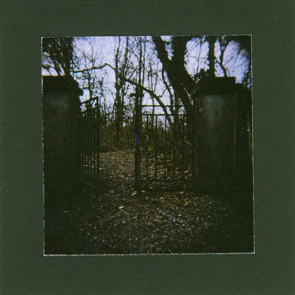

artist: **The Driftwood Manor** release: _Dominican Black Abbey_ format: 3" CD-R year of release: 2012 label: [Rusted Rail](http://www.rustedrail.com/) duration: 21:19

detailed info: [discogs.com](http://www.discogs.com/Driftwood-Manor-Dominican-Black-Abbey/release/3748790)

**The Driftwood Manor** is fast becoming one of _the_ household names for alternative folk in Ireland. I've never hidden my admiration for their previous releases, albums and EPs alike, and it doesn't surprise me that their latest little offering _Dominican Black Abbey_ is no exception. Again released by **Rusted Rail**, these six tracks provide further proof of the songwriting talent of **Eddie Keenan** and his morphing band.

Compared to some of those earlier works, _Dominican Black Abbey_ sounds a bit sparser; less layered vocal harmonies, no elaborate drones, etc. A bit of drifting electric guitar melodies provide some new sound as well. But the core is the same: voice, guitar, bouzouki, violin, and solid original compositions and lyrics that flow flawlessly along with the melodies. Listening to masterful tracks such as "Like Parting with Ghosts" or "The Blackest of Silks" should be enough to convince you.

The lyrics deserve some extra mention as well, being a lovely affair, an excellent traditional approach to rhythm and rhyme, and a thematic amalgamation of love stories, nature observation and landscapes, and dark touches of spirits and folklore.

Surely deserving of a wider audience, here's another call from me to lend The Driftwood Manor your ears if you're in any way interested in modern folk music. If you're already a fan, you know what to do.

Reviewed by **O.S.**

Tracklist:

1\. Dominican Black Abbey (3:27) 2. I Could Sense A Violent Death (4:49) 3. Like Parting With Ghosts (4:55) 4. Trees Shaped By The Wind (2:13) 5. The Blackest Of Silks (3:38) 6. There Are Signs (2:17)
