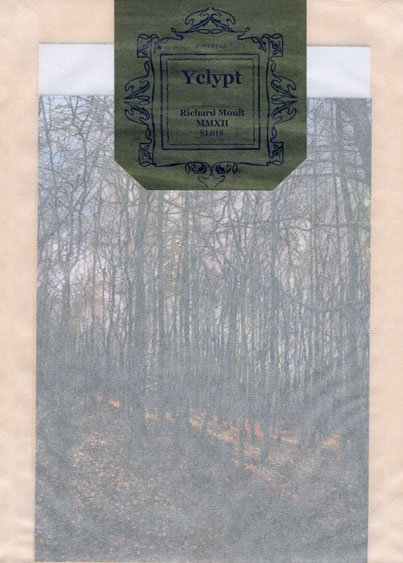

\[caption id="attachment\_3676" align="alignright" width="104"\] Cover Painting\[/caption\]

\[caption id="attachment\_3677" align="alignright" width="107"\] Packaging\[/caption\]

artist: **Richard Moult** release: _Yclypt_ format: CD year of release: 2012 label: [Second Language](http://www.secondlanguagemusic.com/) duration: 33:18

detailed info: [discogs.com](http://www.discogs.com/Richard-Moult-Yclypt/release/3855265)

If I had to name musicians I'm really deeply glad to know, **Richard Moult** would be near the top of my list. Not just because of the consistent quality of his compositions, but also because they build bridges between the worlds of classical music, ambient, and folk, as is also witnessed by Moult's contributions to bands like **United Bible Studies** and **Far Black Furlong**. _Yclypt_ is his latest full-length album, a half-hour series of pieces for string quintet, released through Second Language Music, like last year's [_Celestial King for a Year_](http://www.eveningoflight.nl/2011/08/05/review-richard-moult-celestial-king-for-a-year-2011/ "Review: Richard Moult – Celestial King for a Year (2011)").

_Yclypt,_ though in line with _Celestial King_ in its string setting, is less dronish, and perhaps a bit more committed to putting its melody upfront. The "Apollo Winceleseia" cycle has an almost baroque touch at times, especially the wonderfully calm opening of the second movement. The prevailing emotion is one of sadness, though, a profound forlorn thread that can be traced through the majority of Moult's music.

Nowhere is this more poignant than in "Song for Mourie", a heart-wrenching piece that would have to be a threnody to someone who has gone beyond. After the almost silent "Na h-Òbaidhnean", The last third of the album is given over to "Symbol of an Infinite Past", the most drone-based of the compositions. The emotional swell of the earlier music is allowed to ebb away here, and instead we are treated to soft, stretching string notes, with maybe the tiniest hint of electronic manipulation pricking through here and there. This 'symbol' is perhaps an attempt to reposition the mind after emotional trauma by focusing on a larger, spiritual plane.

The title _Yclypt,_ an Old English participle meaning 'embraced', refers perhaps not only to the physical embrace of a loved one, and the ritual embrace of a church in folklore, but also to a yet larger embrace, that of the world and universe, a spiritual presence to fall back on in times of need.

Whether or not my interpretations hold any merit doesn't really matter. The music speaks for itself, and it is a beautiful, ofttimes understated, sequel to _Celestial King,_ which was often heavy with string and vocal drones. The presentation and packaging by the label are lovely as well, including a postcard with Moult's cover painting and three skeleton leaves, and thankfully it is also available to non-subscribers.

http://www.youtube.com/watch?v=H8Le45Gql1A

Reviewed by **O.S.**

Tracklist:

1\. Apollo Winceleseia I (3:27) 2. Apollo Winceleseia II (4:21) 3. Apollo Winceleseia III (8:56) 4. Song For Mourie (4:31) 5. Na H-Òbaidhnean (1:58) 6. Symbol Of An Infinite Past (10:08)
