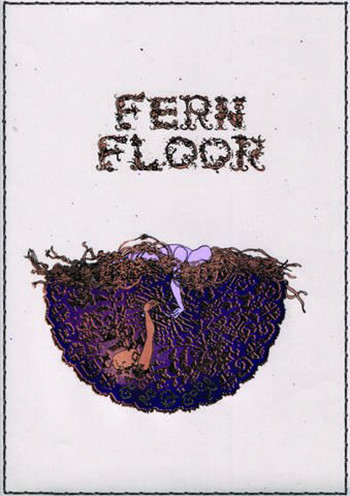

artist: **Fern Floor** release: _Elder_ format: MC year of release: 2012 label: [Fort Evil Fruit](http://fortevilfruit.blogspot.nl/) duration: 29:54

In this year's range of impressive debuts I certainly want to mention this tape album by Irish sextet **Fern Floor**. Over six tracks and almost thirty minutes they reveal that they've been able to grow quite a few good prog folk songs with a wide range of influences.

The three main vocalists each lead two of the tracks, and this opens up a great deal of variation and shift of perspective for _Elder_. The opening tracks on each side are by **Andrew Cunningham**, starting with the very groovy and rhythm-driven "Anchors", a powerful and insistent song that also stresses the heaviness the band attains at times. The shortish "Cartoon Moon" is a bit lighter in mood, but features a similar elaborate groove by bassist **Fergal O'Reilly** and drummer **Ray Keenaghan**. The **Andrew Fox** tracks are sadder and darker, particularly the melancholic "Anneleis". The last tracks on each side are sung by **Emer Brady** with her lovely jazzy voice. "Let Lie" is a nice quirky affair, but the real weight is on "Head of Gas, Heart of Oil", a dark long piece on oceanic pollution. Finally, I shouldn't neglect to mention **Ian Lynch**, who subtly adds whistles, pipes, and keys throughout the album.

Though there are certainly some elements on _Elder_ that give away that we're dealing with first underground release - though clear, there's something light and unpolished about the production; not all vocal parts are equally strong - it's clear that Ireland has another excellent folk group in its scene, and one that doesn't shy away from influences spanning many decades. There's sixties and seventies folk, of course, prog rock, and even a touch of metal in some melodies, perhaps. Not all that unlikely a combination if you have band members tied to **Wreck of the Hesperus** and **United Bible Studies**, among others. Regardless, a very good - and furthermore, promising - debut tape on the quickly growing **Fort Evil Fruit** label.

Reviewed by **O.S.**

Tracklist:

1\. Anchors (5:02) 2. Anneleis (5:54) 3. Let Lie (4:29)

4\. Cartoon Moon (2:59) 5. Tightrope (4:03) 6. Head of Gas, Heart of Oil (7:27)
