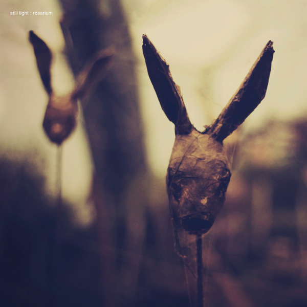

artist: **Still Light** release: _Rosarium_ format: 2LP, CD year of release: 2012 label: [tonefloat](http://www.crazy-diamond.nl/tonefloat) duration: 47:06

detailed info: [discogs.com](http://www.discogs.com/Still-Light-Rosarium/release/3944200)

The rust of autumn needs a soundtrack, and **Still Light'**s second album is one of this year's best candidates. **Kirill Nikolai'**s progressive folk project is up to steam again, three years after the immediately excellent début record [_Lything_](http://www.eveningoflight.nl/2011/01/19/review-still-light-lything-2009/ "Review: Still Light – Lything (2009)"). The metaphor may be ill-chosen, though: _Rosarium_ ambles through the countryside at a ponderous pace, and steam power is far frown my mind when listening to this record, unless it is the power of a train gently but cruelly taking you away from a lover to an unknown destination.

Although soft electric guitar melodies and fragile, almost whimper-spoken vocals form the prominent heart of Nikolai's music, a lot of the strength of _Rosarium_ lies in the subtle additions: fuzzy spells of synth and organ, backing vocals, gentle percussion, touches of strings... The influence of sixties and seventies prog experimentation - the calmer variety, that is: more "Grantchester Meadows" than "Astronomy Domine" - can be felt clearly, especially when Nikolai indulges in a misty instrumental drone like "Processional pt. II".

The richness of the instrumentation, also thanks to the guest contributors, and the warmth of the production add much to this album's value, which unfortunately is a tad light when it comes to composition. Lots of bittersweet waltzing with the falling leaves, but few surprises apart from an occasional new voice, or an instrumental bit where the intricate sound design shines forth. Despite this lightness, _Rosarium_ is convincing, a melancholic journey that pulls you in, not in the least at the very end of the final track, where softly fading acoustic guitar, organ, and cello disappear into the autumn waters.

A perfect album for the season, then, and a lovely space to get lost in for a while. The collector in you can rejoice as well, because this is another one of those lavish **tonefloat** releases, especially the limited double LP on 45 rpm, which comes with a CD copy as well. Finally, there's a triptych of videos to promote this album online at the dedicated site [http://www.soletwistedheir.com](http://www.soletwistedheir.com); here's one of them to tease you:

\[vimeo 48804461\]

Reviewed by **O.S.**

Tracklist:

1\. Bough (9:16) 2. A Thing Buried (2:35) 3. The Cross of Snow (6:36) 4. Two Sisters (9:13) 5. Processional Pt. I (5:48) 6. Processional Pt. II (5:25) 7. Rosary (8:13)
