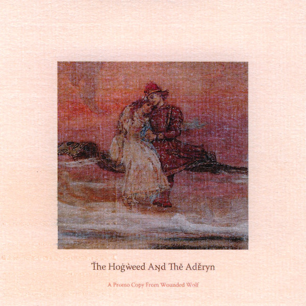
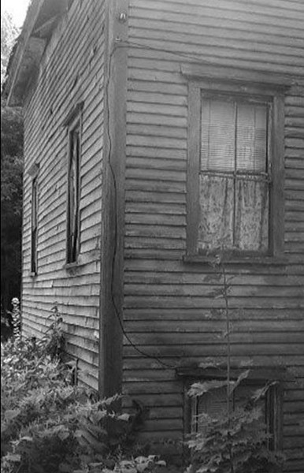

\[caption id="attachment\_3708" align="alignright" width="91"\] EP#2\[/caption\]

**Almeeva** - _EP#2_ \[[discogs](http://www.discogs.com/Almeeva-Ep2/master/475734)\]

Another cool little tape from **BLWBCK** records in France, this second EP by Almeeva (**Gregory Hoepffner**) holds a little over twenty minutes of excellent road music, halfway between dance and rock. Reminiscent of bands like **Maserati**, these tracks unavoidably make you feel like you're speeding along a boulevard. A dry electronic beat, bass, and delayed snatches of guitar melody construct that atmosphere meticulously.

All of the tracks are short and sweet, not too heavy on the ears, although at some points, especially in the excellent "Flares", Hoepffner dares to dive into some darker, slower moods. This isn't a very weighty or innovative release, but as a fair-priced tape + digital release, it offers some excellent nighttime music, whether you're in your car, or just driving on your sofa.

\[caption id="attachment\_3805" align="alignright" width="150"\] The Hogweed and The Aderyn, promotional cover\[/caption\]

_**The Hogweed and The Aderyn**_ \[[label](http://woundedwolf.wordpress.com/2012/08/25/the-hogweed-and-the-aderyn/)\]

From the studio of Turkish label **Wounded Wolf Press** comes a new EP of experimental folk with influences from all over the world. The duo of **Atay İlgün** and **Gözde Omay** combine a selection of folk instruments - stringed, flutes, percussion, metallophones - with compositions that take as many cues from middle eastern and asian music as from psych folk.

The four tracks on this self-titled release make the most of that unique combination, with shifting moods, and a pleasant atmosphere with touches of mystery. A good comparison would be **Sand Snowman**, with a similar eclectic set of inspirations, as well as dreamy female vocals.

Excellent stuff, but somewhat short. I really hope the duo will  come up with a full-length album soon - in a similar lovely handmade release - to work out their promising concepts on a larger scale.

\[caption id="attachment\_3813" align="alignright" width="97"\] This Is a Death Dream\[/caption\]

**Naythen Wilson** - _This Is a Death Dream_ \[[discogs](http://www.discogs.com/Naythen-Wilson-This-Is-A-Death-Dream/master/478801)\]

One  spontaneous singer/songwriter with a humongous discography covering another: this is Naythen Wilson doing **Jandek**. Perhaps surprisingly so, a comparison reveals that Wilson remains relatively faithful to the original versions of these songs. Surprising, because they vary widely in tone and composition. Most prominent is a dark kind of bluesy folk, with lots of ringing chords and lack of harmony, but we also find a funny track like "Janky", spiritual chants on "Om" or some heavier experimental rock elements in "Ghost Town by the Sea" and "Ace of Diamonds". The digital-only bonus track "Worthless Recluse" is a spoken word piece lasting twelve minutes - again like the original.

If anything, Wilson makes these disparate songs a tad more musical, but just barely so, staying true to the improvised and quirky nature of Jandek's music. This tape, put out on Ireland's **Fort Evil Fruit,** is certainly recommend if you're looking for about an hour of surprising and varied outsider folk.
