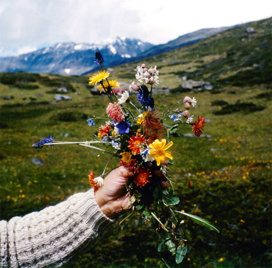

artist: **The Cloisters** release: _The Cloisters_ format: CD + CD-R year of release: 2012 label: [Second Language](http://www.secondlanguagemusic.com/) duration: 41:41, 34:23

detailed info: [discogs.com](http://www.discogs.com/Cloisters-Cloisters-The/release/4000273)

By now I think we can safely enshrine **Michael Tanner** in the hall of fame of composers who... — well, I still have difficulties describing this movement, if indeed it is one, but I would say that it is characterised by a modern or forward-looking combination of instrumental (mostly acoustic) music with electronic recording and editing techniques, field recordings, and sampling. At the same time, rather than running with the obvious theme of futuristic urban music, these composers look backward and inward, to a partly real, partly imagined historical landscape.

In Tanner's case, we are often dealing with Britain, its past, its green lands, its songs, and its ghosts. What makes his music so poignant is that he approaches these themes using the abovementioned idiom, giving a new and urgent  emotional energy to what might otherwise be a bland nostalgia. This was readily apparent in Tanner's work as **Plinth**, and collaborations such as **The A. Lords** and **Taskerlands**, but I found it rarely as strong as on this, his first album under the name **The Cloisters**. For this debut on **Second Language Music**, he is joined by other excellent musicians **Aaron Martin** (cello), **Áine O'Dwyer** (harp), **Daniel Merrill** (viola), and **Hanna Tuulikki** (harmonium).

The beautiful tracks on this untitled album have a musical language that is not easy to decipher. The individual elements — drawn out organ drones, layered strings, rolling harp and piano melodies, ghostly snatches of old choral voices, animals, etc. — are perhaps easy enough to place. The total narrative, however, is elusive and quite novel. It tends partly towards a known soundscaping approach, but always with a strong melodic underpinning. First and foremost, Tanner displays the power to write a story in music, and any translation is bound to be vague and impressionistic at best. It becomes all the more clear that music can indeed be a _second language_. We have to approach what it says directly, even though we will always risk missing part of the story it holds.

If there is an imagined story to go along with _The Cloisters_, mine would be that of an extended journey by foot through verdant hills and dark moorlands, with rippling brooks ("The Lock Keeper"!) rain clouds, and sudden streams of light. Perhaps there is a person along the way, a home, or maybe only ghosts and ruins. Some additional glimpses of the story can be found on the second disc of this set, available only to label subscribers. _Little Summer_ and _[Little Winter](http://www.eveningoflight.nl/2011/12/25/review-the-cloisters-little-winter-2011/ "Review: The Cloisters – Little Winter (2011)")_ are EPs, the latter of which graced my solstice weeks a year ago with its haunting snowy songs. _Little Summer_ is a bit closer to _The Cloisters_, particularly the first track which remixes parts of "Riverchrist", but also the other two tracks, beautiful as they are in their string-heavy melancholy.

So yes, this is another one of those albums at the heart of that as yet unnamed and ephemeral movement. Landscape music from the 21st century, but deeply informed by what came before. Second Language subscribers will get the loveliest package — not just the main album in its lovely packaging with photographs, but also the bonus CD-R. For label outsiders, you can still order separate copies from the label, and you might be able to procure the EPs through other channels. _Little Winter_ is still [available as a digital release](http://iamplinth.bandcamp.com/album/little-winter), and perhaps _Little Summer_ will be as well at some point. Whichever way, do seek all of them out.

http://youtu.be/qGW6Pn2k894

Reviewed by **O.S.**

Tracklist:

_The Cloisters:_

1\. Riverchrist (17:20) 2. The Lock Keeper (2:25) 3. Freohyll Nocturne / Hymn (15:29) 4. A Pelagic Recital (6:27)

_Little Summer / Little Winter:_

1\. Gwillim Grave (5:02) 2. 'Neath Kerne Bridge (3:58) 3. Pwyll-y-Wrach (5:52)

4\. Sorgen (10:02) 5. Hvislyse (6:03) 6. Pesta Komm (3:26)
