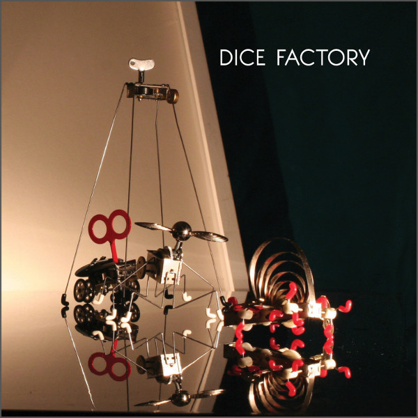

artist: **Dice Factory** release: _Dice Factory_ format: CD year of release: 2012 label: [Babel](http://babel-label.bandcamp.com/) duration: 54:49

detailed info: [discogs.com](http://www.discogs.com/Dice-Factory-Dice-Factory/release/4045178)

Though it's a slight stylistic sidetrack from what I usually serve up here, I don't want to withhold this jazz album from you. London's new quartet **Dice Factory** have just released a self-titled debut album and it's a bullseye, twisting a jam and improv-based approach to a set of surprisingly tight tracks.

The line-up is a mite traditional perhaps (drums: **Jon Scott,** piano: **George Fogel**, bass: **Tom Farmer,** tenor sax: **Tom Challenger**), but the compositions betray a broad range of influences from all sorts of experimental areas, as well as rock and funk. Farmer's bass is the most steady factor on the album, aligning with either the drums or the piano to provide a rhythmic base, though this sounds much more boring than it is. With the sometimes abrupt tempo and meter changes going on, rhythm is one of the exciting factors here, as it should be. Challenger's sax is more ephemeral and free-ranging, often providing the main melody, or counterpoints to Fogel's piano.

While _Dice Factory_ has its calmer moments, the band isn't afraid to step up the tempo and/or add a little chaos at times. In fact, finding structure in chaos was one of the conceptual points of departure for the band, according to Challenger. What makes the result so successful is that they maintain a strong hold on the overall structure. The tracks never descend into so much seemingly random noodling that free jazz is sometimes dismissed for; rather, there's a perfect balance between rhythmic and harmonic exploration and the central direction of a track. Some parts, like "Saribund" and "You're Lucky" are really funky with some very tight rhythm sections that tug at your mind. And the ending part of "T.N.G" with its ever-deepening chord progression is just beautiful, plain and simple. It's as if the band was afraid to end the album on such a warm and harmonious note that they decided to throw a jumpy forty-one second coda after it.

So, a nice surprise to find this album in my mailbox. Although the overall sound and production is perhaps a bit traditional and polished – a bit more grit and dirt wouldn't have done any harm – Dice Factory have an excellent sense of direction and a firm grip on a balance between composition and improvisation. The engineering of chaos suggested by the band's name is clearly audible throughout and proves to be an approach that pays off greatly when done right, as these men have.

Reviewed by **O.S.**

Tracklist:

1\. Heyu Nantucket (7:56) 2. Gooch (5:47) 3. Saribund (4:32) 4. You're Lucky (5:42) 5. Eternal Sleep (6:00) 6. Zout (3:58) 7. Eternal Moment (5:35) 8. Pipes (5:37) 9. T.N.G (9:01) 10. Saribund (Coda) (0:41)
