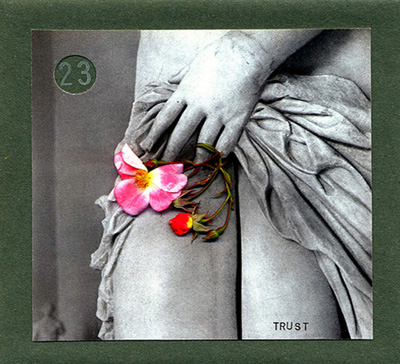

artist: **Various** release: _Trust_ format: CD year of release: 2012 label: [Time Released Sound](http://timereleasedsound.com/) duration: 69:12

detailed info: [discogs.com](http://www.discogs.com/Various-Trust/release/3946608)

Compilations are strange things. Often they're a promotional tool, an archival effort, or an attempt to chart the essence of a musical current by casting a wide net. From time to time, though, you find compilations that somehow function more like a regular album, a tightly knit whole with a clear vision that just happens to comprise the works of different artists. _Trust_, put out in a highly limited edition by **Time Released Sound**, is such a piece.

The album is an ambient journey through a rather dreamlike landscape, empty, abandoned, dotted with ruins and patches of flowers. There is something soft and pastel-tinted about it all, warm at times, chilly at others, but the atmosphere is never complacent or too easy-going.

Relying heavily on the electro-acoustic approach that has been gaining ground in ambient music for quite a while, the artists here generally combine melodies on e.g. piano, strings, and bells with subtle manipulations, field recordings, and electronic effects to achieve that grainy, organic texture that I personally find very attractive. Some impressions: piano is quite prominent in the first two tracks, though the opener by **The Frozen Vaults** is more threatening, while **David Newlyn**’s piece is gentle and a tad wistful. An ear-catching track is **Rudi Arapahoe**’s twinning of bass-heavy treated piano with an ethereal female voice. **Wil Bolton**’s "Persimmon" is a wonderfully sweet and calm piece of layered guitar strummings. Most of the second half of the album runs together in terms of sound, and my attention tends to drift a little, though certainly not in a bad way. You really get into the flow of the album by this point. It's good to see _Cloud Atlas_’ **Sonmi451** get into music, by the way, and her lovely relaxing metallophone track "Helder" is about what you'd expect from a neuro-programmed servant clone from the future. Finally, **Richard Moult**’s track opens up startlingly dramatic compared to the flow of the preceding tracks, with its pairing of Moult's trademark piano melodies and an unconventional bowed string instrument drifting over it. Soon, however, the piano goes mostly solo and we drift off to the end on its melancholic meanderings.

Altogether, _Trust_ proves that a well-curated compilation can be just as much of a coherent exercise in style as a regular album. While the particular style of this album builds on innovations from the past years, and doesn't tread much new ground, it's still a very enjoyable work with a strong sense of atmosphere and vision, a lovely place to get lost in for an hour. And another one. Et cetera. It's doubtful whether any copies of this are still to be had, and if there aren't, let this serve as a reminder to keep an eye on Time Released Sound for future 'compilations'.

Reviewed by **O.S.**

Tracklist:

1\. **The Frozen Vaults** - Cloak of Lingering Fog (3:02) 2. **David Newlyn** - Strange the Things I Remember (6:44) 3. **Strie** - Pomsta Jelenov (5:08) 4. **Rudi Arapahoe** - Double Bind (4:49) 5. **Thomas Bel** - The Late Evening Hours (5:48) 6. **Wil Bolton** - Persimmon (7:21) 7. **The Humble Bee** - It's Good to Bee Wrong (6:19) 8. **Antonymes** - Time Reversed (5:14) 9. **Sonmi451** - Helder (7:35) 10. **Maps and Diagrams** - The Icy Clasp of Loneliness (5:04) 11. **Fescal** - Morning in Burma (5:21) 12. **Richard Moult** - A Nameless Hill (6:46)
