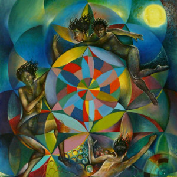

[Sand Snowman - The Celestial Banquet Mix](http://www.mixcloud.com/eveningoflight/sand-snowman-the-celestial-banquet-mix/?utm_source=widget&utm_medium=web&utm_campaign=base_links&utm_term=resource_link) by [Evening Of Light](http://www.mixcloud.com/eveningoflight/?utm_source=widget&utm_medium=web&utm_campaign=base_links&utm_term=profile_link) on [Mixcloud](http://www.mixcloud.com/?utm_source=widget&utm_medium=web&utm_campaign=base_links&utm_term=homepage_link)

A new instalment in our growing series of guest mixes is _The Celestial Banquet_, put together by **Sand Snowman**. He's been one of our 'resident artists' on Evening of Light ever since we reviewed his first album _[Moth Dream](http://www.eveningoflight.nl/2006/10/01/review-sand-snowman-moth-dream-2006/ "Review: Sand Snowman – Moth Dream (2006)")_, all the way back in our first month of existence, October 2006.

Since then, Sand has released a number of albums, constantly refining and improving his style of dreamy psychedelic folk. His last two albums on Dutch label **tonefloat** – _[Two Way Mirror](http://www.eveningoflight.nl/2009/02/01/review-sand-snowman-two-way-mirror-2009/ "Review: Sand Snowman – Two Way Mirror (2009)")_ and [_The World's Not Worth It_](http://www.eveningoflight.nl/2011/11/21/review-sand-snowman-the-worlds-not-worth-it-2011/ "Review: Sand Snowman – The World’s Not Worth It (2011)") – were both masterpieces. We also did an [interview](http://www.eveningoflight.nl/2009/03/11/interview-sand-snowman/ "Interview: Sand Snowman") with him a few years ago, which is recommended if you want to know more about the history of the project and Sand's paintings and inspirations.

This year, it's been a bit quieter around this project, but this mix in which Sand shares some of his musical inspirations with us will hopefully lighten the wait for his next album.

Artwork: **Sand Snowman** \- _The Wheel of Fortune_ (detail) (2012)

Tracklist:

**Giacinto Scelsi** - Aion I **Kate Bush** - Hello Earth **David Bowie** - Neuköln **Japan** - The Tenant **John Barry** - Walkabout **Cul de Sac** - Bellevue Bridge **Cocteau Twins** - Otterly **Mr. Bungle** - The Holy Filament **Maurice Ravel** - The Gallows **Olivier Messiaen** - The Celestial Banquet **Miles Davis** - Orange Lady **Cam Newton** - Up The River **Mark Hollis** - Inside Looking Out **Alexander Scriabin** - Garlands **Ash Ra Tempel** - Liebe
