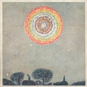

artist: **United Bible Studies** release: _I Am Providence_ format: LP year of release: 2012 label: [Jellyfant](http://www.jellyfant.com/) duration: 31:19

There is something distinctly _kvlt_ about what **United Bible Studies** have done on this most recent album: improvise music over [the actual grave](http://www.flickr.com/photos/strangeinterlude/40695488/) of **Howard Phillips Lovecraft** at Swan Point Cemetery in Providence, Rhode Island. We could nerd off about how awesome this is, and about how this 2008 US tour incarnation of the chimeric group captured the old master's cosmic horror spirit in music somehow. But frankly speaking, that's not what's going on here at all.

To me, Lovecraft's horror seems firmly based in a deep-seated fear of the irrational that lurks in all mankind, but projected onto the foreign, the primitive, and the alien in a way that I can only describe as xenophobic. The music of United Bible Studies is profoundly different, however. Rather than tapping into one writer's creative and paranoid spirit, it feels as if they've opened up all the graves at Swan Point, not in the least afraid of having a bit of a weird, dejected Halloween with the New England ghosts. Eerie voices like some strange corruption of choral singing form much of the intangible substance on _I Am Providence_, with banjo, organ, and strings rounding out the sound in some of the tracks.

I can almost see the band sitting there, on a windy night, spirits of the deceased moaning softly about their heads, in the eye of a gentle storm of revenants. It's way more melancholic and liminal than it is terrifying, spiritual more than horrific. The album also builds upon the band's own past, in a good way. The short re-enactment of "Tributaries of the Styx" takes us back to 2006's [_The Shore That Fears the Sea_](http://www.eveningoflight.nl/2006/10/01/review-united-bible-studies-the-shore-that-fears-the-sea-2006/ "Review: United Bible Studies – The Shore That Fears The Sea (2006)"), while the gorgeous vocal layerings remind me of the same year's "Spoon of Haar" on _[The Northern Lights and The Northern Dark](http://www.eveningoflight.nl/2006/11/01/review-united-bible-studies-the-northern-lights-and-the-northern-dark-2006/ "Review: United Bible Studies – The Northern Lights and The Northern Dark (2006)")._ This one, however, is easily one of the most powerful albums the band has ever produced, focused and urgent in its sound.

This is ritual, improvised and real, channelling folk and religious themes like so much intaken breath, and spitting it out in half an hour of ghost music that bridges the boundaries between this world and the next. Phenomenal and essential.

Reviewed by **O.S.**

Tracklist:

1\. I Am Providence Pt. 1 (7:45) 2. Chthonic Spiral (5:14) 3. Tributaries of the Styx under Providence (2:50)

4\. Swan Point Petrichor (4:44) 5. Grave Trudge (3:27) 6. I Am Providence Pt. 2 (7:19)
