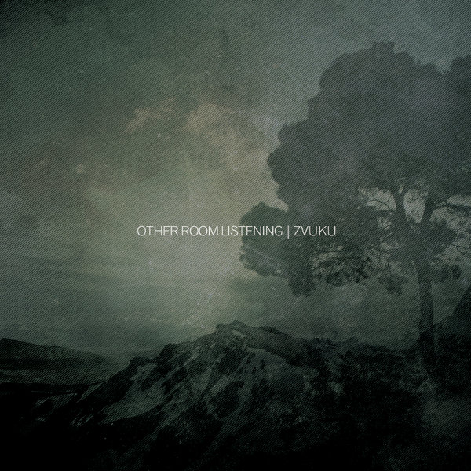

\[caption id="attachment\_4034" align="aligncenter" width="150"\] Art by Kozue Oshima\[/caption\]

Hey friends, guess what? We spun through the multiverse a bit, and another year has flown by. Thankfully we've been able to keep everything running pretty much as usual here at Evening of Light. No release from us this year, but we're working to make something nice of our upcoming fourth release by **Far Black Furlong** in 2013. Again, we'd like to thank all the artists and labels for thinking of us again this year. Music is a huge part of what keeps us going in our lives!

First of all, here are our ten favourite records of 2012 (so far), ordered alphabetically:

**Bvdub**  - _Serenity_ (Darla) \[[Our Review](http://www.eveningoflight.nl/2012/12/26/review-bvdub-serenity-2012/ "Review: Bvdub – Serenity (2012)")\]

The year was almost over, but we were just in time when we started thinking "what did **Brock Van Wey** do this year?". Well, among other things, he released this masterpiece of trance-influenced chillout ambient. Nostalgic, sure, but nostalgia is rarely better than this.

~

**The Cloisters** \- _The Cloisters_ (Second Language) \[[Our Review](http://www.eveningoflight.nl/2012/11/04/review-the-cloisters-2012/ "Review: The Cloisters (2012)")\]

**Michael Tanner** was dubbed ambient artist of the year by _[A Closer Listen](http://acloserlisten.com/2012/12/17/acl-2012-top-ten-ambient/)_, so who are we to disagree? Of his solo compositions this year, _The Cloisters_ went deepest. Ambient indeed, but acoustic, organic, warm, cold. We called it "Landscape music for the 21st century". We suppose that's about right.

~

**DVA** - _Botanicula_ (Minority) \[[label](http://www.minorityrecords.com/store/)\]

It's a game soundtrack, it's happy and childlike. What's it doing here? I don't know... maybe it's here because it's so charming that it might be the most played album in our household this year. Czech duo DVA and their folk and vocal-based experiments not only made an excellent soundtrack, perfectly tailored to the game, it's strong enough to stand on its own as a strange, happy thing.

~

**Richard Moult** \- _Yclypt_ (Second Language) \[[Our Review](http://www.eveningoflight.nl/2012/10/03/review-richard-moult-yclypt-2012/ "Review: Richard Moult – Yclypt (2012)")\]

Continuing in the footsteps of last year's _[Celestial King for a Year](http://www.eveningoflight.nl/2011/08/05/review-richard-moult-celestial-king-for-a-year-2011/ "Review: Richard Moult – Celestial King for a Year (2011)")_, _Yclypt_ sees Moult composing for string quintet, putting his own piano playing aside for a moment. The immensely beautiful compositions on this new album move from romanticism through baroque to end up in modern droning territory. Sad and masterful.

~

**Rain Drinkers** - _Yesodic Helices_ (Brave Mysteries) \[[Our Review](http://www.eveningoflight.nl/2012/03/15/review-rain-drinkers-yesodic-helices-2012/ "Review: Rain Drinkers – Yesodic Helices (2012)")\]

_Springtide_ made it to [last year's top 10](http://www.eveningoflight.nl/2011/12/31/2011-a-retrospective/ "2011: A Retrospective"), and since _Yesodic Helices_ is an equally impressive piece of music like only Rain Drinkers makes it, we had to include it. Ambient, folk, cinematic music, strong rhythmic buildups, it all comes together here on Schafer & Taylor's latest LP.

~

**Songs of Green Pheasant** - _Soft Wounds_ (Rusted Rail) \[[Our Review](http://www.eveningoflight.nl/2012/02/18/review-songs-of-green-pheasant-soft-wounds-2012/ "Review: Songs of Green Pheasant – Soft Wounds (2012)")\]

A new discovery for us, this project of **Duncan Sumpner**, but we instantly fell in love with his laid back indie folk. Definitely not a record that immediately wows you, but we've been listening to it all year, and boy has it stuck.

~

**Taskerlands** \- _Taskerlands_ (Time Released Sound) \[[Our Review](http://www.eveningoflight.nl/2012/04/24/review-taskerlands-2012/ "Review: Taskerlands (2012)")\]

Who else but **Michael Tanner** and **David Colohan** (and guests) could pull off this magical two track album of submerged pastoral improv music? Twin guitar meanderings, backed with piano and bass clarinet, explore the borders between folk, ambient, and jazz.

~

**Troum** \- _Grote Mandrenke_ (Beta-lactam Ring) \[[Our Review](http://www.eveningoflight.nl/2012/08/30/review-troum-grote-mandrenke-2012/ "Review: Troum – Grote Mandrenke (2012)")\]

Leave it to the two experienced dronemeisters of Troum to create one massive track that awesomely captures the gruesomeness _and_ the calm of a great mediaeval European flood. An intense journey of rhythms and waves.

~

**United Bible Studies** \- _I Am Providence_ (Jellyfant) \[[Our Review](http://www.eveningoflight.nl/2012/12/16/review-united-bible-studies-i-am-providence-2012/ "Review: United Bible Studies – I Am Providence (2012)")\]

The students went to America to tour it up but found time to improvise over Lovecraft's grave. The result, surprisingly, wasn't that horrific, but we're pretty sure all sorts of spirits were involved in this marvellous half hour of vocal experiments and freefolk. (**Michael Tanner** and **Richard Moult** _might_ also be on this record.)

~

**Zvuku** \- _Other Room Listening_ (Futuresequence) \[[Our Review](http://www.eveningoflight.nl/2012/05/01/review-zvuku-other-room-listening-2012/ "Review: Zvuku – Other Room Listening (2012)")\]

Irish ambient project Zvuku took us by surprise this year, first with two excellent tracks on the _SEQUENCE_ compilations, and quickly after that with this debut album. _Other Room Listening_ is a delicate and well-wrought work of melancholic ambient and acoustic melodies.

And here's 'the best of the rest', albums we enjoyed greatly but that didn't make the final cut:

- **Cedar Spirits** \- _Cedar Spirits_ (Glass Throat) \[[Our Review](http://www.eveningoflight.nl/2012/12/15/review-cedar-spirits-2012/ "Review: Cedar Spirits (2012)")\]: The merging of the crew of two northwest American labels results in a sincere ritual folk album that just breathes the natural environment and these people's love for it.
- **Circulation of Light** - _Acheiropoieta_ (Brave Mysteries) \[[Our Review](http://www.eveningoflight.nl/2012/10/16/review-circulation-of-light-acheiropoieta-2012/ "Review: Circulation of Light – Acheiropoieta (2012)")\]: **Nathaniel Ritter**’s solo project grows into its own with this CD where obscure keyboard melodies, drones, and ritual vocals flow together into something unique. Experimental with a few classical influences, and (yet) more proof of the hidden talents in the **Brave Mysteries** cabal.
- **Dice Factory** - _Dice Factory_ (Babel) \[[Our Review](http://www.eveningoflight.nl/2012/11/20/review-dice-factory-2012/ "Review: Dice Factory (2012)")\]: This free jazz quartet from London dropped a terrific debut album of extremely tight songs that create structure from apparent chaos.
- **The Driftwood Manor** - _Dominican Black Abbey_ (Rusted Rail) \[[Our Review](http://www.eveningoflight.nl/2012/09/30/review-the-driftwood-manor-dominican-black-abbey-2012/ "Review: The Driftwood Manor – Dominican Black Abbey (2012)")\]: **Eddie Keenan** and his band keeps doing mostly EPs, but if they're all as good as this one, we're not complaining. Still one of Ireland's premier modern folk groups, with rock-solid songwriting and lyrics.
- **East of Oceans** - _Symbol #6_ (Auxiliary): East of Oceans is **Brock Van Wey**'s more dancey moniker, and the full length album _121 Days_ was rather nice. This one takes the cake though, two 10″ sides of mightily catchy and ethereal breakbeat.
- **Eitarnora** - _Murmurations_ (Brave Mysteries) \[[Our Review](http://www.eveningoflight.nl/2012/09/20/review-eitarnora-murmurations-2012/ "Review: Eitarnora – Murmurations (2012)")\]: Not much going on in the realm of neofolk, but Eitarnora (**Jon Rosenthal** and **Val Dorr**) surprised us with their more improvised and classical guitar-based approach. Rough, but oh so promising.
- **EUS**, **Postdrome** & **Saåad** - _Sustained Layers_ (BLWBCK) \[[Our Review](http://www.eveningoflight.nl/2012/06/21/review-eus-postdrome-saaad-sustained-layers-2012/ "Review: EUS, Postdrome & Saåad – Sustained Layers (2012)")\]: This three way transnational collaboration resulted in an excellent album of dark ambient and drones. That's all we got to say about that.
- **Evan Caminiti** - _Night Dust_ (Immune): One half of **Barn Owl** solo here, and it's a lovely affair of wispy guitars and synths, ghostlike and nocturnal. A grainy and foggy release that sounds perfectly in the right place on tape.
- **The Gray Field Recordings** - _Nature Desires Nature_ (Reverb Worship) \[[Our Review](http://www.eveningoflight.nl/2012/05/09/review-the-gray-field-recordings-nature-desires-nature-2012/ "Review: The Gray Field Recordings – Nature Desires Nature (2012)")\]: Though not as awesome as _The Weaver's Daughter_, which would have been in our 2009 best of the year list, had we had one back then, this latest album by **R. Loftiss** and consorts continues her singular style where experimental folk and electronics meet in a dark and spectral place.
- **Jon DeRosa** - _A Wolf In Preacher’s Clothes_ (Mother West) \[[Our Review](http://www.eveningoflight.nl/2012/05/24/review-jon-derosa-a-wolf-in-preachers-clothes-2012/ "Review: Jon DeRosa – A Wolf in Preacher’s Clothes (2012)")\]: No **Aarktica** this year either as DeRosa continues on his solo path. He dusted off his shirt and waistcoat and went and crooned for us with a suitably old-timey backing band. With a few modern and experimental touches, the result was nostalgic and refreshing at the same time.
- **Jon Porras** - _Black Mesa_ (Thrill Jockey): The other half of **Barn Owl** had an equally impressive solo album this year. Porras cultivates more of a desert feel than Caminiti, but his drifting compositions are equally lush and calming.
- **Kinit Her** - _Storm of Radiance_ (Brave Mysteries / Pesanta Urfolk): This might be Schafer & Ritter's best album to date, a powerful blend of highly experimental folk with diverse influences. Obviously comparable to **Wreathes** (see below), but a tad less song-based.
- **Lost Harbours** - _Hymns & Ghosts_ (Liminal Noise) \[[Our Review](http://www.eveningoflight.nl/2012/08/08/review-lost-harbours-hymns-ghosts-2012/ "Review: Lost Harbours – Hymns & Ghosts (2012)")\]: Another lovely debut. This psychedelic folk duo delivered an ambitious first record, with two extensive folk-drone pieces, and some very delicate and sparse
- **Machinist** - _Convergence_ (Narrominded): Our friend **Zeno van den Broek** keeps outdoing himself, not only as a visual artist, but also in his soundscapes. _Convergence_ has both: [excellent cover art](http://www.narrominded.com/catalogue/nm061-machinist-convergence/) displaying one of his mixed media pieces, and music wedding minimal tone pieces to field recordings and drones.
- **Mendel Kaelen** - _The Tragedy That Drowned Itself_ (Sineszi) \[[Our Review](http://www.eveningoflight.nl/2012/10/25/review-mendel-kaelen-the-tragedy-that-drowned-itself-2012/ "Review: Mendel Kaelen – The Tragedy That Drowned Itself (2012)")\]: And another Dutch artist to be proud of! Kaelen's second album is centered around the musical and non-musical sounds he could coax out of  an indian harmonium. An excellent concept resulting in lovely drones and creaky sounds.
- **Plinth** - _Collected Machine Music_ (Time Released Sound): Hey look, it's **Michael Tanner**. Again. Half of this is material from a **Rusted Rail** 3″ from back in the days, though, so that's a good excuse not to put this one in the top 10 also. Apart from that, it's excellent: skilfully manipulated recordings off old music machines. Steamy bells and organs dominate on this quirky, incomparable release.
- **Premonition Factory** - _The Theory of Nothing_ (Longstreet) \[[Our Review](http://www.eveningoflight.nl/2012/12/28/review-premonition-factory-the-theory-of-nothing-2012/ "Review: Premonition Factory – The Theory of Nothing (2012)")\]: Not as impressive as _The Sense of Time_ from last year's top 10, but still very good. **Sjaak Overgaauw**'s third studio album is shorter and less bold, but betrays a subtle master's touch.
- **Still Light** - _Rosarium_ (Tonefloat) \[[Our Review](http://www.eveningoflight.nl/2012/10/29/review-still-light-rosarium-2012/ "Review: Still Light – Rosarium (2012)")\]: Still Light provided this year's autumn soundtrack with a beautiful psychedelic folk work with ambient influences.
- **Syven** - _Corpus Christi_ (Audiokratik) \[[Our Review](http://www.eveningoflight.nl/2013/01/15/review-syven-corpus-christi-2012/ "Review: Syven – Corpus Christi (2012)")\]: Much more focused than their debut album, _Corpus Christi_ sees **A. Tolonen** and **Andy** Koski-Semmens refine their bombastic neoclassical style with a concept album of Christian mysticism.
- **Swans** - _The Seer_ (Young God): Gira and his merry band made it to lots of top X lists this year, and that's cool. _The Seer_ is a pretty impressive album in some ways. Then again, some of y'all are acting like y'all never heard a Swans album before. This doesn't hold a candle to _Children of God_, or _Filth_, or _The Great Annihilator_, or _White Light from the Mouth of Infinity,_ or... well, you get the idea.
- **Time Moth Eye** - _Undeath_ (Crucial Blast) \[[Our Review](http://www.eveningoflight.nl/2012/08/28/review-time-moth-eye-undeath-2012/ "Review: Time Moth Eye – Undeath (2012)")\]: **Timothy Renner** lets go of much of his **Stone Breath** folk style for this long album, an impressive and thoroughly dark tour of drones, voices, and sparse melodies.
- **Troy Schafer** - _Evening Song Awaken_ (Recital) \[[Our Review](http://www.eveningoflight.nl/2012/03/30/review-troy-schafer-evening-song-awaken-2012/ "Review: Troy Schafer – Evening Song Awaken (2012)")\]: **Richard Moult** wasn't the only one to release an impressive string album this year: Schafer's solo violin efforts are daring, beautiful, and thoroughly experimental. Classical and freefolk meet somewhere in his creative mind on this lovely album.
- **Witxes** - _Sorcery/Geography_ (Humanist) \[[Our Review](http://www.eveningoflight.nl/2012/06/25/review-witxes-sorcerygeography-2012/ "Review: Witxes – Sorcery/Geography (2012)")\]: This one _only just_ didn't make it to the top 10. **Maxime Vavasseur**'s project brings us dark ambient with touches of jazz that's hard to resist and sure to result in some more great albums like _Sorcery/Geography_.
- **Wreathes** - _Wreathes_ (Pesanta Urfolk / Brave Mysteries) \[[Our Review](http://www.eveningoflight.nl/2012/05/24/review-wreathes-2012/ "Review: Wreathes (2012)")\]: A bold record from Ritter and Schafer, neofolk done differently, with exceptionally strong rhythms, weird voices, and an atmosphere that's far beyond the usual themes of other artists.
