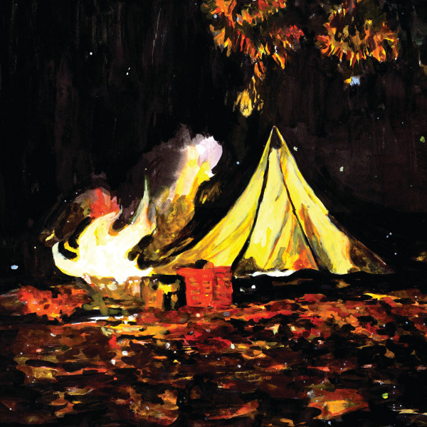

artist: **James Blackshaw** release: _Love Is the Plan, the Plan Is Death_ format: LP, CD year of release: 2012 label: [Important](http://www.importantrecords.com/) duration: 38:49

detailed info: [discogs.com](http://www.discogs.com/James-Blackshaw-Love-Is-The-PlanPlan-Is-Death/master/431673)

Sometimes you lose an artist out of sight for a while. This happened to me with **James Blackshaw**. After a period of listening, collecting, gig attending, I took a break from Blackshaw and his masterful long nails for the past two years, perhaps due to saturation of some kind. Maybe I was progressively less impressed by each album after _[The Cloud of Unknowing](http://www.eveningoflight.nl/2007/07/01/review-james-blackshaw-the-cloud-of-unknowing-2007/ "Review: James Blackshaw – The Cloud of Unknowing (2007)")_.

Whatever happened, with _Love Is the Plan, the Plan Is Death_, he's definitely got my attention again. And this from the album's first notes, because there is something different about the sound. Blackshaw's long and speedy instrumental compositions seemed inseparable from his steel 12-string guitar for many years, but the sound of a classical nylon 6-string on this album is unmistakable. Accordingly, the overall timbre of the music switches from bright, glorious, and ringing to something warmer and more intimate, as if Blackshaw wanted to evoke the campfire atmosphere of the (beautiful) album cover. He can't help being a virtuoso, of course, so there's nothing naïve or simple about the new approach, and the switch is more in terms of sound than in composition.

That said, there is a touch of the neofolky and European in some of the tracks, and a step away from both the raga-inspired early days, and the minimal music experiments that coursed through some of his recent works, though neither are wholly absent. It's more like Blackshaw moves towards a new synthesis. The opening track is extremely strong, with a few melancholic turns, and a lovely interplay between guitar and touches of organ, piano and marimba. As always, the feeling for rhythm and cadance is excellent in the guitar tracks, with the minuscule flows of the individual notes blending wonderfully with the accented beats. The biggest surprise is "And I Have Come Upon This Place by Lost Ways", though. Now, Blackshaw has used voice as a sporadic instrument before, but never has anyone really _sung_ on his albums. **Geneviève Beaulieau** of **Menace Ruine** does just that however, in a duet between his piano and her vocals. A big step in some ways from what he does solo, but it's a wonderful track, and less out of place than you'd at first expect.

As if to compensate for any shock there might have been, Blackshaw launches into "A Momentary Taste of Being" next, a gorgeous showcase of what his music has been about since the start: fingerpicked odes with a sort of spiritual beauty. Again that great pairing between guitar and organ, marimba, and some definite Celtic touches in the melody here and there. Simply wonderful. "We Who Stole the Dream" is darker, somewhat Spanish in sound, featuring a typical – for Blackshaw – slow-fast alternation. The short final track is another piano track, though without vocals this time. Here we can see his work with **Jozef van Wissem** and **Current 93** rubbing off in a minimalistic progression of chords, a vague and melancholic echo of the latter's "Whilst the Night Rejoices Profound and Still".

_Love Is the Plan_ is a great album, though you sometimes have to look for the coherence between tracks. That said, this has been the case for most of Blackshaw's albums. Where the true value lies, in my opinion, in that it adds at least two stunning tracks (the title track and the fourth, certainly) to the growing list of compositions that rank among my favourite tracks ever, like "Sunshrine", "Stained Glass Windows", "Past Has Not Passed", and "The Black Hourglass". We're not even two weeks into the new year, and I already regret missing this one for the 2012 retrospective. Oh well, we live and learn.

Reviewed by **O.S.**

Tracklist:

1\. Love Is the Plan, the Plan Is Death (8:02) 2. Her Smoke Rose Up Forever (7:07) 3. And I Have Come Upon This Place by Lost Ways (5:08) 4. A Momentary Taste of Being (5:25) 5. We Who Stole the Dream (7:18) 6. The Snows Are Melted, the Snows Are Gone (5:49)
