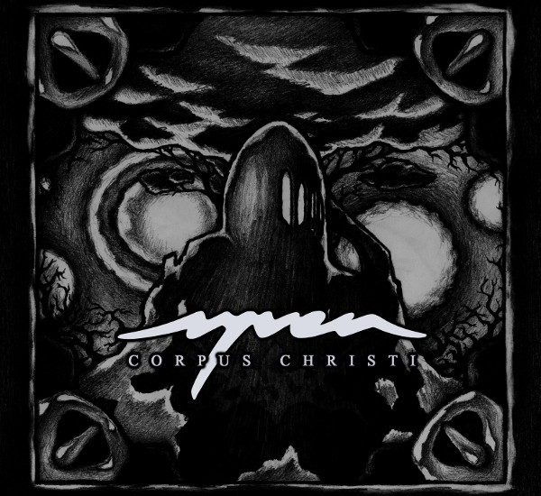

artist: **Syven** release: _Corpus Christi_ format: CD, Flash Drive year of release: 2012 label: [Audiokratik](http://koti.mbnet.fi/atolonen/audiokratik/audiokratik.php) duration: 35:04

detailed info: [discogs.com](http://www.discogs.com/Syven-Corpus-Christi/release/4084559)

2011's [_Aikantaite_](http://www.eveningoflight.nl/2012/01/31/review-syven-aikantaite-2011/ "Review: Syven – Aikantaite (2011)") was an impressive debut for Finland-based duo **Syven** and their unique folky neoclassicism. While this first album was sometimes hampered slightly by overpolished metal influences and a tendency towards long-windedness, it was a solid first effort nonetheless. It pales in comparison to _Corpus Christi_, though, which was one of my favourite surprises of last year.

How can a one-track, 35-minute concept album be less long-winded than five shorter individual tracks? Composition, of course! _Corpus Christi_ is set up in four distinct movements, and even within those pieces, there is a clear step away from repetitive, mantra-based compositions towards something that is more layered and gently evolving. The basic ingredients are still the same, though: **A. Tolonen’**s flowing kantele melodies and synth backings on the one hand, and **Andy Koski-Semmens’** classical bass voice on the other, along with some frame drum percussion.

The album's prelude introduces the slow-paced, deep synth atmosphere that permeates most of the album, and Koski-Semmens  fills the intro with a spectrum of dark, plaintive voices. As the piece gets going in earnest, a piano-like base joins in, along with kantele and drums, and we are treated to a ponderous rendition of the Middle English [_Corpus Christi Carol_](http://en.wikipedia.org/wiki/Corpus_Christi_Carol), which Syven arrange into a sweeping epic ballad.

As Jon Rosenthal over at _[The Inarguable](http://www.theinarguable.com/2012/12/the-music-of-templars-syvens-corpus.html)_ admirably shows, _Corpus Christi_ incorporates profound influences from different sacred music styles, such as the _organum_ music of the Templars, which is an excellent match for Koski-Semmens' lovely basso. The challenge with such influences – unless you're a reconstructionist – is always to see if you can meld them into modern music in an elegant way, and Syven have met that challenge admirably. The lines between mediaeval melodic composition techniques and influences from neofolk and nordic ritual music are almost imperceptible unless you know what to look for.

Moving on, there is a brief silence after "Corpus Christi", a moment of death before the "Renascentia", the most ethereal movement in which the bright, searching kantele melody punctuates the whispered and spoken word parts and airy chants. The album's last five minutes are reserved for a rendition of the _deep_ Templar chant "Crucem Sanctam Subiit", a massively impressive effort by Koski-Semmens, and a powerful closing note.

I can't praise _Corpus Christi_ enough. By skilfully melding different kinds of sacred and folk music, Syven somehow dissolve the distance not only between mediaeval and modern music, but also between the mediterranean and the nordic. It also opens up Christian mysticism in a way that highlights some of its more universal components, particularly when we come to the areas of music, blood, death, and rebirth. Masterfully crafted and polished to a sheen, _Corpus Christi_ is an album for seekers and dreamers.

Reviewed by **O.S.**

Tracklist:

1\. Corpus Christi (35:04) I Ploratio II Corpus Christi III Renascentia IV Crucem Sanctam Subiit

video: Corpus Christi
