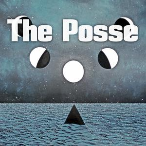

<iframe src="//www.mixcloud.com/widget/iframe/?feed=http%3A%2F%2Fwww.mixcloud.com%2Froamin%2Fthe-posse-003-aqua-vitae-aqua-mortis%2F&amp;embed_uuid=9c5aa2b6-9b62-4bc4-b283-6da092ac8cca&amp;stylecolor=59e4f8&amp;embed_type=widget_standard" height="600" width="600" frameborder="0"></iframe>

[The Posse 003 - Aqua Vitae, Aqua Mortis](http://www.mixcloud.com/roamin/the-posse-003-aqua-vitae-aqua-mortis/?utm_source=widget&utm_medium=web&utm_campaign=base_links&utm_term=resource_link) by [Roamin](http://www.mixcloud.com/roamin/?utm_source=widget&utm_medium=web&utm_campaign=base_links&utm_term=profile_link) on [Mixcloud](http://www.mixcloud.com/?utm_source=widget&utm_medium=web&utm_campaign=base_links&utm_term=homepage_link)

This cloudscape was put together as a back-and-forth collaboration by [Decadans](http://www.mixcloud.com/decadans/) and Evening of Light. Our concept was to put together something that leans quite heavily on depth and water, something that channels the magical and emotional forces of water. A lot of magic and ritual elements, sometimes ethereal, sometimes deep, sometimes a touch of fire.

Many thanks to [Roamin](http://www.mixcloud.com/roamin/) for hosting our cloudscape, and to [The Posse](http://www.mixcloud.com/groups/the-posse/) for fostering Mixcloud collaborations.

The complete tracklist:

**Silent Watcher of Dark Matter** - Haematoxylon **György Ligeti** - 2001, A Space Odyssey **Le Testament de la Lumière** - The Wind Tells Forgotten Times **Mylène Farmer** - l'Horloge (intro) **Wojciech Kilar** - The Ninth Gate (Corso) **Machinist** - BlackBlock III \[Sample:\] **Akira Kurosawa** - Rashômon **Clayton Alpha** - Something Strangely Familiar **Charles Baudelaire** - L'Horloge **Machinefabriek** - Stotterpiano **Rudi Arapahoe** - Double Bind \[Sample:\] **Ingmar Bergman** - Jungfrukällan **Northaunt** - The Fire **Nurse with Wound** - Lofoten Deadhead (excerpt) \[Field recordings\] **Lustmord** - Immersion **Banks Bailey, Darren Tate & Ian Holloway** - Summerland V **Aghast** - Totentanz **Rose Croix** - Rose Croix III **Sephiroth** - Dark Father \[Field recordings\] **Murai Kunihiko** - Zatoichi Main theme **Les Baxter** - The Pit and the Pendulum **Arktau Eos** - Sunken Luminaries **Raising Holy Sparks** - Crossing Kaew Neua Pass **URNA** - Rakshasa **Lee Jackson** - A Game of Chants **Elisha Morningstar** - Salerno **Edward Nikolay Artemyev** - Stalker
