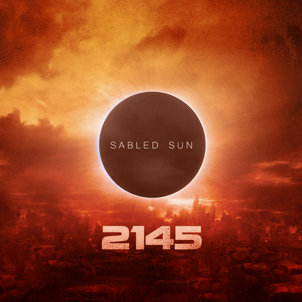
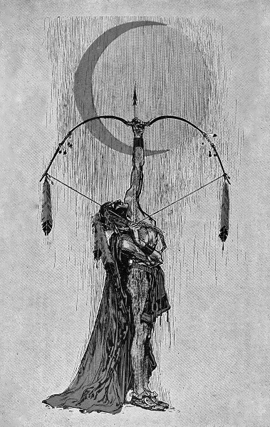
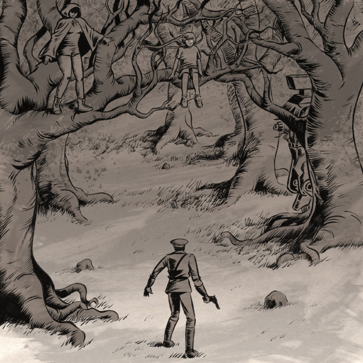

\[caption id="attachment\_4079" align="alignright" width="99"\] Black Light\[/caption\]

**Black Light** - _Black Light_ \[[label](http://www.bravemysteries.com)\]

Wisconsin-based, like their label **Brave Mysteries**, Black Light are one of the newer travellers on the neofolk path. Inspired by the European styles that went before, but with a touch of American outstretchedness to the sound. There's the usual combination of a guitar base and male and female voices, backed with a selection of percussion and auxiliary melodic instruments like glockenspiel.

The tracks are pretty traditional, loyal more to the neofolk lineage than anything folky beyond that, and the sound is very lo-fi. I'd be inclined to compare this album to [the earlier tape by labelmates **Eitarnora**](http://www.eveningoflight.nl/2012/09/20/review-eitarnora-murmurations-2012/ "Review: Eitarnora – Murmurations (2012)"), but Black Light pales a bit in comparison to the more free-roaming and progressive compositions of that duo.

_Black Light_ is pleasant enough to listen to, but there are a lot of rough edges that aren't yet compensated by any clarity of vision or unique style. Not a bad effort, but if the band wants to impress me, they've got some work to do before next time we meet.

\[caption id="attachment\_4083" align="alignright" width="95"\] Eschatology II\[/caption\]

**Burial Hex** - _Eschatology II_ \[[label](http://www.bravemysteries.com/)\]

Part two in what is to become a four-part "divinatory kit and cassette boxset", _Eschatology II_ continues the strong trend set with [the first tape](http://www.eveningoflight.nl/2011/10/31/october-2011-short-reviews/ "October 2011 Short Reviews (Alasdair Roberts, Burial Hex, Haiku Funeral, Voice of Eye)"). These are massive tracks in which **Clay Ruby** takes the time to explore his deep and heavy sounds.

The first track starts deceivingly calmly: a synth and organ movement based on a work by **Albéric Magnard.** Serene and uplifting like few other works by Burial Hex, and with the same gritty classical-meets-industrial elegance we hear in **Circulation of Light**. However, as the track progresses Ruby steadily drags us back into his darker realms. Don't be afraid — or do! — there is plenty of that lovely misty gothic dungeon sound here that is a perfect match for tape as a format. The B-side houses a lengthy remix of "The Tower". A slow but steady (not to mention incredibly heavy) beat dominates the majority of the track, along with thick drones and the occasional melodica brightness just peeking through. The best is at the end: five minutes of powerful rhythms.

With the first two tapes released, this 'Procession of Nightfall' set is turning into a marvellous work, and I eagerly await the final chapters.

\[caption id="attachment\_4074" align="alignright" width="150"\] Collision/Detection v7\[/caption\]

**The Doomed Bird of Providence** - _Collision/Detection v7_ \[[label](http://www.frontandfollow.com/)\]

I've become quite fond of the The Doomed Bird of Providence's nautical neofolk sound the past two years or so, so a new digital EP like this one is a treat. _Collision/Detection_ is an ongoing series, part of the [Long Division with Remainders](http://www.ldwr.net/) collaborative project, wherein different artists work with a few basic sound materials to create something new.

All four tracks here are instrumental, with accordion and fiddle as the prominent instruments, but quite some backing too. The first tracks are a delightful bittersweet, with the longer third track "Seabound" becoming more melancholy and drony towards the end. The final track, "The Wounded Platelayer", even turns towards deep industrial drones and crashing metal with soaring violins, a stylistic shift that works wonders. Like steampunk and seapunk rolled into one, but cool.

Three of the four tracks are set to vintage film material, which you can check out on the [official release page](http://www.ldwr.net/2012/12/v7-by-doomed-bird-of-providence.html). Ergo, it is mostly listenable online for free, but show The Doomed Bird some love as well while you're at it and buy this one.
