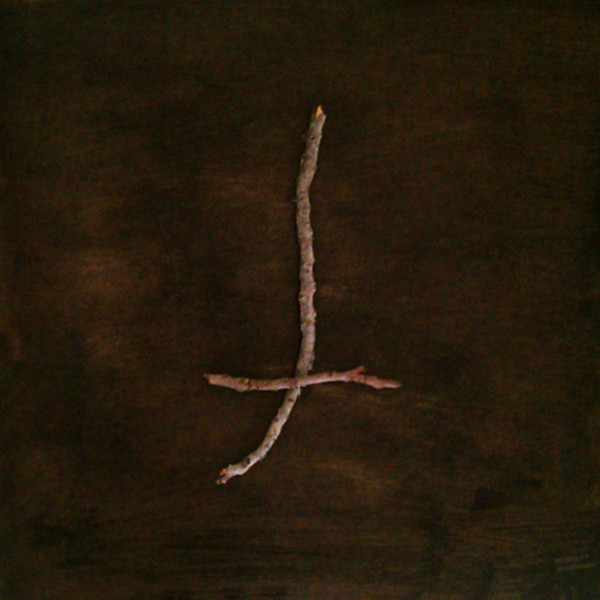

artist: **Clint Heidorn** release: _Atwater_ format: LP year of release: 2011 label: Ashes Ashes duration: 37:46

detailed info: [discogs.com](http://www.discogs.com/Clint-Heidorn-Atwater/release/3234736)

To say that American poetry, as opposed to European, is [more about landscape than history](http://www.guardian.co.uk/books/2013/feb/01/collected-poems-by-edward-dorn-review) is surely an exaggeration — certainly when we extend this idea to music. Obviously many native peoples have plenty of American history to draw on, and the descendants of European settlers have a few centuries of their own to look back to. Europe, conversely, doesn't ignore its landscape, as several recent releases covered here show ([_Taskerlands_](http://www.eveningoflight.nl/2012/04/24/review-taskerlands-2012/ "Review: Taskerlands (2012)"), [_The Cloisters_](http://www.eveningoflight.nl/2012/11/04/review-the-cloisters-2012/ "Review: The Cloisters (2012)")). That said, there _does_ appear to be a strong connection between the American landscape and its music. A recent reminder is **Clint Heidorn’**s _Atwater_ LP, a highly limited affair that at first sight looks like a black metal album.

But 'tis not so. If anywhere, _Atwater_ is best placed in the tradition of freefolk that takes its cues from American roots music and experimental rock, in this case with tinges of jazz and classical guitar as well. I take it Heidorn composed (and possibly improvised) the music, but he enlists the aid of numerous musicians to bring it all to life. Above all, this is an LP of sweet melancholic ambiances and well-placed sparseness and silence. Main melody-bearers are alternating acoustic and warm electric guitar, with prominent cameos for violin, mountain dulcimer (I think), and several others. Subtle percussion lines many moments as well, like a layer of crackling undergrowth.

The first movements are sad and contemplative, a few swells of intensity in the second, the third winding effortlessly from neofolk to some sparse desert rock sounds and back again, both interwoven. The jazzy undertones surface most prominently over the course of the fourth track, where a lovely saxophone lead rounds out the marvellous atmosphere of mystery. As the album moves forward, I get visions of the American land in all its diversity, moving from mountain and forest to canyon and desert, lake and river. And I'll be damned if Heidorn hasn't snuck in a bit of the urban with the industrial soundscapes of the first and last few minutes.

Throughout, Heidorn keeps his calm, making a gentle music that is, however, anything but complacent. It's just not filled with the sharp metal rage that the album's layout suggests. As it stands, it is a marvellous and nearly flawless album that is all too easy to put on repeat, a real treat that draws its energy from experimental folk and other (mostly American) genres, while sailing comfortably somewhere in the middle. The LP is a collector's item by now, but that's even more reason to pick up the dirt-cheap digital edition from Heidorn's [Bandcamp](http://clintheidorn.bandcamp.com/album/atwater).

Reviewed by **O.S.**

Tracklist:

1\. (1:27) 2. (3:49) 3. (3:55) 4. (5:08) 5. (2:55) 6. (6:51) 7. (3:02) 8. (3:13) 9. (7:26)
