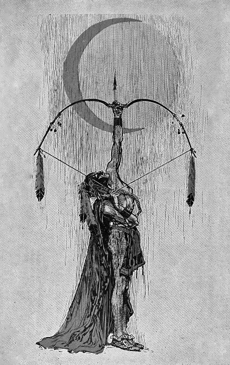

\[caption id="attachment\_4132" align="alignright" width="150"\] 2145\[/caption\]

artist: **Sabled Sun** release: _2145,_  _2146_ format: Digital year of release: 2012 label: [Cryo Chamber](http://cryochamber.bandcamp.com) duration: 62:59, 53:13

detailed info: discogs.com \[[1](http://www.discogs.com/Sabled-Sun-2145/master/434250), [2](http://www.discogs.com/Sabled-Sun-2146/master/509527)\]

The name **Atrium Carceri** will surely ring some bells among lovers of dark ambient. Well, **Simon Heath** is the man behind both that project and this new offshoot, **Sabled Sun**. Musically, it's not a very big departure  from his usual works, but Sabled Sun is a very conceptual affair: impressions from the experience of a man waking up from cryostasis in a post-apocalyptic future world. These two albums, both released in 2012, encompass the first two years of this story.

As you might expect in a project that is so explicitly narrative, the albums, particularly the first part _2145_, have something cinematic about them, in the sense that the album notes and track titles give you some setting and story threads to play with in your imagination, and that the music functions very much like a soundtrack. The building blocks are the familiar ambient synth pads, deep drones, and gritty textures, but the result is very much a series of 'scenes' and melodic themes to underpin chapters of the story Heath wants to tell.

On the first album, I construct this mostly as the process of rediscovery: the unnamed protagonist of the story wakes up in a changed world, sick, and disoriented. Over the course of the album, he slowly comes to grips with his predicament. It feels like an arduous journey through broken landscapes, with desperate attempts to pick up or send distress signals.

\[caption id="attachment\_4133" align="alignright" width="150"\] 2146\[/caption\]

The second album sees the protagonist discovering the lights of an abandoned city. Abandoned by humans that is, as the robotic inhabitants still keep the place going. These tracks seem a bit darker on the whole, channeling a bit of that dystopian urban atmosphere of rain, bright lights, and deep shadows.

Seen from one angle, the soundtrackness of these albums is a bit of a downside. At times, the music does fade into the background a little, which isn't really a selling point in music for the sake of music. On the other hand, the ability to _be_ in the background and support whatever else is going on is arguably the main strength of music-as-soundtrack, and in that department these albums succeed admirably. Sometimes they grab your attention with a new hook, sometimes they act as mood pieces for imagining the story, for dreaming, or even for work.

If you're willing to take the leap and construct your own story for this soundtrack, the first two years of Sabled Sun will be very pleasant companions. But you could also run it along with a spacey game, a comic, and the like—I was reminded more than once of **Mark Morgan**'s _Fallout_ soundtrack, though more in terms of post-apocalyptic atmosphere and the ability to support other media than the music itself. But ultimately, there's also just a lot of good dark ambient in here, with a very hi-fi production, and I look forward to seeing what musical story bits Heath will come up with next for us to play around with.

Reviewed by **O.S.**

Tracklist:

_2145_

1\. Intro (2:28) 2. This Is Where The World Ends (5:49) 3. Abandoned (5:22) 4. Retina (4:35) 5. Singularity (6:41) 6. The Hideout (3:32) 7. Signals (3:56) 8. Silo (5:15) 9. Date Expired (2:48) 10. Shattered (2:51) 11. The Facility (2:17) 12. The Ancient (2:30) 13. A New Sun (4:28) 14. Acid Rain (4:47) 15. Transmission/Outro (5:33)

_2146_

1\. Through The Gates (4:24) 2. Inner Sanctum (7:28) 3. Scanning For Life Forms (5:29) 4. Power Cell (3:54) 5. Exo Suit (6:55) 6. Graveyard Of Broken Machines (5:08) 7. My New Best Friend (3:17) 8. Planetarium (5:00) 9. Deep Within (3:23) 10. My Dying Robot (4:31) 11. End Me (3:39)
