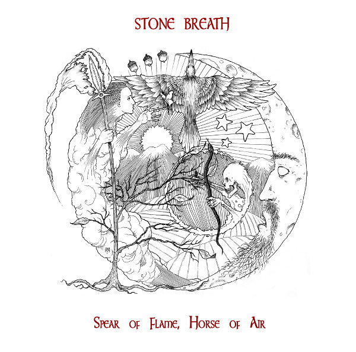

artist: **Stone Breath** release: _Spear of Flame, Horse of Air_ format: LP year of release: 2013 label: [Brave Mysteries](http://www.bravemysteries.com) duration: 37:05

detailed info: [discogs.com](http://www.discogs.com/Stone-Breath-Spear-Of-Flame-Horse-Of-Air/release/4280155)

It's been really good to see **Stone Breath** back on the scene the past few years. Last year's [_Twist of Thorn_](http://www.eveningoflight.nl/2012/05/19/review-stone-breath-twist-of-thorn-2012/ "Review: Stone Breath – Twist of Thorn (2012)") tape wasn't without a few flaws, but it was full of the unique charm and unassuming folk style that **Timothy Renner** has been honing for roughly two decades. It also marked the debut of the band on the **Brave Mysteries** label, a rapidly rising star among American underground labels that returning readers should be very familiar with now. _Spear of Flame, Horse of Air_ sees Stone Breath coming to LP for that same label and will serve as the band's calling card for the near future.

And yes, it does a very good job of it, even though it marks a tiny bit of a new direction for the band, in the sense that the album is heavily focused on traditional ballads like "Crazy Man Michael" and "Tom of Bedlam". The style is unmistakably Stone Breath, with a combination of male and female voice bringing both contrast and harmony to the lyrics, and a variety of guitars, banjos, and other strung instruments as main backing. While there is room for some instrumental experiment and even soling—such as at the end of "The Unquiet Grave"—the emphasis is on traditional song.

On the one hand, that's a pity, as Renner has proven to be capable of extraordinary drone-folk works, particularly on the dark album _The Silver Skein Unwound_ ten years ago. Then again, the current approach leaves a bit more openness to the sound, and gives room to gems like "Mad Song", a piece with gorgeous guitar and harp work, along with the soft and cloudy female vocals. The three central tracks of the album are very serene anyway, a simple neofolk style, contemplative, and not really in need of the psych edge that tinged much of Stone Breath's early work.

The intensity is ramped up for the final two Bedlam tracks, however, which definitively underline the theme of madness that ties the album together. Ten ten-minute rendition of "Tom of Bedlam's Song" is lovely, catching a good rhythm and allowing a bit of time to the experimentation that is less present in the rest of the album. The basis of the song is the 17th century lyrics and the tune written by **Nic Jones** in the sixties—well-known from the **Steeleye Span** version of the song—but its center is host to a great cacophony of voices illustrating the concept of lunacy: "I see the moon, and the moon sees me." This interlude done with, the track continues with the rest of the exciting verses of this ballad (see [here](http://mudcat.org/thread.cfm?threadid=112465) and [here](http://home.avvanta.com/~efreeman/Basement/TOB.html) for some history and lyrics), which relates the mad ramblings and dark fantasies of Tom, a supposed inmate of Bedlam asylum.

Part of me had expected Stone Breath's first LP on a diverse and often avant-garde label like Brave Mysteries to be way more 'out there', but I now realise that they might just have signed the band for their original essence: folk music with that perfect balance between tradition and innovation. It's on display here for all, and proves once more that Stone Breath is one of the most important artists in the history of alternative folk in the US. Bless them.

Reviewed by **O.S.**

Tracklist:

1\. Crazy Man Michael (5:08) 2. The False Lady (4:10) 3. The Unquiet Grave (5:04) 4. Mad Song (4:43)

5\. How Should I Your True Love Know? (2:48) 6. A Maid In Bedlam (4:22) 7. Tom Of Bedlam's Song (10:49)
