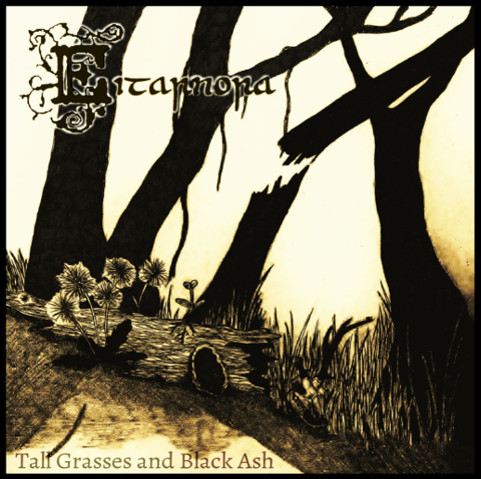

artist: Eitarnora release: Tall Grasses and Black Ash format: CD year of release: 2013 label: [Lakedeer](http://www.lakedeerrecordings.com/) duration: 49:35

detailed info: [discogs.com](http://www.discogs.com/Eitarnora-Tall-Grasses-And-Black-Ash/release/4417806)

After digging into their earlier demos and releases last year, I fully expected **Eitarnora** to be on the brink of producing a really solid album. That early material showed lots of promise and an original, meandering take on folk, but it sure was rough around the edges. _Tall Grasses and Black Ash_ shows that all it took to take the music to the next level was to sit down and do it: better recording quality and production, slightly fuller compositions, and a few guest appearances to round out the sound.

Compared to the tracks on e.g. [_Murmurations_](http://www.eveningoflight.nl/2012/09/20/review-eitarnora-murmurations-2012/ "Review: Eitarnora – Murmurations (2012)"), these new ones sound a bit warmer and lusher. The two basic features of Eitarnora's music — **Jon Rosenthal’**s classical and folk guitar, and **Val Dorr’**s high voice — are still there, but there's some more background glow present as well. A bit of harmonium, soft crackles of fire, a quiet drone. On "Plains Dance", there's the unmistakable violin of **Troy Schafer** adding its own graceful touch.

Rosenthal's guitar playing seems more restrained, more geared towards to soft acoustic chord underpinnings and layered touches of clean electric guitar, rather than the classical approach that featured on some of the older tracks. Both styles have their merits, but the result here is an album that flows softly and thickly, more lulling than before. Central track "The Grey Earth" shows off the many strong points of this album: a lovely misty drone hums away in the background, and there's some little psychedelic synth sounds here and there as well, but wedded to a pairing of female vocals and fingerpicking guitar that wouldn't be out of place on a mid-nineties **Current 93** record.

I've made the comparison before, but there's a fair bit of parallel with **United Bible Studies** in this music, and coming from me that's a big compliment. It's probably that compelling mix of folk influences and psychedelic elements with a very expansive, airy mood. Now that quibbles about lo-fi recording and rough performances are practically out of the way, I won't hesitate to recommend Eitarnora and this album to all lovers of experimental and neofolk.

Reviewed by O.S.

Tracklist:

1\. Feet In The Earth (13:27) 2. Plains Dance (9:05) 3. The Grey Light (7:55) 4. You Are Mine (7:15) 5. Reciting (11:49)
