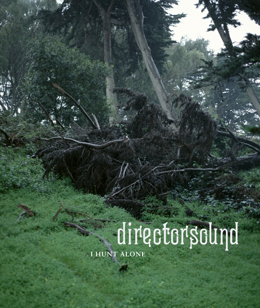

artist: **Directorsound** release: _I Hunt Alone_ format: CD year of release: 2013 label: Second Language duration: 44:17

detailed info: [discogs.com](http://www.discogs.com/Directorsound-I-Hunt-Alone/release/4318759)

**Nicholas Palmer** is no stranger to our site, as he deserves a place of honour for being one half of the duo **The A. Lords**, together with **Michael Tanner**, whose [self-titled 2011 LP](http://www.eveningoflight.nl/2011/10/16/review-the-a-lords-2011/ "Review: The A. Lords (2011)") remains a favourite. Palmer's solo work as **Directorsound** hasn't featured here before, however, something which I hereby wish to rectify. Following in the footsteps of the magnificent [_**The Cloisters**_](http://www.eveningoflight.nl/2012/11/04/review-the-cloisters-2012/ "Review: The Cloisters (2012)") album (Tanner again), subscriber label **Second Language** has just released _I Hunt Alone_, the latest Directorsound work.

Despite being Palmer's solo project, the album sounds like a band effort, a rich fusion of pastoral folk, middle-eastern music, latin, jazz, and who knows what else. There are a few guest artists on some of the tracks adding cello or flute, but most of the music is carefully arranged and performed by Palmer himself. His mastery of the influences is complete, and in doing so he creates a musical world that is quite unique.

It is more active and upbeat than I had expected based on his involvement in The A. Lords. The title track is the most familiar one, a calm piece for solo acoustic guitar, classical and slightly mediterranean in its atmosphere. It had featured last year on the label's _End of a Season_ compilation, and I based my expectations for the album on this gorgeous composition. It's also a misleading one, however. Starting with the superb and aptly titled "Pan in Paradise", the release proves to be a whirling affair, most tracks containing steady dance rhythms, percussion, accordions, clarinets, etc. There's a lovely tango in "Sun Dazed and Dancing", the original passion mixed with ever so subtle influences from Palmer's British freefolk background.

The long "Nocturne for Grace" is a dramatic force in the centre of the album, with rippling piano, harmonium, and percussion swells, but also moments of stillness that balance it out. A sweeping melancholic track that exemplifies the emotion you can put into instrumental music. It contrasts with the forget-all-your-cares dance of "La Strega e lo Stolto", and the return to pastoral wistfulness of "Turnal Cu Ceas", a magnificent closing track.

_I Hunt Alone_ is a singular album that somehow manages to capture of various folk musics the emotion and energy of live dance and performance on the one hand, and the calm contemplative solitary moments on the other, and all that in a studio setting. I'm glad to have found another musician and composer that has found that sweet spot between different cultural influences, a warm feeling of the past, and an innovative perspective.

Second Language subscribers will already have gotten this album and its subscriber-only bonus EP, so they don't have to be convinced. To anyone else: I recommend this with all my love.

Reviewed by **O.S.**

Tracklist:

1\. Pan In Paradise (6:51) 2. Serpent In The Jaws Of October (6:58) 3. I Hunt Alone (4:25) 4. Sun Dazed And Dancing (4:24) 5. Daggers (1:16) 6. Nocturne For Grace (9:50) 7. La Strega E Lo Stolto (5:39) 8. Turnal Cu Ceas (4:50)
