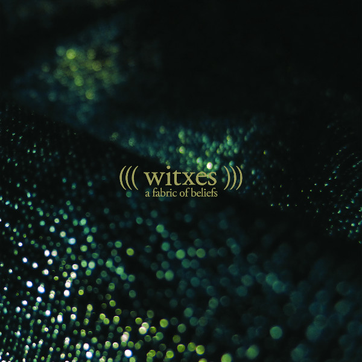

artist: **Witxes**  
release: _A Fabric of Beliefs_  
format: CD, 2xLP  
year of release: 2013  
label: [Denovali](http://www.denovali.com/)  
duration: 53:06

**Witxes**’ debut album _[Sorcery/Geography](http://www.eveningoflight.nl/2012/06/25/review-witxes-sorcerygeography-2012/)_ almost made it to our list of last year's favourite releases, and now, after not too long a wait, we're treated to a strong follow-up album. It's the first release on new label **Denovali**, and it coincides with a rerelease of the first album bearing the same new imprint. In short: that's two double LPs worth picking up.

_A Fabric of Beliefs_ starts off a bit slow, perhaps, with the tripartite "Through Abraxas", but these tracks do show that composer **Maxime Vavasseur** still has a firm grip on his electronics, drones, and some chugging rock parts. The buildup is very good, and it works towards a pretty dark climax, which is beautifully offset by the bright and shimmering acoustic guitar of "The Strands".

In the middle of the album, we find bits of that ambient/jazz hybridity that typified some of the best tracks of the first album. For example, "The Apparel" is like a slow amble through a dark city street and a glittering cave at the same time, ominous and wondrous, with a lovely bassoon lead. These tracks show the most variation in the album and are a pleasant trip through various ideas, like the unnerving flamenco clap/noise of "The Weavers" and the spacious percussion & sax jazz of "The Pilgrim".

The middle part is concluded with gently chirping cicadas and other nighttime animals, a soft tapestry that invites that tender folkiness of "The Words", that one song among instrumentals near the end of the album, similar to "No Sorcerer of Mine" on the previous one. It's a simple but effective piece that leads into the full warm waves of "The Moonlit Passage".

The sound on this second album is as varied as that on the first, if not more. Sometimes warm and deep, sometimes bright and fizzing, and always crystal clear. It is somewhat of an 'authored' album, many elements being stitched together deftly in composed patterns, but perhaps somewhat nonspontaneous because of that. It doesn't really bother me, though. It's a listener's album, a very good one, and one that flits effortlessly between different styles without sounding stretched. Bravo, once more.

Reviewed by O.S.

Tracklist:

1\. Through Abraxas I (6:08)  
2\. Through Abraxas II (6:14)  
3\. Through Abraxas III (5:00)  
4\. The Strands (5:00)  
5\. The Apparel (6:01)  
6\. The Breach (1:16)  
7\. The Visited (5:59)  
8\. The Weavers (2:00)  
9\. The Pilgrim (4:37)  
10\. The Turned (3:30)  
11\. The Words (4:17)  
12\. The Moonlit Passage (2:59)
