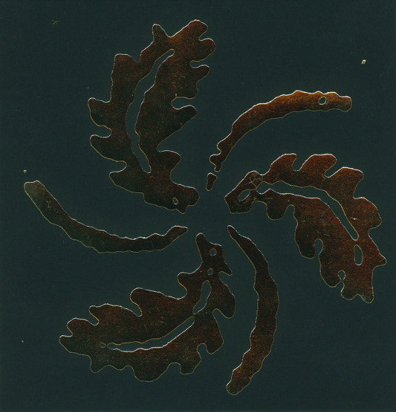

artist: Sangre de Muerdago release: Deixademe Morrer no Bosque format: CD year of release: 2013 label: [Self-released](http://sangredemuerdago.bandcamp.com/album/deixademe-morrer-no-bosque) duration: 61:36

Like last year's tape on **Brave Mysteries_,_** this new full length by the currently Germany-based **Sangre de Muerdago** is an excellent reminder of what is great about neofolk. Though mostly devoid of the psychedelic trappings of some artists we've admired through the years, the band does weld together a number of different local sounds, with elements taken from various European areal styles, and perhaps a bit of US neofolk as well. This is a subtle difference from the previous release, which I classified as mostly typically German. It might be me, but I think I can hear a few more diverse threads picked up here.

It's hard for me to appraise this album, to be honest. On the one hand, I want to give these guys a kick in the pants for staying so close to the by now long-established genre idiom. The best folk music is about reinventing tradition, not about following it to the letter, and I feel that Sangre de Muerdago is still doing a bit too much of the latter. Then again, when I compare many of these tracks to the late nineties classics like **Empyrium**, I think Sangre are actually doing it better. Rather than reinventing, they're refining, and I suppose that's worth something.

As such, the various acoustic string melodies are crystal clear, evoking a soft melancholy and natural atmosphere. There is enough variation in the instruments and playing styles chosen to add pleasant timbre changes into the album, and where suitable, the songs are supported by lovely cello backing and the like. The weak point, as is often the case, is probably the vocal department. The male lead and female and male backing vocals are a bit flat, unremarkable, but suitable to the music. However, "The Paths of Mannaz" shows that old pitfall of the not-quite-so-good guest vocalist; a pity, because the track starts like an absolute classic.

Maybe I sound more negative than I intend to be. _Deixademe Morrer no Bosque_ is a thoroughly lovely album to listen to, and Sangre might be very well be the best traditional neofolk band on the scene at the moment. That should be enough endorsement for lovers of the genre. It's the _traditional_ part that bugs me, though. Neofolk is a genre that's almost too narrow to support a very interesting tradition, and the best artists tend more to dip their feet into it a bit rather than dive in entirely. Sangre de Muerdago have proven that they can master the form, and that's worth a lot, but I hope they have something more than this to tell us as well. Next time?

Reviewed by O.S.

Tracklist:

01\. Deixademe Morrer no Bosque (5:22) 02. Longo Camino de Desaprendizaxe (6:04) 03. Soterrados Baixo as Pedras (5:20) 04. Longas Noites de Choiva Incansable (3:22) 05. O Nome do Vento (4:30) 06. Haunted Glow (4:59) 07. Mencer (2:53) 08. Botados dos Bosques (5:04) 09. Desterro (2:42) 10. The Paths of Mannaz (7:30) 11. Na Procura das Fadas (2:47) 12. Lume (7:09) 13. Abrindo Sendeiros a Traves das Silvas (3:54)
