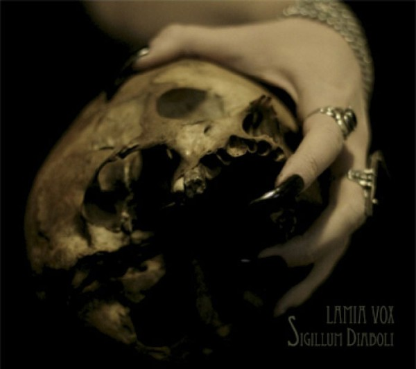
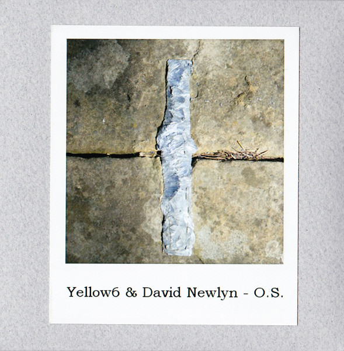

\[caption id="attachment\_4233" align="alignright" width="150"\] 'Sigillum Diaboli'\[/caption\]

**Lamia Vox** - _Sigillum Diaboli_ \[[discogs](http://www.discogs.com/Lamia-Vox-Sigillum-Diaboli/release/4471460)\]

This here seal of the devil is one of those albums that I enjoy because one track grips me in particular, and that is the utterly majestic opener "Born from the Abyss". It is a velvety layer cake of misty chants and deep, warm synths that perfectly recalls the heyday of Scandinavian dark ambient, roughly fifteen years ago. Certainly not out of place on a label like **Cyclic Law**, that's for sure.

The rest of this album, the work of St. Petersburg resident **Alina Antonova**, is nothing to scoff at either, but it is definitely a mood piece, a nostalgic amalgam of ethereal, darkwave, ritual, and ambient influences that epitomises goth atmosphere to me personally. It's a fairly consistent album, but the best is at the start. Still, _Sigillum Diaboli_ will be required fare for some of you, a dark work somewhere between **raison d'être**, **Coph Nia**, **Arcana**, and more recently, **Rose Croix**.

\[caption id="attachment\_4263" align="alignright" width="150"\] 'Στερεά Σύννεφα'\[/caption\]

**Saåad** - _Στερεά Σύννεφα_ \[[bandcamp](http://saaad.bandcamp.com/album/-)\]

This EP, originally on tape, contains one original drone by Tolouse duo Saåad, and four remixes of the piece. The original track is typical for the duo, a thick wall of sound that is somehow warm and chilling at the same time. They resist drawing it out for too long, and most of the room on this tape is reserved for the interpretations of the other artists.

**Listening Mirror** take the minimalist route, leading in with two minutes of near-silence, forming a clean break between the original track and the remixes. Once the volume picks up, "Nubides Solidas" echoes the constant drone of the source track, but with a slightly more open, airy, and perhaps ominous texture. **Plec’**s remix "Solid Clouds" adds in a little grit, but maintains the gentle flow set out by the first two tracks. **Noir Cœur**, then, kicks things into overdrive with a steady beat, percussion, flutes; a compelling rhythmic energy, in short. Their "ठोस बादल" is a fine piece of work, a remix in the more radical sense of truly owning a track. The same goes for "Feste Wolken" by **Almeeva**, who add in their own synth/rock sensibility, again making the track a lot heavier. A solid closing track for an EP about solid clouds.

Since this is another free\* / PWYW release, there no reason not to give it a listen right now.

\[caption id="attachment\_4296" align="alignright" width="147"\] O.S.\[/caption\]

**Yellow6 & David Newlyn** \- _O.S._

_O.S._, a limited handmade release on Greek label **Sound in Silence,** is a nice and relaxing duo effort by two artists who've cut their teeth as solo artists and in various collaborative settings. For this release, Newlyn & Attwood each focus on one instrument, the latter improvising melodies on electric guitar (not unlike the style of his comrade **Dirk Serries**), while the former provides drones and swells on keyboards. While the synths drift a bit more to the background due to the twanginess of Yellow6's guitar, the balance of sound is very good, and the two musicians know how to give each other enough room to manoeuvre.

The atmosphere on the record, which clocks in a little under forty minutes, is generally very laid back, sometimes a bit obscure, sometimes a bit psychedelic, and perhaps a little unassuming and easygoing. It may be the lack of pretension of two musicians who know exactly what they're good at and don't want to take risks. While this doesn't make for a very surprising listening experience, it's a very pleasant and calm one, and with the final track "Spiral Vaults" they do definitely reach some blissful ambient heights.
