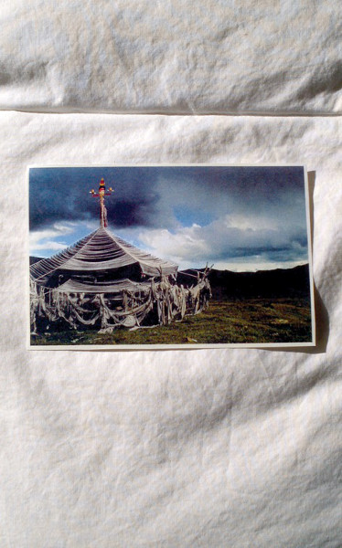

artist: **Ulaan Passerine** release: _Ulaan Passerine_ format: 2xMC year of release: 2013 label: Brave Mysteries duration: 67:04

detailed info: [discogs.com](http://www.discogs.com/Ulaan-Passerine-Ulaan-Passerine/release/4589871)

The name **Ulaan Passerine** didn't immediately ring a bell, but once I found out that it's a project by **Steven R. Smith** of **Hala Strana** (among others), things started falling into place. This is a man with a respected, if relatively obscure, musical history, who played a central role in establishing experimental folk sounds in the US since the late nineties.

Even without that context, though, this new double tape on **Brave Mysteries** would have blown me away. These four pieces — each occupying a tape side of sixteen to eighteen minutes — are best classified as freefolk, but Smith has such a strong voice (figuratively speaking) that comparisons with other artists are practically useless to draw.

In these instrumental tracks, _Ulaan Passerine_ conjures up a musical landscape that lies somewhere between the plains of the US and the steppe of Central Asia, a sort of mythical place that unites two opposing sides of the world. It's the sandy, raw, yet gentle notes returning in many tracks that remind me most of the latter locale: a magical blend of overtones, wind, and psychedelic synths. This is a powerful ingredient, but there is also the acoustic guitars, bells, bowls, piano, strings, etc. — a warm american folk tinge. All of these feel more like natural elements of a musical world than characters speaking their individual lines. Ambient music, in a way, but of the kind that reveals a lovely richness when scrutinised.

There's not really an overarching narrative to the album; each tape side is a lengthy vignette that can be played equally well on its own or as part of a whole. It's a series of glimpses into the same place, but from different angles, different times, seasons, weather conditions.

Achieving maximal results with a modest instrumental setup and melodic composition, _Ulaan Passerine_ is a superb folk/drone piece with a colour of its own. It's one of the releases this year that you shouldn't pass by without giving it at least a passing glance. For me, it's one of the favourite things to come my way this year, and will serve as a springboard to dive back into Smith's back catalogue.

Reviewed by O.S.

_\[Note: the tape is sold out from the label, but a digital version of the album can be bought [directly from the artist](http://worstward.bandcamp.com/album/ulaan-passerine)\]_

Tracklist:

1\. (17:20) 2. (17:31) 3. (16:05) 4. (16:07)
