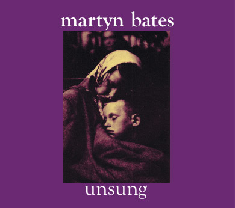

artist: **Martyn Bates** release: _Unsung_ format: CD year of release: 2012 label: Ambivalent Scale duration: 41:51

detailed info: [discogs.com](http://www.discogs.com/Martyn-Bates-Unsung/release/4059439)

I'm just going to keep on pushing **Martyn Bates** until you're sick of it, and then continue doing it. Although he's surely not the only one deserving this unenviable status, he's the first person I think of when I consider artists with severely underrated careers. Bates had been making music since the late seventies, most famously as half of **Eyeless in Gaza**, spanning genres from noise to pop, rock to ambient, and his staple influence: folk.

His latest album _Unsung_ is in the latter category, though all of these except "Wait and See" are original songs by Bates. If anything, this album is _stripped_: the lion's share of it is just Martyn and his guitar. It's powerful singer/songwriter stuff from one of the most recognisable voices around, and there is a freshness in a lot of these songs that is remarkable given the ubiquity of the genre, as well as the fact that Bates has been making music for so long. That said, the strongest parallel is between this album and Bates' solo albums around the year 1990, particularly the superb _Letters to a Scattered Family_. This new one is less bombastic, more subdued, and doesn't immediately stand out when considered in the context of Bates' œuvre.

The strength of _Unsung_ is in the individual tracks, with "Caustic" and "Wait and See" having particularly strong melodies. The title track has somewhat of a darker gravity in its refrain, and is also one of the highlights here. My favourite must be "Muted Music", with its bright uplifting refrain. "Love Came to My Door" deserves a final mention: an a capella song where subtle reverb and echo effects create something of a minimal ambient backdrop in places.

_Unsung_ may not be Bates' best or most groundbreaking album, but it's a great addition to his discography, especially since we haven't had a full-length album of new solo material in quite a while. It's also a great echo of what Bates can do in an accessible guitar + song style. However, I hope we can also expect some more work where he dives back into either his folk/ambient crossovers, or his stripped down synth song style of the _Letters Written_ albums.

Reviewed by O.S.

Tracklist:

1\. Years (5:20) 2. Caustic (4:00) 3. Wait And See (3:35) 4. All The Days 'Round (3:30) 5. Unsung : The Sun Knows (4:02) 6. Muted Music (5:01) 7. No One (4:10) 8. To Read Your Way (3:36) 9. Love Came To My Door (3:21) 10. And This The Day (5:12)
