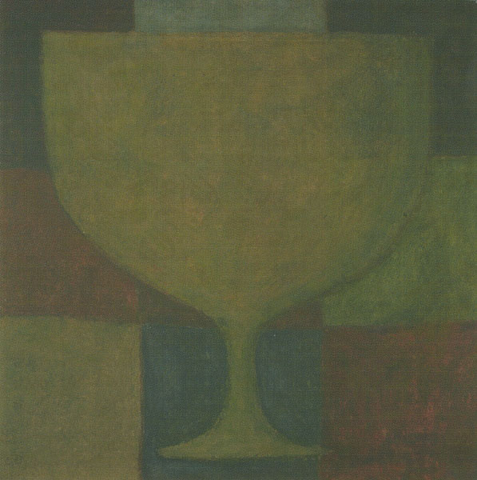

\[caption id="attachment\_4337" align="alignright" width="149"\] 1999 cover\[/caption\]

artist: **In Gowan Ring** release: _(Abend The Knurled Stitch O'er) The Glinting Spade_ format: CD, LP year of release: 1999, 2013 label: Bluesanct, [Merlin's Nose](http://www.merlins-nose.com/) duration: 56:43

detailed info: [discogs.com](http://www.discogs.com/In-Gowan-Ring-The-Glinting-Spade/master/287103)

Rereleases long overdue is primarily a relevant category when you don't own the original album. Apparently, I got the absolute last copy of the original _The Glinting Spade_ CD when I bought it from **Bluesanct** some seven years back, or at least that's what the label told me. It's been sold out since then, and while the surrounding albums _The Twin Trees_ and _Hazel Steps Through a Weathered Home_ had been given new editions by **Shayo** at around the same time, _The Glinting Spade_ had to wait to this year to be overhauled by German label **Merlin's Nose**. The groundbreaking début album _Love Charms_ has been wallowing in obscurity since 1994, but hey, what can you do. Maybe something to consider for its 20th anniversary next year? For those who for whatever reason didn't snag a copy of the original release, here are some reasons why the new issue should get your attention.

In many ways, this album is a natural step between the surrounding second and fourth albums: a move from hazy psychedelic folk to more focused and compact songs. _The Glinting Spade_ has its share of drone material, exemplified by the two "Star" tracks, but the sung parts are clear and tighter than before. Because of this 'halfway' nature, I had considered the album somewhat inferior to its more extreme neighbours.

\[caption id="attachment\_4354" align="alignright" width="150"\] 2013 cover\[/caption\]

The album does house what is in my view a serious contender for the best track **B'eirth** ever wrote, not to mention one of my favourite songs ever, period: "Cipher's String on the Tree in the Dream of the Queen". The song is about as long as the title, but it's an unsurpassed showcase of some of the best aspects of his music. A dawning opening of string drones and guitar gives way to a slow march for horns and percussion that introduces the basic chord setting of the track. The introduction over, B'ee switches to a warm lyrical introduction over ambient and bells. The central part works out the themes in harp and guitar, but indulges in some more reverberating ambient and chant parts a little over halfway, weaving back and forth. The ending is a great return to the march of the beginning, but wearing two different cloaks: first stately, led by a whistle, but then suddenly more whimsical, before fading into the drones of "Bow Star".

Looking back, however, the rest of the album also falls  more into place for me now than it did before. The shorter songs of the album (one, two, five, & six) are all lovely affairs that form an excellent modest adornment for the central piece that is "Cipher's String". Individually, though, they are also as good as the material that would follow on _Hazel Steps_. All things considered, this might make _The Glinting Spade_ the most eminently suited album to introduce **In Gowan Ring** to new listeners. As such, the reissue of this album should be exciting, whether you're interested in getting to know the music of B'eirth (one of our favourite modern troubadours) or you just want to complete your collection.

Reviewed by O.S.

Tracklist:

1\. Two Wax Dolls (5:35) 2. To Thrum a Glassy Stem (4:05) 3. Cipher's String on the Tree in the Dream of the Queen (13:09) 4. Bow Star (6:21) 5. A Bee at the Dolmen's Dell (6:58) 6. Arrowsmith's Fire (8:05) 7. Milk Star (12:31)
