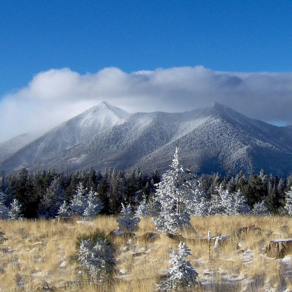

<iframe src="//www.mixcloud.com/widget/iframe/?feed=http%3A%2F%2Fwww.mixcloud.com%2Feveningoflight%2Fcloudscape-39-july-2013%2F&amp;embed_uuid=41b49369-2ee0-4d0e-b378-fd17f4a00a50&amp;stylecolor=f1edb1&amp;embed_type=widget_standard" height="600" width="600" frameborder="0"></iframe>

[Cloudscape #39: July 2013](http://www.mixcloud.com/eveningoflight/cloudscape-39-july-2013/?utm_source=widget&utm_medium=web&utm_campaign=base_links&utm_term=resource_link) by [Evening Of Light](http://www.mixcloud.com/eveningoflight/?utm_source=widget&utm_medium=web&utm_campaign=base_links&utm_term=profile_link) on [Mixcloud](http://www.mixcloud.com/?utm_source=widget&utm_medium=web&utm_campaign=base_links&utm_term=homepage_link)

00:00 | In Gowan Ring | Cipher's String on the Tree in the Dream of the Queen | [The Glinting Spade](http://www.eveningoflight.nl/2013/06/28/review-in-gowan-ring-the-glinting-spade-1999/ "Review: In Gowan Ring – The Glinting Spade (1999)") | 1999 13:10 | Xenis Emputae Travelling Band | Littlebeck / Trisagion | Three Spirits | 2013 21:17 | Moon Zero | Endless Palms (Savaran Remix) | Tombs Remixes | 2013 26:23-58:57 | Sabled Sun | Signals I | 2013 30:00 | Bruno Heinen Sextet & Karlheinz Stockhausen | Aries | Tierkreis | 2013 34:30 | The Gray Field Recordings | Angel Machines, Devices Some Say | Misanthropic Alloy in the Memory Box | 2005 39:38 | Bruno Heinen Sextet & Karlheinz Stockhausen | Aries | Tierkreis | 2013 43:00 | Postdrome | Fade I (Guardian) | Where the King Will Land | 2013 45:20 | Raising Holy Sparks | Leaving Utah (For C.) | Four Sacred Mountains | 2013 52:38 | Nechochwen | Pilawah | Algonkian Mythos | 2008 58:44 | Raising Holy Sparks | You Are in the Mountains, While I Am in Your Dreams | 2013
