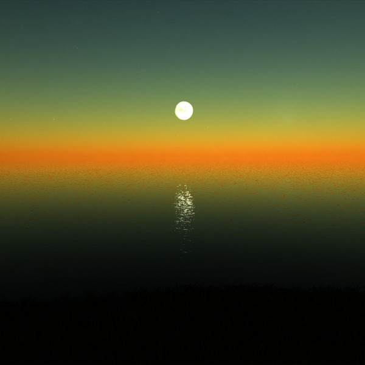

I've been meaning to do a showcase of some videogame soundtracks for a while, and this month I have the perfect excuse. I wrote an article on the island games _Dear Esther_, _Miasmata_, and _Proteus_ for the fourth issue of [_Five out of Ten_](https://fiveoutoftenmagazine.com/) magazine, and as it happens all three games have fine music. I used some outtakes from those soundtracks and mixed them up with some of the usual Evening of Light fare and I think the combination is rather fitting, with all artists included here operating somewhere along the boundaries of ambient, classical, folk, and drone.

_Dear Esther_'s soundtrack is the work of composer [**Jessica Curry**](http://www.jessicacurry.co.uk/)**,** and she scored the ghostly game with compositions based on piano, strings, and voice, but with the occasional electronic trickery involved. _Miasmata_'s music, like everything in the game, is the work of brothers **Joe and Bob Johnson** who together form **[IonFX](http://www.ionfx.com/).** The music from the game is a subdued ambient synth affair that subtly underlines the exploration, danger, and breathtaking natural vistas of their island. The music in **Proteus**, finally, is a special case. There is no proper soundtrack-as-album for the game, as all the music — the work of [**David Kanaga**](http://davidkanaga.com/) — is generated in response to how you play the game. The samples used here were extracted from playthroughs of the game.

The music of these four composers is supplemented by the work of **Richard Moult**, **Michael Tanner** (as **Plinth** and **The Cloisters**) , **Richard Skelton**, and **David Colohan** (as **Raising Holy Sparks**), sometimes in collaboration with others. Regular readers and listeners should be familiar with their work, and others will hopefully discover it along with the soundtracks. The Plinth tracks are taken from the limited bonus EP _Flotsam_, a companion piece to _Music for Smalls Lighthouse_. The Richard Skelton tracks were taken from his original _Landings_ blog where he combined music, photography, and poetry. Later he worked some of the material into his [_Landings_](http://www.eveningoflight.nl/2009/10/27/retrospective-some-recent-richard-skelton-releases/ "Feature: Some Recent Richard Skelton Releases") LP, but I'm fairly sure the material presented here was only ever published on the original blog.

Enjoy, and if you like what you hear, please consider purchasing the games and/or their soundtracks, which should be easy to find through the above links. Also, if you want to read more about the games and how their island locales function as spaces and symbols, please buy a copy of [_Five out of Ten_](https://fiveoutoftenmagazine.com/), which also includes nine other articles of videogame criticism. The proceedings are split evenly across all authors.

<iframe src="//www.mixcloud.com/widget/iframe/?feed=http%3A%2F%2Fwww.mixcloud.com%2Feveningoflight%2Fisolation%2F&amp;embed_uuid=7558c9d0-0d6d-40fb-9a77-fd964c21bcd5&amp;stylecolor=eb9c00&amp;embed_type=widget_standard" width="600" height="600" frameborder="0"></iframe>

[Isolation](http://www.mixcloud.com/eveningoflight/isolation/?utm_source=widget&utm_medium=web&utm_campaign=base_links&utm_term=resource_link) by [Evening Of Light](http://www.mixcloud.com/eveningoflight/?utm_source=widget&utm_medium=web&utm_campaign=base_links&utm_term=profile_link) on [Mixcloud](http://www.mixcloud.com/?utm_source=widget&utm_medium=web&utm_campaign=base_links&utm_term=homepage_link)

Tracklist:

IonFX - Miasmata Plinth - Sea Oak I Jessica Curry - Dear Esther Richard Moult - Procyon over Beinn Airigh Charr Jessica Curry - Remember (Donnelly) Richard Skelton - Chord Path (Part I) David Kanaga - \[Water\] David Kanaga - \[Spring\] IonFX - The Path IonFX - Respite The Cloisters - Riverchrist Jessica Curry - Golden Ratio Richard Moult - Apollo Winceleseia III Jessica Curry - On the Motorway Richard Skelton - Yarrow Plinth - The Siren Murmur Jessica Curry - Always (Sanford Mix) Raising Holy Sparks - Blue Star Katsina Richard Skelton - Meeting of the Waters IonFX - Guilt IonFX - Trance The Cloisters - A Pelagic Recital Jessica Curry - The Very Air Jessica Curry - Ascension David Kanaga - \[Winter / Ascension\]
