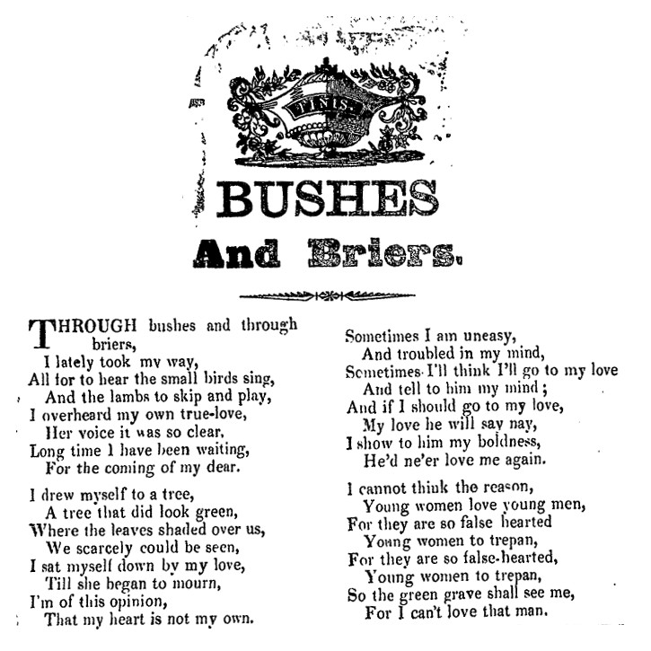

Songs are sometimes immortal travellers, and if you follow their tracks, you end up in all kinds of places. Regular readers will know I have a weak spot for folk ballads, and their history and various interpretations are fascinating to track. _Bushes and Briars_ came onto my path from different directions, but I'll get to that later.

The oldest mentions of the ballad that I could find are from nineteenth century broadsides such as [this one](http://bodley24.bodley.ox.ac.uk/cgi-bin/acwwweng/ballads/image.pl?ref=Harding+B+11(500)&id=01390.gif&seq=1&size=1).

A mockup of the lyrics from one of the broadsides.

It's a classic love ballad, in the sense that it explores some of the troubles and uncertainties of love and relationships. The woman in the song doesn't trust men, and the last line suggests she's driven to suicide because of it. Within the context of British ballads as a whole, that is understandable, as many of them are about men preying on (and murdering) women.

In 1904, the song was collected and rearranged by English composer **Ralph Vaughan Williams**, and from there on it entered into the repertoire of many choir and solo singers.

The history of the song goes dark here for a number of decades, but it most definitely resurfaced in the folk revival of the 1960s, where it was recorded by **Isla Cameron** for her self-titled 1966 album. More importantly, the song ended up in the 1967 film adaptation of **Thomas Hardy**'s novel _Far from the Madding Crowd_, in which it is sung by actress **Julie Christie**, though dubbed by Cameron.

\[embed\]http://www.youtube.com/watch?v=PcgVYa1zPe0\[/embed\]

At least from that time, "Bushes and Briars" has been a standard not only in the classical world, but also among folk singers.

**Sandy Denny’**s "Bushes and Briars", by the way, is _not_ a rendition of this particular ballad, though it's worth [a listen](http://www.youtube.com/watch?v=yJ_2SQLw6a4).

I actually first came across "Bushes and Briars" while reading **Simon Reynolds**’ (highly recommended) book _Energy Flash_ about late 80s and early 90s house and rave culture. He mentioned a 1992 track called "Sub Dub" by **DJ Seduction** which (supposedly) sampled the voice of **Maddy Prior**, best known from **Steeleye Span**.

\[embed\]http://www.youtube.com/watch?v=BPChSQGN8OA\[/embed\]

I went on a brief wild goose chase trying to find out when Prior (or Steeleye) had recorded the song, but my search came up empty. As it turns out, "Sub Dub", though the best known, wasn't the first incorporation of "Bushes and Briars" into electronic music. "Sub Dub", in fact, samples the 1992 house track "West in Motion" by **Bumble**, where the ballad is sung by Breda Mayock. Another misunderstanding cleared up due to the diligent research of YouTube commenters.

https://www.youtube.com/watch?v=CQcYLa1IzNs

Being something of a club classic, "Sub Dub" went on to inspire other producers, and it ended up at the harder end of the musical spectrum when it was succesfully picked up by **DJ Weirdo** and **Dr. Phil Omanski** for their gabber track "[Young Birds](http://www.youtube.com/watch?v=PmxxpyFJJzc&list=PLQK0Qoq1e3YjCWbP0sP2dvFMqFx8u_JW4&index=7)". In 2006, finally, hardstyle producer **Patrick Bunton** [had another go at it](http://www.youtube.com/watch?v=xBtigsxkuio&list=PLQK0Qoq1e3YjCWbP0sP2dvFMqFx8u_JW4&index=13), though I always feel that hardstyle lacks most of the energy of rave and gabber of the nineties.

Of all the nineties (and later) house version of the song that I've heard, my favourite is probably the Rollers Remix of "Sub Dub" made by **DJ SS**. It takes the drum 'n' bass of the original, but strips it down into something darker and emptier. The cold synth waves and delayed toko melody make this version into something really original.

\[embed\]http://www.youtube.com/watch?v=FArrxegTMRg\[/embed\]

My most recent (and unexpected) encounter with the song was its incorporation into the long work "Fields Were the Essence of the Song" by **Jessica Curry**. It's a lovely piece weaving together classical piano composition with narrative spoken word, but different verses from "Bushes and Briars" feature in between the narrative parts.

<iframe style="border: 0; width: 100%; height: 120px;" src="https://bandcamp.com/EmbeddedPlayer/track=1209278296/size=large/bgcol=ffffff/linkcol=333333/tracklist=false/artwork=small/transparent=true/" seamless=""><a href="http://jessicacurry.bandcamp.com/track/fields-were-the-essence-of-the-song">Fields Were the Essence of the Song by Jessica Curry</a></iframe>

Though not all of the versions and genres will likely be to everyone's taste, the journey of "Bushes and Briars" is testament to the flexibility of musical culture _and_ to the power of individual songs.

If you've got more versions of the track you wish to share, please leave a comment or send me an email. If the track is available on YouTube, I will add it to the [master playlist](http://www.youtube.com/playlist?list=PLQK0Qoq1e3YjCWbP0sP2dvFMqFx8u_JW4).

Some web pages with additional info:

- [http://mainlynorfolk.info/june.tabor/songs/bushesandbriars.html](http://mainlynorfolk.info/june.tabor/songs/bushesandbriars.html)
- [http://mudcat.org/thread.cfm?threadid=40546](http://mudcat.org/thread.cfm?threadid=40546)
