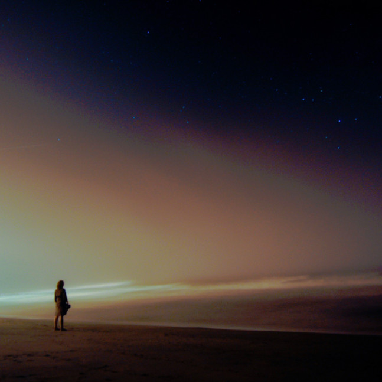

<iframe src="//www.mixcloud.com/widget/iframe/?feed=http%3A%2F%2Fwww.mixcloud.com%2Feveningoflight%2Fcloudscape-40-september-2013%2F&amp;show_tracklist=&amp;stylecolor=461060&amp;hide_artwork=&amp;mini=&amp;embed_type=widget_standard&amp;embed_uuid=ef745a67-0e55-4a05-80db-b2f37f07741e&amp;hide_cover=" height="600" width="600" frameborder="0"></iframe>

[Cloudscape #40: September 2013](http://www.mixcloud.com/eveningoflight/cloudscape-40-september-2013/?utm_source=widget&utm_medium=web&utm_campaign=base_links&utm_term=resource_link) by [Evening Of Light](http://www.mixcloud.com/eveningoflight/?utm_source=widget&utm_medium=web&utm_campaign=base_links&utm_term=profile_link) on [Mixcloud](http://www.mixcloud.com/?utm_source=widget&utm_medium=web&utm_campaign=base_links&utm_term=homepage_link)

Photo: Chris Arnade - "Beach, Stars and Waves: Rhode Island" <[http://www.flickr.com/photos/arnade/4...](http://www.flickr.com/photos/arnade/4782409524/)\>

Tracklist:

00:00 | Directorsound | Pan | I Hunt Alone | 2013 06:38 | Offthesky | Frozen Fountain | Hiding Nature | 2010 10:48 | Moongazing Hare | For Eldridge Cleaver | For Tom Carter | 2013 1320 | Nick Grey & Peter James | Juliet of the Shadows | For Tom Carter | 2013 16:50 | Lost Trail | The Next Four Questions | For Tom Carter | 2013 20:57 | The Floating World | Stars and Gleaming Leaves | The Wood Beyond the World | 2013 26:35 | Vortex | Confusion | Kali Yuga | 2013 30:10 | Kinit Her | A Dome Surrounds | The Poet & the Blue Flower | 2013 35:56 | Jessica Curry | Fields Were the Essence of the Song | 2009 45:03 | English Heretic | Fungi from Suburbs | "Anti-Heroes" | 2013 50:20 | Gorges | Our Throats, Like Valleys (Side B) | 2013 61:46 | Helena Espvall | Ceramic Blade, Iron Insect | For Tom Carter | 2013
