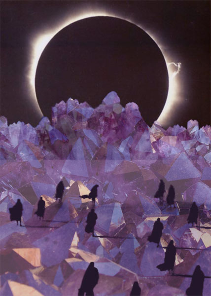

<iframe src="//www.mixcloud.com/widget/iframe/?feed=http%3A%2F%2Fwww.mixcloud.com%2Feveningoflight%2Felectric-crystal-bodies-a-numen%25C3%25A9ra-soundtrack%2F&amp;show_tracklist=&amp;stylecolor=b454de&amp;hide_artwork=&amp;mini=&amp;embed_type=widget_standard&amp;embed_uuid=ec63feac-170f-42d9-b572-ce1b2da6aab5&amp;hide_cover=" height="600" width="600" frameborder="0"></iframe>

[Electric Crystal Bodies: A Numenéra Soundtrack](http://www.mixcloud.com/eveningoflight/electric-crystal-bodies-a-numen%C3%A9ra-soundtrack/?utm_source=widget&utm_medium=web&utm_campaign=base_links&utm_term=resource_link) by [Evening Of Light](http://www.mixcloud.com/eveningoflight/?utm_source=widget&utm_medium=web&utm_campaign=base_links&utm_term=profile_link) on [Mixcloud](http://www.mixcloud.com/?utm_source=widget&utm_medium=web&utm_campaign=base_links&utm_term=homepage_link)

_Electric Crystal Bodies_ is intended as a soundtrack for a campaign of the RPG Numenéra I'm playing with some friends. I was mainly inspired by the area we are currently exploring: The Cloudcrystal Skyfields, but also by the general feel of the game: mysterious, a blend of science fiction and fantasy. I looked for songs mostly by word association with the title, but since my collection quite often meshes together nicely, making a coherent mix out of it didn't prove too difficult. So, a journey through strange landscapes, encounters with ancient advanced technologies, and a rocking bonus track at the end. Enjoy!

Tracklist:

Aarktica - A Plague of Frost in the Guise of Diamonds Aarktica - A Plague of Frost in the Guise of Diamonds (Al Qaeda Remix) Chris Christodoulou - 25.3°N 91.7°E Alphane Moon - Full of Stars Higuma - Crystal Rain Claw Lycia - The Body Electric Richard Skelton - Alder Traditions (Part 1) Witxes - Thirteen Emeralds Chris Christodoulou - Double Fucking Rainbow Premonition Factory - Electric Coil - Amethyst Deceivers Bvdub - Towers Rise to the Sky Manilla Road - Crystal Logic
