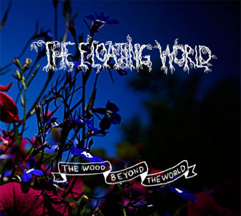
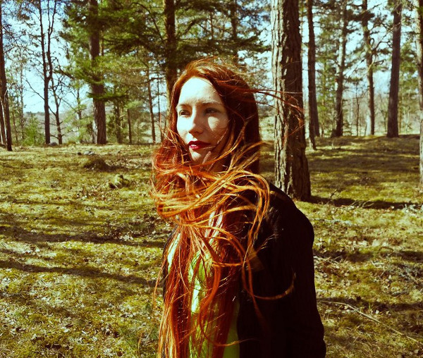
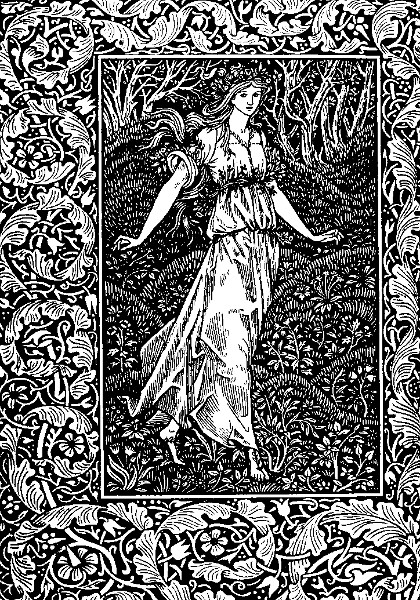

**The Floating World** is the main artistic project of **Amanda Votta,** specialising in flute-based ambient music with dark and mysterious undertones. Starting as a solo flute project with its first releases eight years ago, it has since attracted numerous collaborators on various instruments and, occasionally, spoken word. Recent albums [_The Apparition_](http://www.eveningoflight.nl/2012/08/27/review-the-floating-world-the-apparition-2012/ "Review: The Floating World – The Apparition (2012)") and _We Hunted_ have appeared on **Cyclic Law** and **Reverb Worship**, respectively, and this label attention will hopefully propel Votta's music into a wider audience.

Her latest album_, The Wood Beyond the World_, is just out on **Eclipse**, the subsidiary label of Cyclic Law, and it is the direct inspiration for the interview below. Not only did I find it one of Votta's most interesting releases to date, it also prompted me to finally dive into the **William Morris** novel after which the album was names, which had been on my to-read list for quite a while. If you'd like to read along, you can download a digital copy of a nice early edition of the book on [archive.org](http://archive.org/details/woodbeyondworld00morriala).

\[caption id="attachment\_4449" align="alignright" width="150"\] 'The Wood Beyond the World' album cover\[/caption\]

The album is a natural continuation of the slightly psychedelic material on _We Hunted_, although it has its darker moments that remind me of _The Apparition_. While flute remains the core of the atmosphere and music, the guitar contributions on _The Wood_ are extremely fitting and add the extra bit of texture that, frankly, the music needed after a few years. Percussion, bells, and well placed samples of water and voices give space to the tracks here and there, and it feels less claustrophobic than the work on _The Apparition_, though the album is by no means a happy affair. If anything, it feels otherworldly and strange, and in that sense it draws strongly upon journey described in the novel, where Walter finds himself in a place that is alien to him, and where not all the usual rules apply.

_The Wood Beyond the World_ is [available on CD](http://www.cycliclaw.com/THE%20FLOATING%20WORLD%20%22The%20Wood%20Beyond%20The%20World%22%20CD%20(2nd%20Eclipse)) from Cyclic Law, and digitally through various outlets. You can hear tracks from it on our three latest Cloudscapes ([#40](http://www.eveningoflight.nl/2013/09/09/cloudscape-40-september-2013/ "Cloudscape #40: September 2013") and [#41](http://www.eveningoflight.nl/2013/10/08/cloudscape-41-october-2013/ "Cloudscape #41: October 2013")), as well, if you'd like to hear them in a different context.

The interview below is the result of an email conversation I had with Amanda. My intention was not just to give her the opportunity to tell us a bit about the history of The Floating World, but also to get her to delve a bit deeper into literary and art history, a topic I know she enjoys. As you'll see, those promises were fulfilled, as Amanda has a lot to say on the subject.

_**\[OS\] How did you start playing the flute, and how did you decide you wanted to record solo flute music?**_

\[AV\] I first started playing flute when I was about 8, as part of the concert band at the school I was attending. Before that, I’d had some general music classes at my previous school and bits of piano here and there, courtesy of an uncle. I did actually stop playing flute for a couple of years and picked it up again later when I switched to a public school from the Catholic school I had been attending. That time it stuck though and it’s been my instrument of choice for the past 20 years. It’s the one thing, aside from family, that’s been a constant part of my life for that long.

While I started playing quite young, I didn’t even consider recording anything until much later. I did write songs all along, first just note names – F-Aflat-G – then using staff paper I’d make myself with a pen and ruler. I used up quite a lot of my mother’s typewriter paper doing that, but she never seemed to mind. Once I felt competent writing songs myself I did that for a few years before I started thinking about recording any. That was around the point that I began writing music to go with poems my sister had written. She’d give me a bunch of her poems and I’d sit down, determined to write one song an evening to match them. These songs seemed to me like they were finally starting to express whatever it is I keep trying to convey with music. They had that quality to them, the right keys, the right tone, mood. Probably helped by the fact that I was writing music to match her and she and I have always had the same kinds of ideas about art. We’re trying to express essentially similar concepts with what we do. It was these songs that ended up forming the _Folklore of the Moon_ EP I did, and also made me aware of just how much other art forms – not just music – could and did influence me and what I wanted my music to be, the direction I wanted to go in.

\[caption id="attachment\_4455" align="alignleft" width="150"\] Amanda Votta\[/caption\]

_**\*I suppose you've known Timothy Renner since you did that**_ **Folklore of the Moon** _**EP in 2005, but how did you get in touch with collaborators Grey Malkin & Neddal Ayad?**_

I’ve known Neddal nearly as long as Tim. He and I started talking right around the same time and it was actually him who asked me if I wanted to do the _Folklore of the Moon_ thing – he and Tim arranged that together. At the time I made that EP I was living in Ontario near Toronto and not long after that came out he ended up living down the road from me. We’d spend most days hanging out, listening to music, watching movies and such. This was when we started working on our band **Secrets to the Sea**. We had a tape out in 2006, I think. We hadn’t worked on any SttS in years, but lately we’ve been writing more songs that are completely different from either older SttS or anything TFW does, which has been very enjoyable to do. We’ll probably have a tape of our older songs out on **Lost Grave** sometime and then the newer stuff somewhere at some point. We’re not quite finished working on that yet, though. He also had an album out of his solo work, **Great Attractor**, on the English label **Reverb Worship** not long ago that I played on and mastered for him. Working with Neddal on music is always enjoyable since he and I have known each other for a while now and we have very similar ideas about most things, art and otherwise. He knows what I’m going for, I know what he’s going for, aesthetic and sound wise so it just works. At times, with TFW especially, we don’t even really have to listen to one another’s parts to end up coming up with something that works. We know what keys the other likes and how we each play well enough now to basically improvise everything. At some point, we had a discussion about how when recording layered parts neither of us bothers to listen back to what we’ve done. You just record the one part, go right on to the next. Working that way has helped a lot to make this and the last TFW album what they are. The kind of not thinking when you make something, having something in mind but nothing concrete or fully formed and just allowing the thing to make itself is something I value and why I enjoy making music with Neddal so much.

And while I haven’t known Grey as long as I’ve known Neddal, he does understand that something we’re trying to achieve, that mood or idea that we want the listener to take from the music. He’s added a whole other dimension to the band as well, thanks to his own particular way of playing, and helped to fill it out and further refine things. He and I first got in touch when he asked me to contribute flute to his incredible, spooky folk band **The Hare and the Moon,** and I loved working on his songs so much that I asked him to start adding to TFW. He, without us having to discuss it really, knows precisely what to do with each song he’s contributed to. It certainly helps that we share and aesthetic and similar taste in music, movies and books. For whatever reason, that’s always been important to me in choosing who to work with—possibly because if you have similar tastes it’s more likely you’ll be creating for similar reasons. More likely you’ll have some kind of mutual, intuitive understanding, which I find to be extremely important.

I also have to mention **Roy K. Felps** of **Korperschwache**, who plays acoustic guitar on “Stars and Gleaming Leaves.” We’ve also been acquainted for a while now and have gone back and forth a bit about working together over the years. While his music and mine might seem to be from completely different ends of the spectrum, Korperschwache being generally much harsher than TFW, we do also share similar tastes and he knew exactly what to do with the song he worked on, too. He ended up contributing because I mentioned something about liking **Low**’s sound on their song “Do You Know How to Waltz?” and he offered to take a song and see if he couldn’t do something similar sound-wise. Which isn’t really what ended up happening, but what did happen seems perfect to me for the song.

There’s also my sister, Nicole, who has either written something for the vast majority of TFW songs or I’ve written the songs for something she wrote. She might not be a musical contributor, but to me she’s just as essential throughout the process of writing an album and integral to making the end result feel complete as the other musicians involved. For _The Wood Beyond the World_, she wrote one piece to kind of tie the whole together which will be printed inside the digipack—though I don’t know if it’ll be included on the digital edition. Her writing has always been impressive to me. She’ll write something that will amaze me both because I think it’s just good writing and because every time I read something she’s written I’m reminded again that she knows that indefinable thing. One of these days I’d love to see a collection of her work published, illustrated by Tim. That would be perfect.

Over the years there have been other people I’ve tried to work with on TFW, but it just didn’t happen. At this point, these are the people I’ve found who really have something important to add and who know just how to do that. It’s nice, much more enjoyable than doing the bulk of the music on your own.

_**\*Your contributions to Far Black Furlong are some of my favourite things. How did you get involved with them?**_

**Richard Moult** contacted me not long after the _Folklore of the Moon_ disc came out and asked if I’d be interested in contributing some flute to the album they were in the process of working on at the time. Since I very much admire his work—his music, painting and writing—I agreed. He’s incredibly talented, as were the other musicians working on that album and it’s one of the things I’ve done that I’m most happy with. Richard is someone else who, though his work may be tied to a tradition, has an extremely unique perspective that comes through in everything he does. He’s a composer, painter, writer, who understands and is versed in theory and technique, but everything he does is distinctly his own. And there’s a distinct strangeness to it as well, which I definitely appreciate.

\[caption id="attachment\_4454" align="alignright" width="105"\] Frontispiece of the Kelmscott edition of 'The Wood Beyond the World'\[/caption\]

_**\*What about the book**_ **The Wood Beyond the World** _**made you ultimately choose to name an album after it?**_

I’ve always liked the book and there’s something about that title that it just pops into my head unbidden at times. The way it sounds, what it makes me think. The book tells the story of Golden Walter, who leaves his homeland on a voyage by ship after becoming estranged from his wife. While traveling, he learns his father has killed his wife and in turn been killed by his wife’s family, and is swept to a distant land by a storm. This and the death of his wife and father make him feel removed from his home, causing him essentially abandon the idea of the land from which he came being his home. He has no ties to it any longer, no reason to return. Meanwhile, there’s a new country for him to explore. On his voyage, he’d has a vision of a Maiden, whom he sets out to find when he arrives in The Wood Beyond the World with some direction from a hermit. He does find her, enthralled by an enchantress, whom they eventually escape from. The book ends with a happily ever after scenario, but the part that interests me and that I find most engaging is the middle act and it’s this part of the book I had in mind when naming the album. The wandering through a strange land, arrival in the primeval forest, and discovery of those he had visions of are what I find most engaging. Not to mention the dwarves who make dire pronouncements concerning Walter and the maiden. There’s something almost eerie about it, despite the dense language it’s written in or the way Morris treads lightly here as though he doesn’t want to write anything too fraught with what I always feel is the potential for terror. Just think of Walter, far from home in a strange and seemingly perilous wood that exists yet somehow doesn’t. It’s a thing of vision, a thing set apart from the real world by distance and by its fantastical nature, by the journey he went on—not just the physical journey, but the entire experience he’s been through. Also, though the maiden is a prisoner, she’s also an enchantress like her captor and she plays a large role in their escape. She’s not simply a passive prop, a princess in a tower. Though, I do feel the end of the book isn’t really in synch with the beginning and middle. Walter and his new bride presumably live happily ever after as the monarchs of a kingdom they happen upon after escaping The Wood Beyond the World, which is a stark contrast to the danger and strangeness of what came before. It’s that strangeness that made the title stick with me and why I chose to name an album for the book.

_**\*To me, it feels like you took somewhat of a distance from the book in terms of atmosphere. Morris' works feel very familiar and European in some sense, while your music — not just on this album — feels more detached and alien. Perhaps closer to Dunsany's work than Morris’. Do you feel the same way, or does Morris conjure up different images for you?**_

Beneath the medieval language and style there’s a definitely unsettling undercurrent. The danger Walter and the maiden are in, the very fact that he’s in a world not his own, the enchantress who holds the maiden captive, and all things that, to me, contribute to the sense of creeping dread underlying the tale. To be sure, Morris takes his cue here from the medieval romanticism of **Thomas Malory**, but even in Malory there’s the alien. This can be seen in what could be termed the supernatural elements of a work like _Le Mort d’Arthur_, the sorcerers and sorceresses, the quest for the grail, Excalibur and what is perhaps the oddest section to me, “The Tale of Balyn and Balan.” This is the section dealing with Arthur’s affair with his half-sister and their child Mordred, and also describes how Merlin instructed Arthur to take every newborn boy and set them adrift on a ship. The ship crashes and Mordred is the sole survivor, Arthur’s son who later kills his father. What is most strange about it isn’t even the events themselves, it’s the rather impartial way the events are recounted. You might think that, to a medieval author and their audience, this would be highly immoral and any telling of such a tale full of warnings and admonishments to not act as the players here do. But it’s fairly free of such things. The oddness inherent in this and the rest of the tales contained in Malory’s work is made readily apparent if you look through the version illustrated by Aubrey Beardsley. His style, the way he chooses to portray scenes, compliment quite well the alien quality of Malory’s tales. Or to me they do.

I suppose this is also what I see in Morris’ work and is the thing that draws me to it, the quality it possesses that I most appreciate with. Both he and Malory can be read as essentially romantic fantasies, but in both are elements that go beyond that. It’s not as readily apparent as in Dunsany, but it’s there.

Dunsany is also a major source of inspiration and an influence on me. My beaten up copy of _The Blessing of Pan_ is full of torn corners of paper marking pages, some with notes written on them that, look at them now, I don’t even remember why I wrote them or what I meant. That book probably has the single most perfect approach, perfect descriptions of music I’ve read in fiction. Whenever he describes the music Tommy Duffins plays he refers to is as a mystery, something from the far past, something indefinable, inevitable, unavoidable. The village can’t help but listen. It’s incredible, there’s nothing like it. Whenever I pick it up it makes me want to immediately sit down and start working on a song. Whereas the alien in Morris is not truly the focus, it is the heart and soul of Dunsany’s writing. His writing itself has that very dream-like, nebulous, hazy quality I try over and over to create musically. There’s also a distinctly sinister quality to his work that I appreciate, a kind of subtle something that makes you feel ill at ease.

This unsettling quality in Dunsany and the influence it has on me is also why I definitely appreciate **Algernon Blackwood** just as much. His “The Willows,” which I’m currently reading for probably the sixth time, is nothing but unsettling. Another factor in my appreciation for it is the way he describes sound. Unlike Dunsany, he doesn’t call it a mystery and it isn’t music he’s referring to, but the river, the wind, the willows themselves. The sounds you would hear normally while traveling down a river become uncanny, unknowable, disturbing because what they indicate isn’t that you’re in a familiar environment, but in a place incompatible with your understanding of a mundane island in a mundane river. This story is often referred to as an example of the earliest weird fiction and it does perfectly capture that odd, out of place-ness, that sense of strangeness, perfectly.

There are a couple of other books and writers that had a decided impact on _The Wood Beyond the World_ and The Floating World in general. For this album in particular, the Homeric Hymns to Dionysus were a large influence. Specifically, **Charles Boer**’s translation. His sparse, minimalist and very modern way of rendering the ancient Greek into English is probably the best version I know of. He doesn’t take away meaning from the words by translating them this way, he allows a modern reader to feel the full impact of what was written. It isn’t lost in what might sound like overly involved language. It’s kind of a stark contrast to Morris, too. But it was from those Hymns that I got the idea for the words for “To Lay Flowers at His Feet.”

**Walter F. Otto**’s _Dionysus_ also has had a large and lasting impact on me. This is really a scholarly work on the cult of Dionysus, how he was worshipped, what he meant, was he was. But it’s written in a way that really will, as a friend who I loaned it to said, put the fear of god in you. The way he discusses the beliefs, methods of worship and meaning of Dionysus is not like anything else I’ve read. There’s a chapter in it, “Pandamonium and Silence,” that’s absolutely stunning.

Similarly, there was something I read by **David Toop** that had a profound impact. I think it was _Sinister Resonance_, wherein he calls sound a haunting, a ghost and describes sound as intangible, uncanny, the act of listening akin to mediumship. Sound is an insubstantial thing. Unlike the written word, you can’t see it. A book you can touch, turn the pages, see it, feel it, read it aloud. There’s something more concrete to it, literally. You can even run your hand over a page and feel the ink used to print the words. But you can’t access sound that way. It exists at a remove. That’s the feeling on it I’ve had for as long as I’ve been playing, but seeing that someone else feels the same way about it and articulated it so well really caused me to focus on that aspect while working on this album. That alien quality you mention is what sound is to me. There’s something of it, in some way, in most of what I enjoy musically and artistically in general. It doesn’t have to be an overt quality, it can even be something not necessarily alien, but a raggedness. I don’t want to say an imperfect quality, because it’s more a lack of cleanness.

It might even be in this book as well, but Toop quotes a line from Rilke, “Beauty is the beginning of terror,” which is one of the most accurate ways to describe the quality I’m drawn to in art. It’s not even necessarily terror either, it’s just something that’s a bit off which makes the whole so much better than it would be otherwise.

There is, of course, the influence of sound itself on the album. Sounds as in a branch tapping on the window, the sound of walking through tall grass, standing outside at night and sound as in other music.

_**\*What's you take on Morris in the history of (fantasy) fiction? That J.R.R. Tolkien was influenced by him is well-known and clear if you know where to look, but do you see his legacy in other writers? How would you typify Morris compared to his contemporaries?**_

I do have to agree that he is a sort of figurehead for the beginning of modern fantasy. What he wrote wasn’t history, it didn’t share with Malory that intention of recounting events and describing individuals with a real basis in reality, but instead he focused on the imagined. The world he imagined may have shared similarities with medieval Europe, but it was also of his own design. The tales are his own invention. Inspired by Malory, but not existing in that same area. It’s a fantasy of history, an improbable past, that he wrote of. And he was really among the very first to do so.

Perhaps the most obvious example of Morris’ influence in other, modern writers would be someone like **Patricia McKillip**. She writes about essentially the same things he did, but without the archaic style. Magic and strangeness and worlds that are both familiar and alien. To an extent, I can also see something of Morris in **Tanith Lee**, especially her _Secret Books of Paradys_. It might seem an odd comparison, but there’s something of Morris’ hints of the uncanny in her work—but fully realized. Morris also didn’t really write damsel in distress stories. Yes, many of the people, not just women, in his work were in distress. But as in _The Wood Beyond the World_, they were never wholly helpless. The female lead in _The Well at World’s End_ also acts independently and essentially saves herself. Both Lee and McKillip write female characters that aren’t of the damsel in distress variety as well.

Whenever I think of Morris, I think of him first in the context of the Pre-Raphaelite Brotherhood, alongside Dante Gabriel Rossetti, Holman-Hunt, Millais, Burne-Jones and Christina Rossetti—who was an important member of their inner circle, though not an actual member of the group itself. Thinking of him in relation to DG Rossetti, Morris is certainly more connected to the idea of a chivalrous past and much less likely to write a paean praising a prostitute. Yet they do have some points in common, not least of all the focus on an artistic medievalism. In Rossetti’s case, a more obviously and highly eroticized medievalism—as with Burne-Jones—but there’s the common thread there of looking to the past for subject. I also have to say, there are certainly eroticized elements in Morris, it’s just they’re more veiled thanks to his style. Think of the bizarre love square in _The Wood Beyond the World_ involving Walter, the maiden, the enchantress and a dwarf—not to mention the enchantress’s cast-off prince. Like Rossetti, he also successfully worked in more than one medium.

There’s also the Pre-Raphaelite principle of taking a realistic subject and applying a magical, symbolic element. Not voiding the realism, but certainly not making realism the sole law. Morris engaged with the magical more than most of his contemporaries, yet there is that principle of a realism with magic superimposed. What, say, Holman Hunt did with color, Morris did with words. He chose to write in a rich, vibrant, heavily ornamented style akin to the rich, vibrant heavily pigmented tones you can see in Hunt’s work. In this, he also compares to Christina Rossetti, who was a superior poet to her brother in my estimation. Though her use of language was much more modern than Morris’ there’s a similarity there in the way they don’t necessarily rely entirely on conventional views of gender roles. While her work could be called bleaker than the writing of Morris, there is a shared sense of danger and strangeness.

Aside from his ability to create things that have had a lasting impact on the arts, Morris is also admirable for his personal convictions. He was a socialist who believed in a rejection of manufactured arts and crafts in favor of the hand-made, in the artisan as artist, in making art available to those without wealth. He rejected the idea of a hierarchy of art, too, and really rejected the idea of hierarchy generally. In a way, he was a unique individual among his contemporaries in that he did engage in a variety of artistic endeavors—embroidery, weaving, tapestry, poetry and prose—as well as being an active thinker on political and social issues. I suppose that when I chose to name an album for one of his novels it was as much because of what the novel means to me in an artistic sense as it is my admiration for many of his ideas in general, his desire to do away with hierarchy and his need to create, to express something both strange and familiar to his audience.
