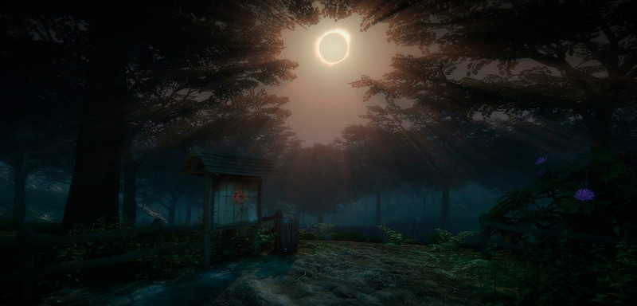
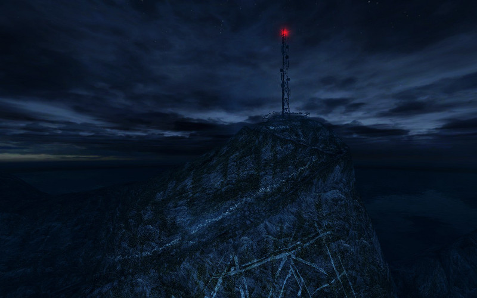

Early art for 'Everybody's Gone to the Rapture'  
© The Chinese Room

**Jessica Curry** is an English composer and co-director (together with Dan Pinchbeck) of videogame studio [**The Chinese Room**](http://thechineseroom.co.uk/). Like many people, I first became familiar with her work through the award-winning soundtrack for the game _Dear Esther_, an experimental attempt to tell a ghost story in an interactive medium. I've written on some of the narrative and spatial aspects of the game in issue #4 of [_Five out of Ten_](http://fiveoutoftenmagazine.com/catalogue/) magazine, and featured some of the music from the soundtrack in the companion Cloudscape for that article, “[Isolation”](http://www.eveningoflight.nl/2013/08/01/cloudscape-isolation/ "Cloudscape: Isolation").

In the autumn of last year, the studio's second game was released: _Amnesia: A Machine for Pigs_. Where _Dear Esther_'s soundtrack was sparse, hanging somewhere between ambient and classical, and reflecting the wind- and seaswept air of the game's Hebridean setting, _A Machine for Pigs_ called for something darker: dissonant horror tropes rubbing shoulders with industrial screeches and Victorian song. You can hear some tracks from that album in the [November Cloudscape](http://www.eveningoflight.nl/2013/11/08/cloudscape-42-november-2013/ "Cloudscape #42: November 2013").

Jessica is currently working on the soundtrack for the studio's upcoming game _Everybody's Gone to the Rapture_. In a recent email conversation, we discussed her background, current works, and some thoughts on the relationship between space, sound, and play.

**_\[OS\] What is your background as a composer and musician?_**

Jessica Curry

\[JC\] When I was four years old I started playing the piano. I had an incredible teacher who was never worried about grades or exams, she just wanted to instil a love of music in me, which she duly did. I started composing very soon after that and would spend hours picking out melodies on the piano. I always wrote incredibly sad songs, even as a small child—a tradition which I can proudly say has been passed on to my son: at the age of five he penned a song entitled "My Half Sister is Dead." I then started playing the cello and was involved in every musical activity imaginable. I was a total music nerd—madrigals, choir, orchestra. string ensemble—I did the lot! I then decided that I wanted to read English Literature at University and that music would be my hobby. Although I really enjoyed it, I missed music horribly, and after I graduated my amazing step-father slid an application for the National Film and Television School in front of me. That moment changed my life and ever since then I've been creating music. I've done everything—opera, installations, Requiems, games—and I can honestly say that I've loved every minute of it. Music gives my life purpose, reason and hope and I would be lost without it.

**_How do you relate music to space? Your piece "[Fields Were the Essence of the Song](http://jessicacurry.bandcamp.com/track/fields-were-the-essence-of-the-song)" and your game soundtracks are all compositions that are intended to go along with a (virtual) physical movement of the listener._**

The siting of my work is always absolutely integral to my creative and compositional process. In 2011 I undertook a residency at Fabrica Gallery which was very much about sound and space. **Janet Cardiff**'s _The Forty Part Motet_ was sited at the gallery at the time, where each individual choral voice is heard from 40 high fidelity speakers. [Here](http://achorusline.wordpress.com/2011/05/10/sound-space-and-architecture/) is a blog post which is very relevant to the question you've posed.

During that residency I led a sound walk around the city and that was a lovely experience for everyone involved. We exist on a such a visual level and increasingly we all wear headphones as we navigate through spaces. This was about re-tuning in to the city, and listening at a level of focus that almost never occurs in our daily lives. One participant wrote about his experience, concluding:

> "At the final turn from the seafront back towards the gallery, we go into a dead-end, and underground car park for a hotel and casino, the sounds become full in echo and darkness, the smell of urine cannot be ignored, and I feel a sense of concern as to if we have gone the wrong way, such is the atmosphere down here. But then Jessica takes us back on a more or less quieter return (or is it my attention?) and as we pass under some scaffolding opposite Fabrica, the worker above throws heavy bolt joints into a container and our right ear drums are seemingly shattered as if the filmic nature of the walks narrative came to climax."

Also during that year I was part of the "Adopt a Composer" scheme and I was placed with **MUSARC**, a choir formed of architects who are interested in the relationship between architecture and sound. That was a fascinating experience for me and especially since that year of focused listening that question of how sound, space and form interact is always at the heart of how I work. Virtual space is even more exciting in a way as you get the opportunity to tailor the experience in such a bespoke and detailed way.

_**Regarding sound/music/space: can you give a concrete example of how to tailor sound to space? What effects do you hope to evoke in the listerner/traveller when adding a specific spatial and directional dimension to music?**_

A scene from 'Dear Esther'

One of the things that I have been very interested in in the past is positioning of players and singers. I think this is something that isn't so thought about in live performance as there is a set way of doing it that rarely gets challenged. During the Requiem some pieces were played from another room in the underground space and this gave those moments an incredible eeriness. We are so used to being able to locate sound and set a visual on it, which completely changes the way we experience sound. Something as simple as playing the music in another space was incredibly effective. I think what I hope to add most is a layer of attention. Like I said, it's really easy to be very lazy when it comes to listening, or semi-listening. With subtle and unexpected placement you can really engage your audience and ask them for their full attention.

_**How do you tailor your compositions to the content of the game you're working on? Do you design along with Dan \[Pinchbeck\]?**_

Dan and I work in a really lovely and organic way. Sometimes the music comes first and he will write to that and sometimes he will give me some key words and images so that I can write some initial music. I think that in this way you get much deeper relationship and I think that's why people respond to our collaborative efforts so strongly. For me it's all about finding an authentic world, so for _A Machine for Pigs_ the fact that the game was set in Victorian England was absolutely key. I composed German Lieder, used instruments of the time such as the Glass Armonica and even penned a music hall number for the game, which was a huge amount of fun. For _Dear Esther_ it was all about identifying with the sparse and lonely feel of the island, hence the lack of vibrato from the strings in the OST. I really wanted to give the music that Hebridean feel.

_Everybody's Gone to the Rapture_ is set in the 1980's so that is setting wonderful challenges and explorations all of its own! I'm at the very early stages of composing for _Rapture_ and it's very much a case of trying things out right now. It's the exciting and scary part! I'm experimenting with integrating that period into the sound world that I'm creating. It's a completely new direction for me so it'll be interesting to see how that pans out. I can't really say much more right now as my mum passed down a superstition that if you talk about things before they're finished then you talk them out of your system rather than write it.

_**How do you feel about responsive/interactive music design in games or otherwise? Is this something you have done or would like to do? How do/would you approach it?**_

_Rapture_ is my first real attempt to write a properly interactive music score and it throws up so many challenges. I'm finding in tough to keep the musical strength of the pieces whilst allowing them to be flexible enough to be chopped and changed depending on the player's actions. I have got the bit firmly between my teeth now and I am determined to find that sweet spot between the two. It is incredibly hard though and is ageing me a little more each day.

_**What about rescoring older works? Philip Glass, for example, made a new score for the 1939 film version of**_ **Dracula**_**. If you could rescore any 'classic' game, which one would you pick, and how would you go about it?**_

One of my favourite ever musical moments was seeing and hearing [Philip Glass's re-scoring of Jean Cocteau's 1946 film _La Belle et la Bête_](http://www.eif.co.uk/labelle) at the Barbican. People in the audience were crying and it was just an incredibly emotional and beautiful evening. I think if I could re-score any game it would probably be _Pong_. That may seem like an odd choice but I think you could make an entrancing and hypnotising experience—it would be fascinating for me to see how much meaning and pathos one could infuse into such simple and repetitive visuals. Personally I think you could suggest a whole narrative and journey—I am quite tempted to give it a go now Oscar!

_**Interesting choice! If you had to take this thought experiment a bit further, how would you score the (competitive?) narrative of**_ **Pong**_**? What if the players didn't move their bats at all, with the ball just flitting and bouncing about?**_

I wouldn't engage with the competitive narrative or indeed any aspect of the narrative at all. I would make it completely meditative and repetitive. It would be a hymn to minimalism. The ball could flit and bounce as it likes!

Jessica's personal portfolio website is currently under construction, but you can listen to and buy her music on [Bandcamp](http://jessicacurry.bandcamp.com).
