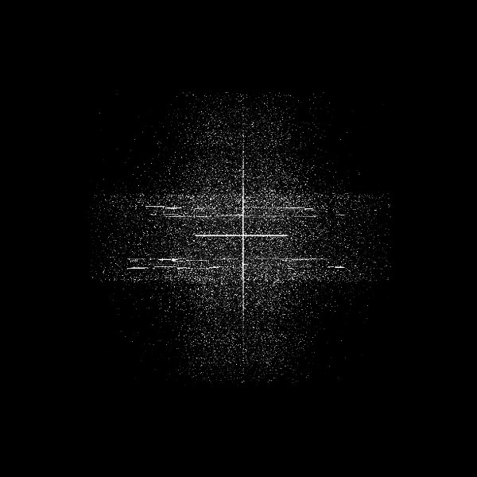

artist: **AUN**  
release: Alpha Heaven  
format: CD, LP  
year of release: 2013  
label: [Denovali](http://www.denovali.com)  
duration: 57:42

detailed info: [discogs.com](http://www.discogs.com/Aun-Alpha-Heaven/master/574090)

It's been a few years since I got to know Canadian duo **AUN** (**Julie Leblanc, Martin Dumais**) from their album [_Black Pyramid_](http://www.eveningoflight.nl/2010/09/28/review-aun-black-pyramid-2010/) on **Cyclic Law**. Compared to that album, _Alpha Heaven_ feels a bit less dense, with less focus on heavy drones, and more on open spaces, although both are still present. Like some previous works, _Alpha Heaven_ seems to have something of an outer space setting for me, which is of course stimulated by some of the titles, which suggest celestial bodies and exploration.

While some tracks are content to drift, with brighter and darker synth melodies and sometimes slightly gritty drones, other pick up something of a pace, with choppy drums, or just bass pulses. These dynamics not only emphasise the feeling of _journeying_ (i.e. _voyager_) but also make the album varied to listen to. The first three tracks have a strong buildup and a bright, open atmosphere, which somewhat jars with the title of "War Is Near". It's an interesting ambiguity, made stronger by Leblanc's lulling vocals on this track, which suggest anything but impending conflict. Neither do lovely serene tracks like "Peacecalm" and "La Luna". Near the end, more bold tracks like "Alpha" and "Voyager" build the album towards a deep climax.

_Alpha Heaven_ is probably my most-played album from last year, which is a recommendation by itself. No weak tracks, no problems with replayability, in other words: this one can go on repeat. But within the album structure, it's the final track that takes the cake. Unfortunately the track in question, "Return to Jupiter", is exclusive to the CD and digital editions of the album. The LP edition does come with a download, so at least you'll have the track in some form. In any case, it's a slightly different version of "Return to Jupiter Jazz", which appeared on an earlier 10".

The track deserves a paragraph of its own because it's just that damn good. A ten-minute romp of epic space travel poured into thick synths and massive rhythms. It's indeed like returning to Jupiter, but it feels as if you're doing it on the interstellar equivalent of a chopper, the engines chugging away behind you as you soar through the void. There's a lot of bright colours, powerful horns as a vague nod to the 'classic' sound of space music, quite a bit of solar wind in your hairs... It's astounding how AUN have married spacious ambient to psychedelic rock here. I know it's their signature style, but that doesn't make it any less impressive.

Reviewed by **O.S.**

Tracklist:

1\. Koenig (5:39)  
2\. Returna (5:26)  
3\. War Is Near (5:32)  
4\. Viva (2:55)  
5\. Vulcan (5:12)  
6\. La Luna (5:31)  
7\. Peacecalm (2:25)  
8\. Alpha (4:48)  
9\. Voyager (5:30)  
10\. Floodland (4:00)  
11\. Return To Jupiter (10:40)
