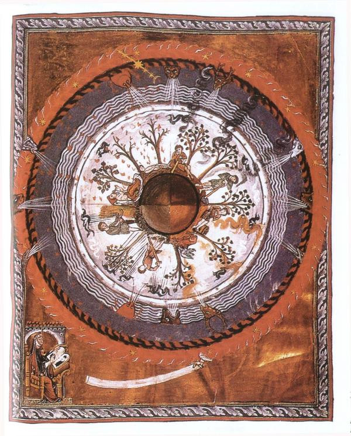

Welcome to the first Evening of Light mix presented by an actual human voice. Bear with me while I get the hang of it, and let me know what you think. I'll probably continue doing music-only mixes, but the monthly mixes in which I present various new tracks will most likely feature presentation from now on. After almost four years, I felt it was time for something new. Hope you enjoy!

<iframe src="//www.mixcloud.com/widget/iframe/?feed=http%3A%2F%2Fwww.mixcloud.com%2Feveningoflight%2Fcloudscape-44-february-2014%2F&amp;stylecolor=d85d27&amp;embed_type=widget_standard&amp;embed_uuid=cdd193b4-5b82-4aba-924d-136f18f712d5" height="600" width="600" frameborder="0"></iframe>

[Cloudscape #44: February 2014](http://www.mixcloud.com/eveningoflight/cloudscape-44-february-2014/?utm_source=widget&amp;utm_medium=web&amp;utm_campaign=base_links&amp;utm_term=resource_link) by [Evening Of Light](http://www.mixcloud.com/eveningoflight/?utm_source=widget&amp;utm_medium=web&amp;utm_campaign=base_links&amp;utm_term=profile_link) on [Mixcloud](http://www.mixcloud.com/?utm_source=widget&utm_medium=web&utm_campaign=base_links&utm_term=homepage_link)

00:00 | Ulver | Intro | Themes from William Blake's 'The Marriage of Heaven and Hell' | 1998 03:40 | Vampire Slayer | Nosebleed | Makeout Weird | 2013 09:12 | Ian Hawgood & The Green Kingdom | With Me | 15 Shades of White | 2013 13:24 | Lost Harbours | Within | 2014 17:36 | Richard Moult & David Colohan | III | Hexameron | 2013 21:20 | The Volume Setting Folder | Fratto | SEQUENCE7 | 2013 28:25 | United Bible Studies | Brew the Sequence | Rosary Bleeds | 2014 34:35 | Obsequiae | Altars of Moss | Suspended in the Brume of Eos | 2011 40:20 | Troum | Mare Morphosis | 2013 52:55 | AUN | Alpha | Alpha Heaven | 2013 58:00 | Agitated Radio Pilot | The Drunken Poet | 2009
