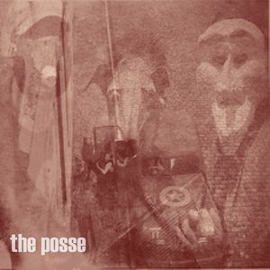

<iframe src="//www.mixcloud.com/widget/iframe/?feed=http%3A%2F%2Fwww.mixcloud.com%2Froamin%2Fthe-posse-006-was-it-a-dream-or-something-sinister%2F&amp;embed_uuid=9a890ee5-d9d9-4e6d-916f-68985a6f403f&amp;replace=0&amp;hide_cover=1&amp;stylecolor=996540&amp;embed_type=widget_standard" height="600" width="600" frameborder="0"></iframe>

[The Posse 006 / Was It a Dream or Something Sinister?](http://www.mixcloud.com/roamin/the-posse-006-was-it-a-dream-or-something-sinister/?utm_source=widget&amp;utm_medium=web&amp;utm_campaign=base_links&amp;utm_term=resource_link) by [Roamin](http://www.mixcloud.com/roamin/?utm_source=widget&amp;utm_medium=web&amp;utm_campaign=base_links&amp;utm_term=profile_link) on [Mixcloud](http://www.mixcloud.com/?utm_source=widget&utm_medium=web&utm_campaign=base_links&utm_term=homepage_link)

The Posse is back with a new group mix! This one was made by [WeirdwithBeard](http://www.mixcloud.com/weirdwithbeard/), [meistsonnig](http://www.mixcloud.com/meistsonnig/), [black\_ops](http://www.mixcloud.com/black_ops/), and myself.

Tracklist:

00:00-04:43 - Zohar Argov - The Flower in My Garden (really slow version) 03:56-06:45 - Damon - Song Of A Gypsy (slow version) 04:33-07:11 - Ø - Otava 05:49-13:30 - Ø - Syvyydessa kimallus 06:30-11:30 - Ernest Cline - Dance Monkeys, Dance 11:30-14:34 - Koenraad Ecker - Decline 12:40-14:36 - Bryan Lewis Saunders/ Christopher Fleeger - The Social Masochist 14:37-14:40 - Agoraphobic Nosebleed - The Fifth Day of Sodom: Like a Cretin On Christmas Eve 14:40-25:19 - Rainer von Vielen - Lass Los / Nichts 15:01-23:19 - Gottfried Michael Koenig - Essay 17:33-20:33 - Raising Holy Sparks - At the Confluence Of The Ganges, Yamuna & Saraswati (The Dream Before) 20:53-25:25 - Rainer von Vielen - Distanza 25:26-30:26 - Æthenor - Laudanum Tusk 28:42-33:02 - Alphane Moon - To Almandine 30:36-36:21 - Shrine - Paradise 34:50-39:20 - Plastic Venus - Nir 38:45-41:25 - Martin Horntveth - Der Alte 39:35-44:45 - We Are Ghosts - Ghosts of the Columbarium 41:38-46:15 - Phurpa - Conferring Empowerment and Self-Transformation 44:56-51:13 - Xenis Emputae Travelling Band - Hidden Seam & Lode Ford 47:34-51:38 - Beyond Sensory Experience - Legacy 51:21-53:07 - Le B'oo Ray - Life, Liberty 51:30-53:57 - Godspeed You! Black Emperor - 09-15-00 (Part One) 52:50-56:04 - David Thrussell - A New Beginning 56:06-59:59 - Marissa Nadler - Was It a Dream
