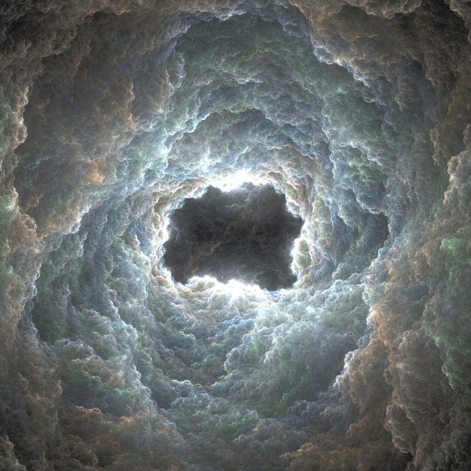

In Christian religious music, the voice and its word dominates. In my interpretation, some composers of dark ambient and related electronic music genres from recent years have adopted this tradition of sacred music, while simultaneously deconstructing it. It is not music from a church or a monastery. Rather, it is composed of distorted echoes of such music. The bells echo to us from across a chasm in time or space, the choirs are ghostly, disembodied. Sometimes sound is literally taken apart, reduced to base elements, cracked open to reveal an inner void.

Accompanying his latest album, _Mise en Abyme_, Peter Andersson of **raison d'être** states:

> _Mise en Abyme_ is an inner journey down to the most hidden and dark parts of the Self. _Mise en Abym_e literally means 'placed into the abyss' and conceptually the album contains ingredients from _The Divine Comedy_ by Dante or any similar stories/myths around the katabasis theme. Instead of being linked to religion, history or morality, it is purely a psychological and therapeutic trip to the underworld, investigating the subconscious. But even in the darkest and chaotic places in the depths, there are small shades of light, hope and understanding; one can be enlightened and purified upon returning to the conscious world.

This mix was partly composed in this spirit, placing pieces of sacred music from Christian history alongside the works that are inspired to go beyond that tradition.

<iframe src="//www.mixcloud.com/widget/iframe/?feed=http%3A%2F%2Fwww.mixcloud.com%2Feveningoflight%2Fsacred-voice-deconstruction%2F&amp;embed_uuid=62f8ecff-530e-460d-8493-d1bb2312e98f&amp;replace=0&amp;stylecolor=b3d8ef&amp;embed_type=widget_standard" height="600" width="600" frameborder="0"></iframe>

[Sacred Voice Deconstruction](http://www.mixcloud.com/eveningoflight/sacred-voice-deconstruction/?utm_source=widget&amp;utm_medium=web&amp;utm_campaign=base_links&amp;utm_term=resource_link) by [Evening Of Light](http://www.mixcloud.com/eveningoflight/?utm_source=widget&amp;utm_medium=web&amp;utm_campaign=base_links&amp;utm_term=profile_link) on [Mixcloud](http://www.mixcloud.com/?utm_source=widget&utm_medium=web&utm_campaign=base_links&utm_term=homepage_link)

Tracklist:

Incipit Musica Catholica - Alleluia Ensemble Organum - Alleluia - O Pimenon ton Israhil Giovanni Pierluigi da Palestrina - Heu mihi Domine Incipit Musica Catholica - Mariam Matrem raison d'être - In Lonelienes Cisfinitum - Tactio III Giacinto Scelsi - Alleluja Troum - Palas Tyn raison d'être - The Eternal Return and the Infinity Horizon Cisfinitum - Devotio I Giovanni Pierluigi da Palestrina - Missae Papa Marcelli: Gloria Gustaf Hildebrand - Ruins of a Failed Utopia Rapoon - One Last Breath Valentin Silvestrov - Diptychon: Testament Akira Rabelais - 1440 Promp. Parv. 5182 Wawyn, or waueryn, yn a myry totyr, oscillo.
