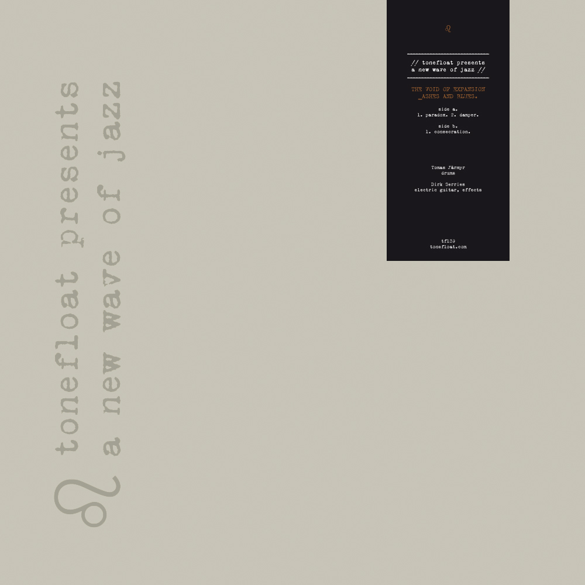

\[caption id="attachment\_4540" align="alignleft" width="150"\] YODOK III\[/caption\]

Dutch label **tonefloat** and the prolific Flemish musician **Dirk Serries** have been working together closely for years now, but this month, they are taking their collaboration to a new level.  [**A New Wave of Jazz**](http://tonefloatrecords.blogspot.nl/2014/05/tonefloat-presents-new-wave-of-jazz.html) is the title of a new sublabel of tonefloat and its description suggests that it will be home to music with a dedicated improvisational approach, inspired by the free jazz and DIY philosophy of **Sun Ra** and the **El Saturn** label. In this case, that means albums curated by Serries, released on limited edition LPs in custom sleeves.

To kickstart the label, two albums are being released this month, both projects featuring Serries himself on guitar. The first album, the self-titled début of the project **YODOK III**, sees Serries joined by **Tomas Järmyr** on drums, and **Kristoffer Lo** on brass. The second album, _\_ASHES AND BLUES_ by **THE VOID OF EXPANSION**, is just Serries and Järmyr as a duo.

For no particular reason, I'll start with the latter album. The tracks on _\_ASHES AND BLUES_ are built on an even flow of guitars, mostly chords, drones, individual notes, all stretched out and laid down gently. This is offset by the rippling drums that vary much more in intensity, from total absence to tumbling solos. As often with Serries' projects, there is a strong tendency to build each piece towards a natural crescendo — a steady, unforced accumulation of sound from all instruments. In this case, the guitar tones gain depth, a bit of rough texture, while the drums simply become ever more present and intense.

\[caption id="attachment\_4542" align="alignright" width="150"\] THE VOID OF EXPANSION - \_ASHES AND BLUES\[/caption\]

The wildly improvised percussion is indeed reminiscent of some of the more frantic areas of jazz, but it is balanced by the unwavering stability of the guitars. Rather than all instruments setting off in the same direction, a curious branching is created between harmony and rhythm — like one dancer whirling fast around an almost motionless one. The _YODOK III_ album is similar in setup to that by THE VOID OF EXPANSION, but it has the addition of Lo on tuba and flugabone. These soft, drawn out waves of brass form a natural complement to Serries' guitar fundament, while the drums still provide a form of counterpoint, much like their role on the other album. Because of this added variety in sound, I slightly prefer _Yodok III_ over its companion.

Judging from the sublabel's name, I had expected the first sounds to be somewhat different from what it turned out to be, more distant from the existing tonefloat catalogue, for one thing. It's not that I'm operating with a particularly narrow definition of jazz, it's more that the albums aren't really a huge departure from most of Serries' other works from the past few years. Perhaps that departure will come with the addition of other artists to the label roster. After all, a collection of music centered around the theme of free exploration and improvisation can afford to be diverse, or maybe it can't even afford _not_ to be diverse. That said, I'm sure a composer like Serries has the insight to curate the label well, and time will tell what the directions are going to be.

So far, A New Wave of Jazz can pride itself on being home to two strong new (Serries & co) projects, the first of which — YODOK III — will make its live début this month in Belgium and the Netherlands, with live performances of THE VOID OF EXPANSION planned for later this year. Both sound like live music par excellence, so I'm looking forward to seeing these sounds unfold in front of me.

> You can stream and order the albums on the label's Bandcamp: [YODOK III](http://newwaveofjazz.bandcamp.com/album/yodok-iii) — [THE VOID OF EXPANSION](http://newwaveofjazz.bandcamp.com/album/ashes-and-blues)
