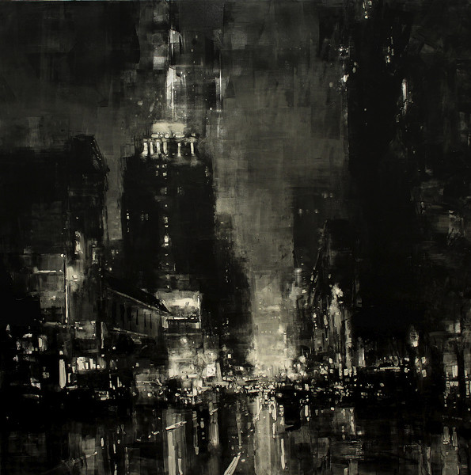

<iframe src="//www.mixcloud.com/widget/iframe/?feed=http%3A%2F%2Fwww.mixcloud.com%2Feveningoflight%2Fcloudscape-47-june-2014%2F&amp;embed_uuid=6c538f7a-00d5-4aae-bc3b-cc6f8aa5d9e0&amp;replace=0&amp;embed_type=widget_standard" width="600" height="600" frameborder="0"></iframe>

[Cloudscape #47: June 2014](http://www.mixcloud.com/eveningoflight/cloudscape-47-june-2014/?utm_source=widget&amp;utm_medium=web&amp;utm_campaign=base_links&amp;utm_term=resource_link) by [Evening Of Light](http://www.mixcloud.com/eveningoflight/?utm_source=widget&amp;utm_medium=web&amp;utm_campaign=base_links&amp;utm_term=profile_link) on [Mixcloud](http://www.mixcloud.com/?utm_source=widget&utm_medium=web&utm_campaign=base_links&utm_term=homepage_link)

Tracklist:

bvdub & loscil | Aether | Erebus | 2013 Orme | Sur le pavé | Debut | 2014 Anne Chris Bakker | This Garden | Reminiscences | 2014 Alasdair Roberts & Robin Robertson | Laoidh Fhionnlaigh Oig | Hirta Songs | 2014 Áine O'Dwyer | Boatwoman (Lene Charlotte Holm remix) | 2013 Michael Tanner & Alison Cotton | Floodplains | 2014 Machinist | Divergence | 2014 Column One | Antiphona | AntiphoNA | 2013 Maurizio Bianchi | I | Dicembre 1980 | 2013 Troy Schafer | III | Survey of a Broken Tape Recorder | 2014 Noxroy | Stellar Engine | Anverloss | 2014 Noxroy | Pyjama | Anverloss | 2014 Barbacana | Barbacana | Barbacana | 2013 Petrels | Katharina-22B | Mima | 2014 Isnaj Dui | Broken Fragments | Unstable Equilibrium | 2009 EUS | Reviraje | EUS/Mytrip | 2014 aliceffekt | Cya | Purgateus | 2014
