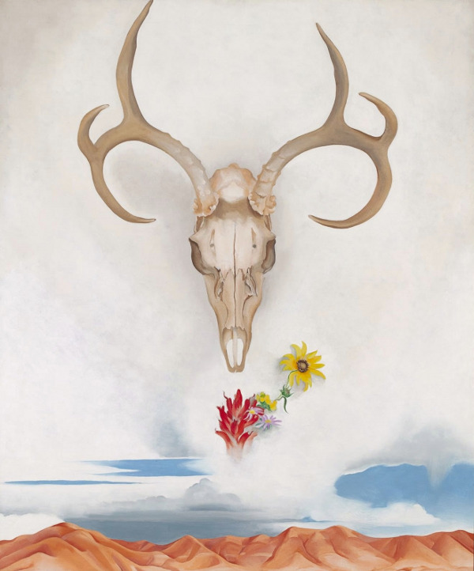

<iframe src="//www.mixcloud.com/widget/iframe/?feed=http%3A%2F%2Fwww.mixcloud.com%2Feveningoflight%2Fsummer-solstice-2014%2F&amp;embed_uuid=dcb355bb-9606-40ca-9541-1614e9fd63ba&amp;replace=0&amp;stylecolor=ff0500&amp;embed_type=widget_standard" width="600" height="600" frameborder="0"></iframe>

[Summer Solstice 2014](http://www.mixcloud.com/eveningoflight/summer-solstice-2014/?utm_source=widget&amp;utm_medium=web&amp;utm_campaign=base_links&amp;utm_term=resource_link) by [Evening Of Light](http://www.mixcloud.com/eveningoflight/?utm_source=widget&amp;utm_medium=web&amp;utm_campaign=base_links&amp;utm_term=profile_link) on [Mixcloud](http://www.mixcloud.com/?utm_source=widget&utm_medium=web&utm_campaign=base_links&utm_term=homepage_link)

A Summer's Day, for J. v. T. ~ Made possible through Patreon support: [http://www.patreon.com/qwallath](http://www.patreon.com/qwallath)

Tracklist:

Richard Moult | Rionnag Bheag | Aonaran | 2013 Barn Owl | Void and Devotion | Shadowland | 2011 Directorsound | Pan in Paradise | I Hunt Alone | 2013 Orme | Le Bois | Debut | 2014 The Gray Field Recordings | Petricore and Lullaby | The Weaver's Daughter | 2009 Popol Vuh | Abschied | Hosianna Mantra | 1972 Nature and Organisation | V | Death in a Snow Leopard Winter | 1998 Austin Wintory | Weary the Weight of the Sun | The Banner Saga | 2014 Plinth | Solicitude | Music for Smalls Lighthouse | 2010 Nucleus Torn | III | Andromeda Awaiting | 2010 Stefan Wesołowski | What the Thunder Said | Liebestod | 2014 Musk Ox | Solstice | Whom the Moon a Nightsong Sings | 2010 Raising Holy Sparks | Cloaked in Robes of Bright Morning | The Observance of Holy Days | 2012

\[under it all\] Michael Tanner | Nine of Swords | 2014

Art: **Georgia O'Keeffe** - _[Summer Days](http://www.wikiart.org/en/georgia-o-keeffe/summer-days)_ (1936)
