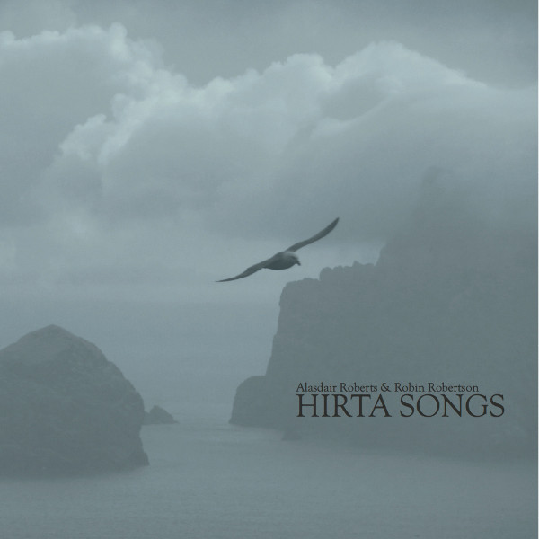
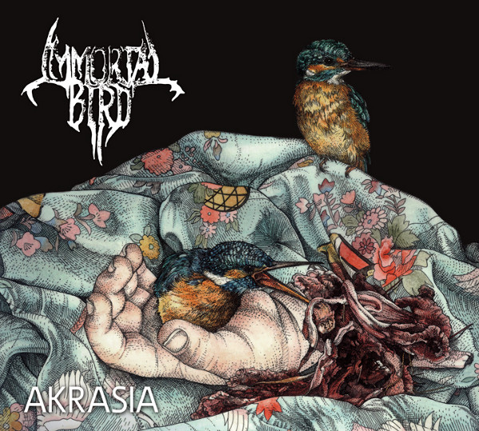
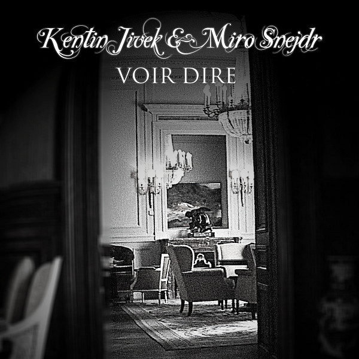
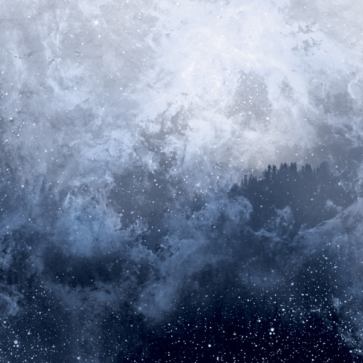

**Alasdair Roberts** & **Robin Robertson** - _Hirta Songs_ (2013, [Stone Tape](https://stonetaperecordings.bandcamp.com/album/hirta-songs))

\[caption id="attachment\_4569" align="alignright" width="150"\] _Hirta Songs_\[/caption\]

This is a real treat for lovers of Scottish folk. A cycle of original songs with a traditional feel, all situated around the abandoned island of Hirta. The songs range from festive and upbeat to calm and contemplative, with a couple of gorgeous solo harp pieces thrown in. Centerpiece is the ten-minute suite "Leaving St Kilda", a psychogeographic spoken word piece that should set your heart beating if you enjoyed other recent Hebridean art pieces such as the game _Dear Esther_ and its soundtrack by **Jessica Curry**.

**Immortal Bird**  - _Akrasia_ (2014, [Self-released](https://immortalbird.bandcamp.com/))

\[caption id="attachment\_4570" align="alignright" width="150"\] _Akrasia_\[/caption\]

Metal releases don't often sweep me away these days, but the début EP _Akrasia_ by Chicago's **Immortal Bird** most certainly did. Four super-intense, high-energy black/death pieces that never relent. I suppose lots of the kudos should go to drummer/vocalist **Rae Amitay**, who does a stellar job in both roles. Absolute standout track is "Akratic Seminar", a super-dark piece wavering between slow and fast, with horrifying echoes of **Dolorian** in its melodies, at least to my ears. In short, it's heavy, it's intense, it's smart, and I want more.

**Kentin Jivek** & **Miro Snejdr** - _Voir Dire_ (2014, [Self-released](https://kentinjivekmirosnejdr.bandcamp.com/))

\[caption id="attachment\_4571" align="alignright" width="150"\] _Voir Dire_\[/caption\]

I'd been following **Kentin** **Jivek's** slightly psychedelic neofolk on-and-off for a while now, but this collaboration with **Miro** **Snejdr** — who does drums, accordion, and piano — is a bullseye. It's misty, dreamy, with a central place for Jivek's warm, honeyish French drawl, and very well arranged around songs that mix neofolk with echoes from (European) pop and rock history. The album is a balanced mix of ballad-like chansons (such as the wistful "Si un jour") and more powerful, beat-driven pieces (like "Comme une comète").

**Wolves in the Throne Room** - _Celestite_ (2014, [Artemisia](https://artemisiarecords.bandcamp.com/))

\[caption id="attachment\_4573" align="alignright" width="150"\] Celestite\[/caption\]

_Celestite_ starts familiar enough: a warm, organic heavy ambient buildup with drones, horns and strings. But the black metal outburst you expect never comes. This album is content to linger in ambient territory, and frankly I kind of prefer it that way after a couple of metal albums from the band. Their new synth/drone approach may perhaps be a temporary sidetrack, but it's actually damn good. The compositions flow strongly, often calm, but never letting go of the epic moments that featured in their earlier works. It's simply a very solid set of soundscapes that weds a retro synth sound to organic guitar drones.
