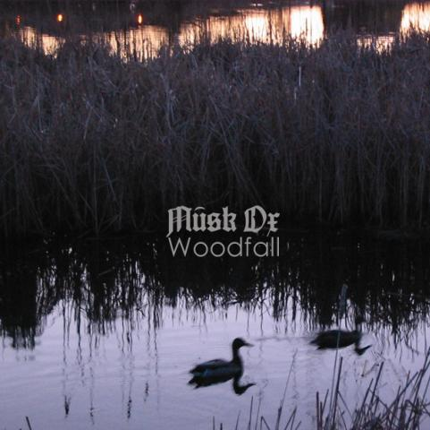

artist: **Musk Ox** release: _Woodfall_ format: CD, Digital year of release: 2014 label: [Self-released](https://muskoxofficial.bandcamp.com/album/woodfall) duration: 65:59

**Nathanaël Larochette’**s **Musk Ox** is now a trio, and with the new album Woodfall, the music has evolved to fully fledged chamber folk. Larochette's classical guitar works in unison with the violin and cello parts added by **Evan Runge** & **Raphael Weinroth-Browne**, the latter of whom also co-composed the album. The result is a suite taking parts from both classical music and the acoustic romantic neofolk from the mid-nineties and later.

The first couple of tracks ("Earthrise", "Windswept") keep a high tempo, with all instruments swirling around a central rhythm. In keeping with the project's wilderness aesthetic, the compositions conjure up leaves in autumn winds, the weight of impending winter. It took me a while to get used to the density of the music, which is somewhat higher than other artists operating in this area, and definitely more so than [Musk Ox's debut](http://www.eveningoflight.nl/2007/12/01/review-musk-ox-2007/ "Review: Musk Ox (2007)") from 2007. After twenty minutes or so, though, you definitely get into the flow, and realise that Larochette and Weinroth-Browne are pretty far ahead of the rest in terms of detailed composition and arrangement, and they aren't afraid to show it on this album. During the third track "Arcanum", the music rises above the grounded themes of the first half, the focus shifting from earth to the heavens. "Above the Clouds" is an upbeat piece full of wonder, and the final movement, "Serenade the Constellations" is lovely and calm, a celestial coda to the rest of the album.

With _Woodfall_, Musk Ox takes a determined step into not-so-easy-listening territory. If I had to compare it to anything, it would be **Michael Cashmore**'s instrumental works from around the turn of the millennium: just as melancholic and natural, but more energetic. Unlike many instrumental neofolk works, a genre of dwindling interest to me for years now, this music is not content to linger in the background. It is bold and demands attention to become more than just a swirl of notes. However, with attunement to this music comes an appreciation of its beauty and skilfulness, both of which are great.

Reviewed by O.S.

Tracklist:

1\. Part 1 - Earthrise (9:24) 2. Part 2 - Windswept (10:44) 3. Part 3 - Arcanum (17:36) 4. Part 4 - Above the Clouds (10:29) 5. Part 5 - Serenade the Constellations (17:47)
