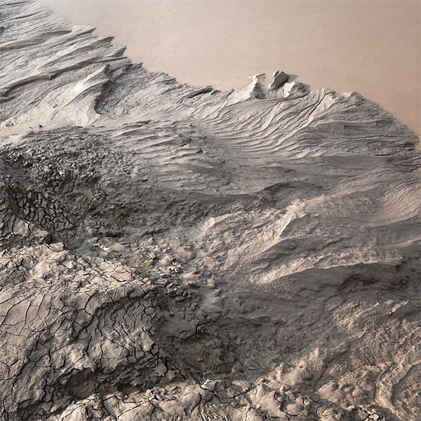

<iframe src="//www.mixcloud.com/widget/iframe/?feed=http%3A%2F%2Fwww.mixcloud.com%2Feveningoflight%2Fcloudscape-49-november-2014%2F&amp;embed_uuid=aa4cbd19-c24e-4b07-be13-963ecbe9db66&amp;replace=0&amp;stylecolor=f2d2d2&amp;embed_type=widget_standard" width="600" height="600" frameborder="0"></iframe>

[Cloudscape #49: November 2014](http://www.mixcloud.com/eveningoflight/cloudscape-49-november-2014/?utm_source=widget&amp;utm_medium=web&amp;utm_campaign=base_links&amp;utm_term=resource_link) by [Evening Of Light](http://www.mixcloud.com/eveningoflight/?utm_source=widget&amp;utm_medium=web&amp;utm_campaign=base_links&amp;utm_term=profile_link) on [Mixcloud](http://www.mixcloud.com/?utm_source=widget&utm_medium=web&utm_campaign=base_links&utm_term=homepage_link)

Image credit: [http://0rpheus38.tumblr.com/post/101602906766/the-empire-of-shadows](http://0rpheus38.tumblr.com/post/101602906766/the-empire-of-shadows)

Tracklist:

00:00 | I've Lost | First Fall | From These Hands | 2012 05:23 | Memory Drawings | Coldstream | There Is No Perfect Place | 2014 07:33 | Memory Drawings | Coldstream (Talvihorros Remix) | There Is No Perfect Place | 2014 10:20-19:00 | Francesco Giannico | Metrophony | Metrophony | 2014 13:31 | The Driftwood Manor | Be There When I Die | Of The Storm | 2013 14:31 | Agitated Radio Pilot | Floodplains | The Days and Hills Grown Old | 2006 17:29 | Rain Drinkers | Field of Ash | Wood Violet | 2014 27:33 | Porya Hatami | Landing | Arrivals and Departures | 2014 32:55 | Coph'antae Tryr | Nothing to Near | Tomb of Empires | 2014 36:17 | Desiderii Marginis | Temple of Andromeda | Hypnosis | 2014 41:30 | Tobias Hellkvist | Plus Minus Zero (Piano Version) | 15 Shades of White | 2013 46:10 | Sentimental Machines | The Shining Ground | Less | 2014 48:10 | United Bible Studies | Halo | Doineann | 2014
