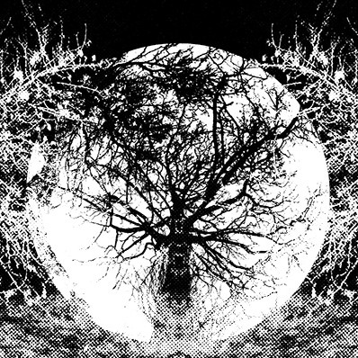
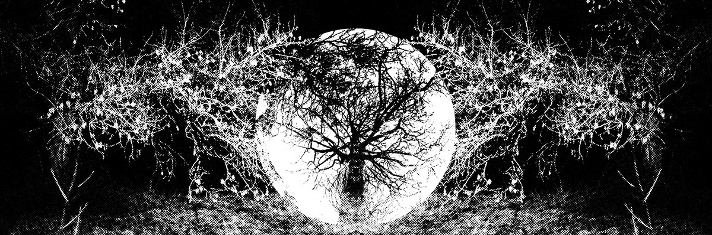
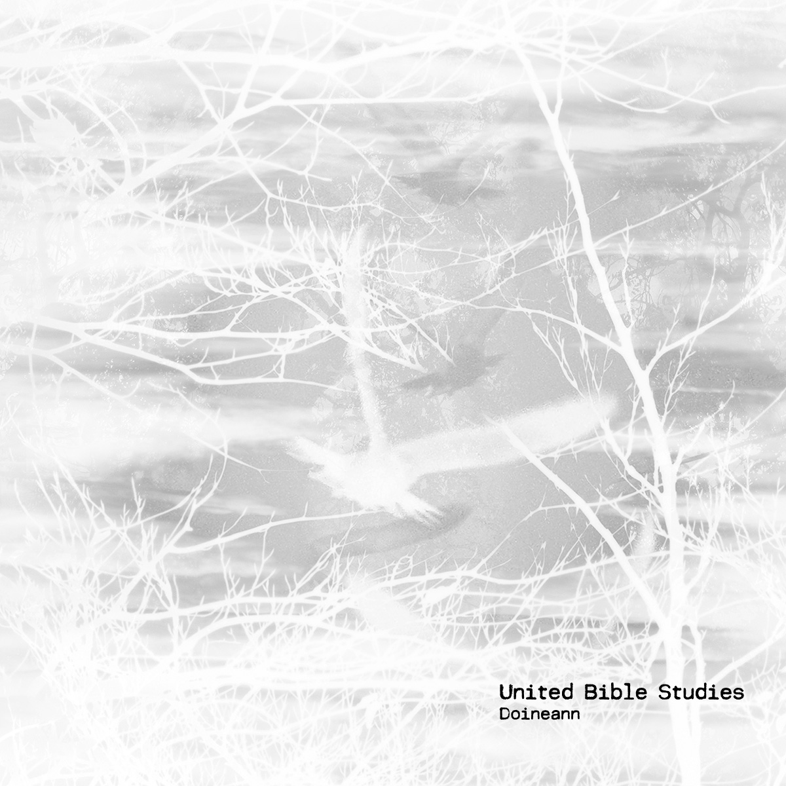

\[caption id="attachment\_4605" align="aligncenter" width="603"\] "E3" by A Year In The Country\[/caption\]

In [my 2012 review](http://www.eveningoflight.nl/2012/11/04/review-the-cloisters-2012/ "Review: The Cloisters (2012)") of _The Cloisters_, I had written about how the imagined landscape (Britain, in these cases) features so strongly in some strains of contemporary experimental folk music. Granted, this has been a central theme in folk since the 60s revival, but as I argue, the ease with which electronic manipulation can be applied these days has really influenced some of the more experimental folk works in the past decade or so. This heightened interplay of the 'acoustic' and electronic, and in a broader sense, between the rural and the urban, makes for a liminal artistic and imaginary field that is finding different forms of expression these days.

One of these forms  is the online blog / travelogue. Around the end of the previous decade, Richard Skelton walked this path with his _Landings_ blog, which combined photographs, poems, and pieces of music recorded in the field. While that blog has since disappeared and the material mainly lives on in Skelton's 2LP + book _L__andings_, the blog illustrated the viability of the concept — I've kept an offline copy of almost all of the _Landings_ material just in case it would go offline; a prescient decision in the end.

This year saw a new blog appear that operates in similar territory but not quite in the same way. _[A Year In The Country](http://ayearinthecountry.co.uk/)_ is a diary of influences and sensibilities, a personal exploration of the uncanny in the English countryside dream and how this is informed by various art forms. The blog is a daily series of posts presenting photographs of landscapes, essays about particular music albums, books, films, and the sale of limited edition artefacts fitting the overall theme.

One days post might be about **Rob Young**'s excellent book [_Electric Eden_](http://ayearinthecountry.co.uk/trails-and-influence-2365-electric-eden/), an extensive study of the rural in electric English culture in the 20th century and early 21st century. You can see why it would be relevant to the blog — and to _Evening of Light_ for that matter. I enjoyed the book greatly when I read it a couple of years ago. Another day's post might just have a photograph of a cloudscape, or a set of buttons for sale.

Once every week _AYITC_ produces the limited edition artefact, some of which are music releases... and here is where the blog really coincides with my analysis of e.g. the album by _The Cloisters_ referenced above. That _AYITC_ and _EoL_ are more or less on the same track when it comes to grasping at the heart of this 'unsettled bucolic dream' movement is illustrated by the fact that we gravitate towards the same artists.

Earlier in the year, for example, the blog released the curious [_Nine of Swords_](http://ayearinthecountry.co.uk/michaeal-tanner-nine-of-swords-day-245365/) by **Michael Tanner —** indeed, he of **Plinth** / **The Cloisters** — as one of these artefacts. It is a tarot-inspired meditation for singing bowls and bells which in itself is indicative of how various influences have enriched experimental folk artistry throughout the years.

\[caption id="attachment\_4604" align="alignright" width="150"\] Doineann\[/caption\]

Today I want to focus on another recent artefact from the series, though: **United Bible Studies**' _Doineann_. I'm very thankful that this originally Irish collective has been so prolific these past few years — one of the few artists that manage to fascinate me over the course of many years, albums, and changing approaches. It almost goes without saying that UBS is one of those artists that is perfectly suited for inclusion in the _AYITC_ series: rooted in Irish and British folk music, but experimental and improvisational from day one: not afraid to throw in synths, manipulations, crunchy guitars, sax, non-European instruments... the list goes on.

Doineann is in itself a typical UBS album — as far as such a thing exists — summarising a few of the various musical approaches from the past few years: shorter folk-inspired songs with an electric touch rub shoulders with instrumental bits, improv sessions, and ambient stretches.

The intro, "Helix" is short and instrumental, setting the scene with cold piano twirl and a backdrop of percussion, flute, and transmitter crackles. On "Clay In My Hands", **Aine O'Dwyer** (harp) and **Paul Condon** (guitar, synths, vocals) do a dreamy waltz together. This is one of those typical tracks that this whole article is about: it's folky and pastoral in some ways, but at the same time it's modern and slightly 'off'... unsettling. The album seems proportioned for an LP release, perhaps, with each 'side' ending in long track. The title third, eponymous track "Doineann" is a slowly moving instrumental, foreshadowing the final track with some motifs and instrumentations, while adding a bit of an improvised jazzy direction to it as well.

The second half of the album starts with "The Blackened Fields": **Alison O'Donnell** on vocals with guitar by **David Colohan** and some further synthesizer backings. On "Seachránái", Colohan lends his own vocals over a delicate harpsichord-led piece. The crowning workof the album is "Halo", a superbly dream-like 13 minutes closer that lives somewhere in the clouds above the landscapes we've been exploring in this piece. It is based in a warm synthesizer and organ glow punctuated by autoharp, electric guitar, and **Richard Moult’**s reverb-drenched voice, which transitions into a glorious choral bit about halfway through. The rest of the track is a melancholic weightless instrumental, a drifting end to a beautiful album.

There are a couple of different handmade editions of the album available through _AYITC_, and you can also buy it digitally from the [UBS bandcamp](https://united-bible-studies.bandcamp.com/album/doineann).

Don't forget to check out the full [_A Year In The Country_](http://ayearinthecountry.co.uk/) blog; there's tons of interesting stuff on there!
